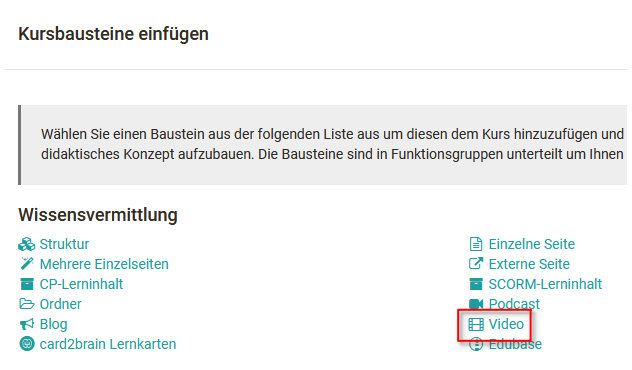
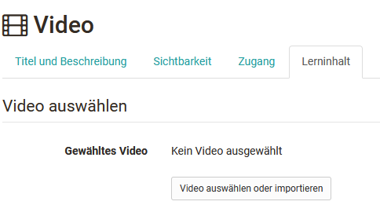
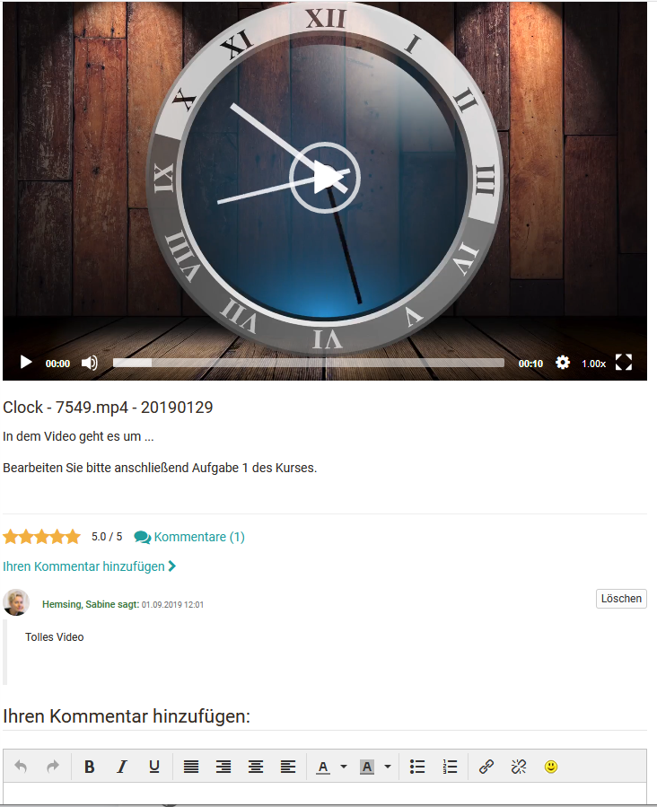

Gehen Sie in den Kurseditor und fügen Sie Ihrem Kurs den Kursbaustein "Video"
hinzu.

Klicken Sie im Tab „Lerninhalt“ auf „Video auswählen oder importieren“, um
Ihrem Kursbaustein ein Video zuzuordnen. Klicken Sie auf „Importieren“ bzw.
"Importieren URL", um ein neues Video hochzuladen bzw. zu verlinken, oder
wählen Sie ein bestehendes Video aus Ihren Einträgen aus. Videos können nicht
nur im Kurseditor, sondern auch im [„Autorenbereich"
importiert](../display/OO160DE/Lernressource%EF%B9%95+Video.html) werden. Wenn
Sie noch kein Video zugewiesen haben, erscheint beim Titel **Gewähltes Video**
die Meldung _Kein Video ausgewählt_.

Wenn Sie schon ein Video hinzugefügt haben, erscheint dessen Name als Link.
Folgen Sie dem Link um zur Vorschau zu gelangen. Um die Zuordnung eines Videos
nachträglich zu ändern, klicken Sie im Tab „Lerninhalt“ auf „Video
auswechseln“ und wählen anschliessend ein anderes Video aus.

Haben Sie ein Video ausgewählt bzw. importiert erscheint der Abschnitt
„Optionen“. Hier können Sie definieren ob die Zuschauer das Video kommentieren
und/oder bewerten dürfen und ob das Video automatisch gestartet werden soll
oder nicht und ob das Vorspulen eingeschränkt werden soll oder nicht. Ferner
können Sie den Titel des Videos und/oder eine Beschreibung des Videos anzeigen
lassen. Beides erscheint dann unterhalb des Videos. Sie können entweder eine
_Eigene Beschreibung_ in dem erscheinenden Eingabefeld hinzufügen, die
_Beschreibung_ der Lernressource _aus_ deren zugehörigen [_Infoseite_
](../display/OO160DE/Infoseite.html)verwenden, oder die Beschreibung ganz
weglassen.

In Lernpfad Kursen kann im Tab "Lernpfad" zusätzlich als Erledigungskriterium
definiert werden, ob die Lernenden das Video zu Ende schauen müssen (zu 95%),
damit der Kursbaustein als erledigt gilt.

Zusätzlich können alle Videos die in OpenOlat als Lernressource angelegt und
im Kurs eingebunden werden noch weiter konfiguriert werden. Dies erfolgt
direkt in der Lernressource im Autorenbereich. Hier können beispielsweise ein
Startbild (Poster) definiert, Kapitelmarken gesetzt oder Quizfragen ergänzt
werden. Die einzelnen Möglichkeiten werden im Kapitel "[Lernressource:
Video](../display/OO160DE/Lernressource%EF%B9%95+Video.html)" erläutert.

Verwenden Sie den Kursbaustein „Video“, um ein Video im MPEG-4 Format (.mp4)
in Ihren Kurs einzubinden. Das Video muss extern erstellt werden.

