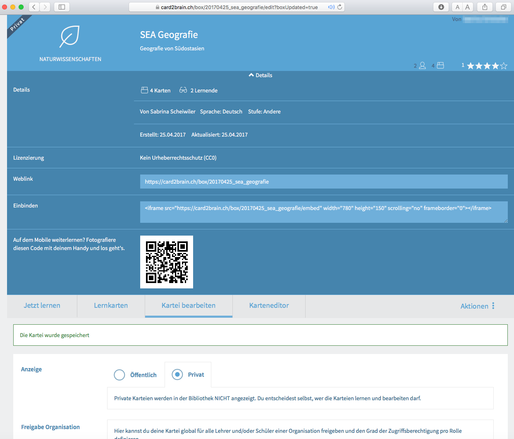
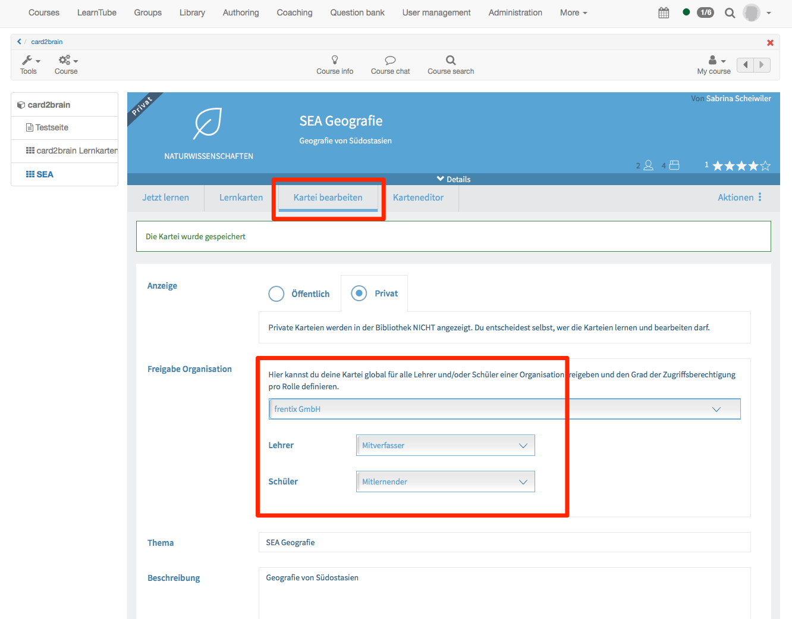

# Kursbaustein "card2brain Lernkarten"

!!! warning "Achtung"

    Um diesen Baustein zu nutzen, müssen Sie zwingend ein Entreprise-Account von card2brain besitzen. Kunden von frentix wenden Sie dafür bitte an [card2brain@frentix.com (mailto:card2brain@frentix.com), Nichtkunden kontaktieren direkt [card2brain](http://card2brain.ch/info/contact).

Der Baustein card2brain ermöglicht das Lernen mit Lernkarten.

Sobald die Voreinstellungen vorgenommen worden sind, kann dieser Kursbaustein
wie alle anderen Kursbausteine im OpenOlat hinzugefügt werden. Nachdem Titel
und Beschreibung und je nach Bedarf Sichtbarkeit und Zugang angepasst wurden,
muss im Tab Lernkartei der Alias der Lernkartei hinzugefügt werden.

Um diesen Alias hinzufügen zu können, muss zuerst eine Lernkartei auf
[www.card2brain.ch](http://www.card2brain.ch) erstellt werden. Die
Lernkarteien können nicht direkt im OpenOlat erstellt werden. Die Lernkartei
wird ins OpenOlat verknüpft. Wenn dann eine Lernkartei erstellt ist, kann der
Alias in den Details geholt werden. Der Alias ist das letzte Element des
Weblinks, z.B. 20170425_sea_geografie. Kopieren Sie den Alias und fügen Sie
ihn im OpenOlat ein. Anschliessend wird der Baustein gespeichert.

Damit nun alle Kursteilnehmer mit dem Baustein arbeiten können, ist folgende
Einstellung in der Lernkartei relevant:

Diese Einstellung können Sie im OpenOlat vornehmen. Nachdem Sie den Kurs
publiziert haben, klicken Sie auf den Kursbaustein card2brain. Klicken Sie
anschliessend auf Kartei bearbeiten. Unter Freigabe Organisation ist bereits
Ihre Organisation ausgewählt. Diese wird bei der Erstellung der Lernkartei in
[www.card2brain.ch](http://www.card2brain.ch) hinterlegt. Für die Lehrer
wählen Sie Mitverfasser und für die Schüler Mitlernender. Somit können alle
Benutzer, welche in diesem Kurs Betreuer sind, die Lernkarten bearbeiten. Alle
Kursteilnehmer können mit den Lernkarten lernen.

!!! info "Info"

    Die Lernkarten sind ausschliesslich zum lernen gedacht und nicht als Prüfung.
    Es werden im OpenOlat keine Punkte gespeichert und der Kursbaustein card2brain kann nicht bewertet werden.
