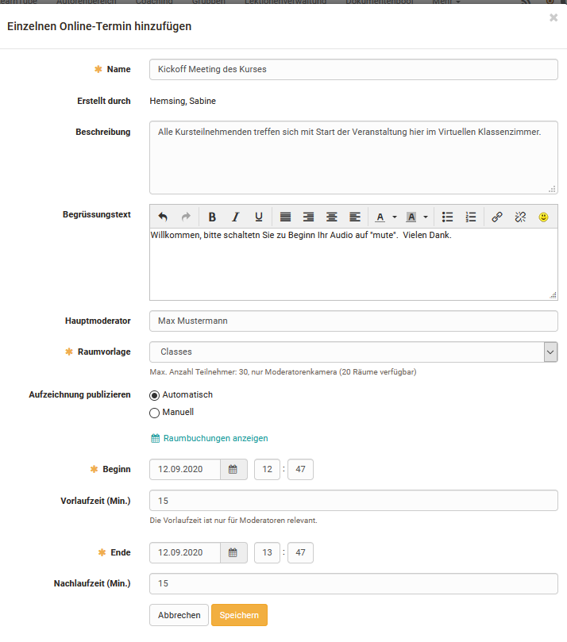
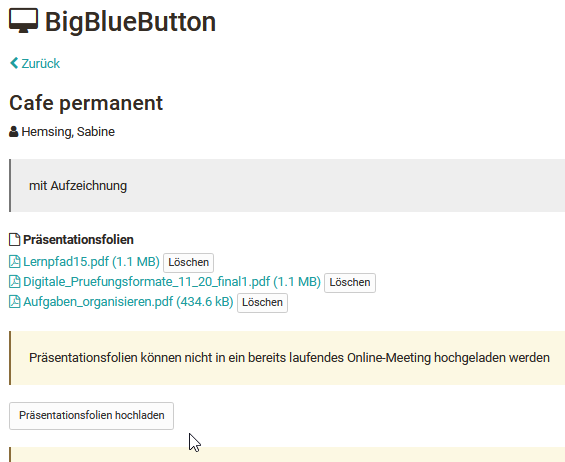
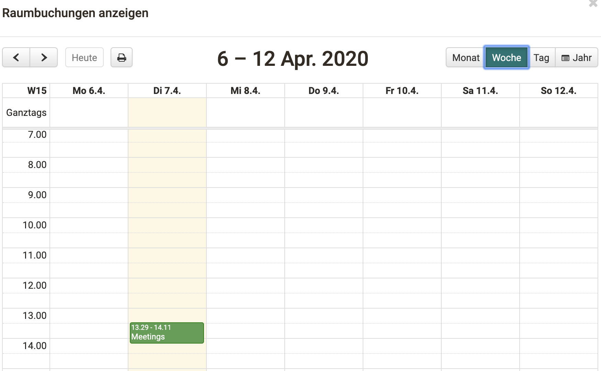

# Kursbaustein BigBlueButton

**Art der Software**|  OpenSource GNU Lesser General Public License (LGPL),
Serverhosting erforderlich  
---|---

## Funktionen der Software  

BigBlueButton ermöglicht virtuelle Klassenräume mit folgenden
Funktionalitäten:

  * Webcam- und Audio-Unterstützung
  * Folienpräsentation z.B. PDF
  * Screensharing
  * Multi-User Whiteboard
  * Umfrage-Funktionen
  * Gruppenräume
  * Gruppenchat, privater Chat und gemeinsame Notizen

  
## Systemvoraussetzungen

BigBlueButton ist eine browserbasierte Software-Lösung und benötigt keine
zusätzlichen Plugins.  
Für den vollen Funktionsumfang (für Betreuer und Teilnehmende) wird **Google
Chrome** oder **Mozilla Firefox** empfohlen. Unter Windows kann die neue
Version von **Edge** **mit Chromium Engine** ebenfalls verwendet werden. Für
das Teilen des eigenen Bildschirms empfiehlt sich die Verwendung von **Google
Chrome**.  
  
  
## Konfiguration im Kurseditor

Bei der Einbindung von BigBlueButton im Kurs kann entschieden werden, ob ein
geplantes Online-Meeting nur durch den Moderator oder auch durch Teilnehmer
gestartet werden kann. Bei aktivierter Option können Teilnehmer das Meeting
erst betreten, wenn der Moderator das Meeting gestartet hat.

  
  
# Raum erstellen

## Konfiguration im Kursrun für Betreuer und Besitzer

Im Kurs können Kursbesitzer und Betreuer im BigBlueButton-Baustein in der
"Terminverwaltung" über "Online-Termin hinzufügen" neue Termine anlegen. Auch
können bereits angelegte Termine kopiert oder gelöscht werden.

!!! tip "Folgende Varianten bei der Erstellung von Online-Terminen werden unterschieden:"

    * Einzelnen Online-Termin hinzufügen
    * Permanente Reservierung hinzufügen
    * Täglich wiederkehrende Online-Termine hinzufügen
    * Wöchentlich wiederkehrende Online-Termine hinzufügen

Die Varianten unterscheiden sich nur in der Erstellung der Termine. Es werden
separate Online-Termine/Reservierungen erstellt, welche anschliessend separat
bearbeitet werden können. Je nach Konfiguration des Servers können hier auch
unterschiedliche Auswahlmöglichkeiten bereitstehen.  

# Online-Termin hinzufügen: Die Einstellungen im Detail

## Konfiguration Online-Termin

  *  **Name** : Bezeichnung des Termins
  *  **Erstellt durch:** Der Name des Erstellers wird automatisch angezeigt.
  *  **Beschreibung** : Beschreibung des Termins, was ist der Inhalt bzw. das Thema der synchronen Session?
  *  **Begrüssungstext** : Der Text wird im BigBlueButton-Raum als Willkommensnachricht im Chatbereich für alle Teilnehmenden angezeigt
  *  **Hauptmoderator:** Hier kann der Name einer Person eingetragen werden.
  *  **Präsentationsfolien hochladen:** Laden Sie Ihre Folien bereits im Vorfeld des Meetings hier hoch oder löschen Sie bereits hochgeladene Folien.
  *  **Rau** **mvorlage** : Auswahl der konfigurierten Raumvorlagen (bestimmt Anzahl Teilnehmende und diverse Voreinstellungen im Online-Meeting). Die Details hängen von der Konfiguration des BigBlueButton Servers ab.
  *  **Bevorzugter Server:** Wird in der Regel automatisch gewählt.
  *  **Aufzeichnungen des Online-Termins zulassen:** ja oder nein
  *  **Aufnahme automatisch veröffentlichen für:** Wählen Sie hier die Benutzergruppen denen Sie die die Aufzeichnung später bereitstellen möchten.
  *  **Benutzer bei Eintritt akzeptieren (Warteraum):** Hier kann entschieden werden ob Personen zunächst in einem Warteraum landen und nicht sofort in den Meeting-Raum gelangen. Wählt man "abgeschaltet" gelangen alle Personen direkt im Meeting-Raum. Alternativ kann hier auch konfiguriert werden, dass jeder (alle Benutzer) im Warteraum landet oder nur Gäste und externe Personen und die Kursteilnehmenden dagegen direkt in den Meeting-Raum gelangen können.
  *  **Darstellung:** Standard oder Webcam Termin (abhängig von der Konfiguration durch den BBB Administrator)
  *  **Zugang externe Benutzer:** Sofern dieses Option vom Administrator erlaubt wurde kann hier die URL angepasst werden, die Sie an die externen Benutzer versenden können. Der Link erscheint anschließend auch für Kursbesitzer und Betreuer bevor der Raum betreten wird. Teilnehmer sehen den Link nicht.
  *  **Passwort für externe Benutzer:** Hinterlegen Sie hier ein Passwort, das Gäste, also Personen ohne OpenOlat Account eingeben müssen um  in den Raum zu gelangen.
  *  **Raumbuchungen anzeigen** : Kalenderansicht zur Prüfung von belegten Online-Meetings

### Nur bei termingebundenen Räumen:

  *  **Beginn** : Geben Sie den Starttermin ein.
  *  **Vorlaufzeit (Min.)** : 0 bis 15 Minuten konfigurierbare Vorlaufzeit, in der das Meeting bereits von den Kursbetreuern und Besitzern, nicht aber von Teilnehmenden, gestartet werden kann z.B. um eine Präsentation bereitzustellen.
  *  **Ende** : Ende des Meetings - die maximale Laufzeit eines Meetings ist abhängig von der gewählten Raumvorlage
  *  **Nachlaufzeit (Min.)** : 0 bis 15 Minuten konfigurierbare Nachlaufzeit. Das Meeting wird nach Erreichen der Endzeit automatisch für alle Personen um die Nachlaufzeit verlängert, es erscheint eine Anzeige mit der verbleibenden Konferenzzeit.

### Nur bei wiederkehrenden Terminen:

  * Start wiederkehrendes Datum: 1. Online-Termin (bei wöchentlicher Wiederholung entspricht dies dem Wochentag der Serie)
  * Ende wiederkehrendes Datum: Ende der wiederkehrenden Termine

Bei wiederkehrenden Terminen können im zweiten Prozessschritt "Datum" die
Termine vor der Erstellung bearbeitet/gelöscht oder mit freien Daten ergänzt
werden.

## BigBlueButton für Gäste (OpenOlat Gastzugang, externe Teilnehmende):

Je nach Konfiguration der BigBlueButton Vorlage kann der Konferenz-Raum auch
nicht registrierten Personen ohne Zugang zu OpenOlat, also Externen (siehe
[G](https://confluence.openolat.org/display/OO152DE/Gastzugang)[astzugang](https://confluence.openolat.org/display/OO152DE/Gastzugang)),
zugänglich gemacht werden. Voraussetzung dafür ist, dass es sich um einen
herkömmlichen, keinen Lernpfad Kurs handelt und der Kurs selbst auch für Gäste
freigeschaltet wurde.  Gäste können bei der Einwahl einen beliebigen Namen
eingeben.

  

!!! warning "Achtung" 

    Sobald ein BigBlueButton-Meeting gestartet, d.h. der Online-Raum geöffnet wurde, können die Einstellungen am Meeting-Termin nicht mehr bearbeitet werden!

## Im Kalender anzeigen

Die erfassten Online-Termine sind bei aktiviertem Kurskalender ebenfalls als
Termin vorhanden und können von Teilnehmenden im persönlichen Kalender
abonniert werden.

Über den Tab "Online-Termine" erhält man Zugang zu einem bestimmten Termin
bzw. Raum.

Kursbesitzer und Kursbetreuer können bereits im Vorfeld ihre Präsentation(en)
hochladen, so dass sie bei Beginn des Meetings zur Verfügung stehen. Direkt
angezeigt wird das oberste Dokument der Liste.

  

  
  
  
## Kalender Anzeige

In der Konfiguration eines Raums kann sowohl während der Erstellung als auch
später beim editieren über den Link "Raumbuchungen anzeigen", eine Übersicht
über alle gebuchten BigBlueButton Räume der Instanz eingesehen werden. Das
erleichtert es zeitliche Engpässe bzw. eine starke Auslastung des Systems
frühzeitig zu erkennen und gegebenenfalls einen anderen Termin zu wählen.

Zusätzlich werden die in BigBlueButton erstellten Online-Termine automatisch
in den kursspezifischen Kalender eingetragen. Von hier aus gelangen alle
Kursmitglieder rasch in den entsprechend verlinkten BigBlueButton Raum.

  
  
## Aufzeichnungen

Die Aufzeichnungen eines Meetings findet man im Tab **"Online-Termine" →
"Aufzeichnungen"**. Wählen sie hier das passende Meeting aus. Automatisch
bereitgestellte Meetings sind hier direkt wählbar. Erfolgt die Bereitstellung
manuell, können Besitzer und Betreuer nun definieren, für welche Zielgruppe
die Aufzeichnung bereitgestellt werden soll. Je nach Server Konfiguration kann
auch ein Download einer Aufzeichnung angeboten werden.

!!! warning "Achtung"

    Die vorgenommenen Einstellungen unter "publizieren" als auch unter "löschen" gelten grundsätzlich sowohl für die Aufzeichnung als auch den Download! Löscht man also einen Eintrag wird die gesamte Aufzeichnung gelöscht.

  

  
  
## Teilnehmerperspektive

Ruft ein Kursteilnehmer einen BigBlueButton Kursbaustein auf, sieht er eine
Übersicht der aktuellen, der abgelaufenen und der permanenten Räume, sofern
vorhanden.  Ein Klick auf "Auswählen" führt zum Login-Bereich des jeweiligen
Raums.

Aktuelle Sessions können durch "Meeting beitreten" gestartet und der konkrete
BigBlueButton Raum aufgerufen werden.

Bei abgelaufenen Meetings können die Räume nicht mehr betreten werden, aber
man erhält hier Zugriff auf eventuelle Aufzeichnungen des Meetings. Betreuer
und Kursbesitzer können hier auch Aufzeichnungen löschen.  
  
## BigBlueButton Meeting Raum

Der angezeigte Willkommen Text kann bei der Einrichtung des Raums angepasst
werden. Sofern die User ein Profilbild hinterlegt haben, wird dieses auch in
der Personenliste angezeigt.

Je nach Raumeinstellung stehen unterschiedliche Möglichkeiten im Raum zur
Verfügung.  
  
!!! note "Link zu weiteren Infos"

    BigBlueButton Anbieter-Webseite: <https://bigbluebutton.org/>

