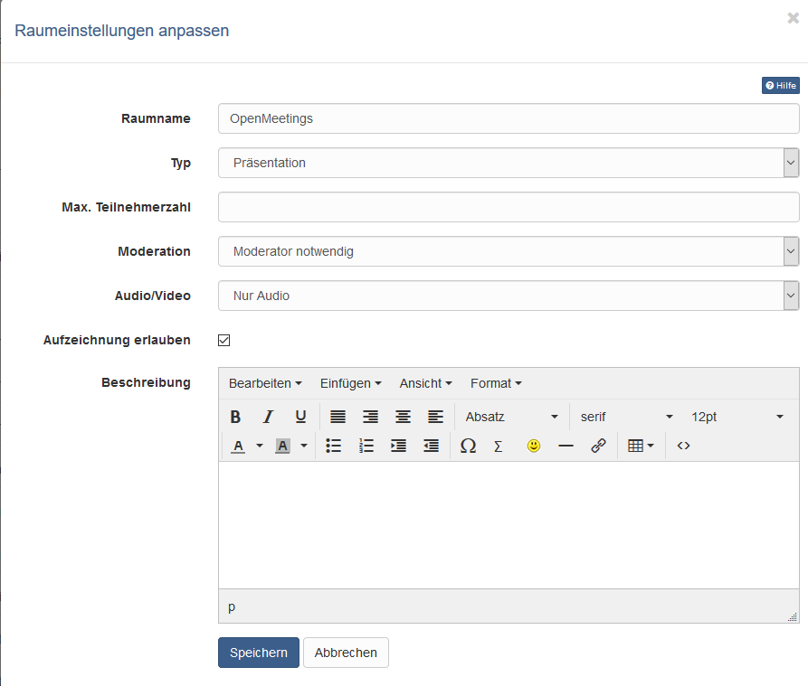
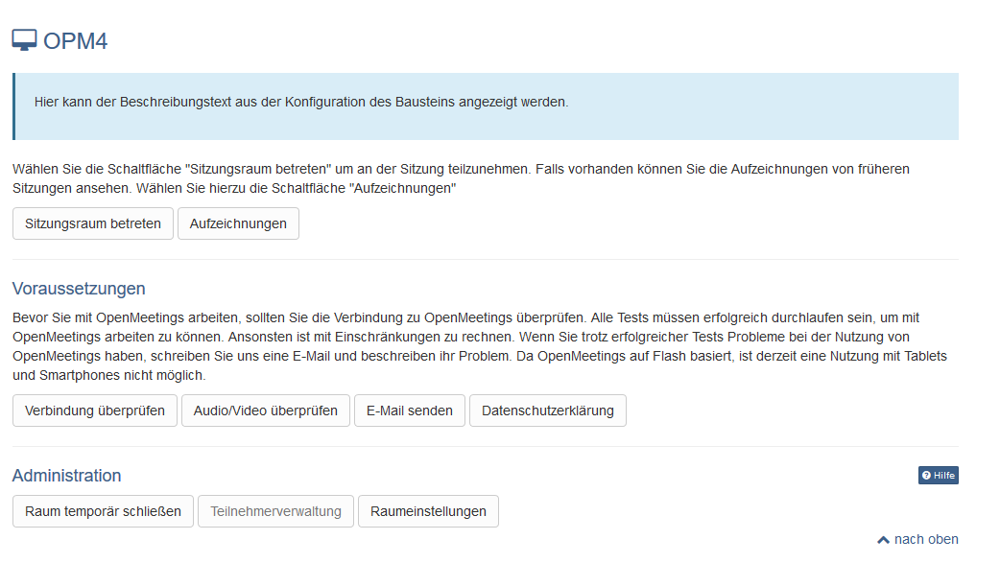

# Kursbaustein OpenMeetings

## Kursbaustein "OpenMeetings"

OpenMeetings ist eine OpenSource Software. Für die Nutzung in OpenOlat ist ein Serverhosting erforderlich. 

## Tool Spezifisches

OpenMeetings verfügt über drei verschiedene Raumtypen, die alle auch in
OpenOlat genutzt werden können:

  * Präsentationsräume (Webinar Räume)
  * Kooperationsräume (Konferenz Räume) und
  * Interviewräume

Je nach Raumwahl stehen unterschiedliche Funktionen zur Verfügung.
Kooperationsräume stehen nicht nur in Kursen, sondern auch in Gruppen zur
Verfügung. Jeder OpenOlat User kann somit ein eigenes Virtuelles Klassenzimmer
für Gruppenarbeiten und Kooperationstreffen nutzen.  

!!! info

    OpenOlat Kursbesitzer und Betreuer sind standardmäßig OpenMeetings Moderatoren.  
  
!!! info "Link zu weiteren Infos"

    Weitere Informationen zu aktuellen Features finden Sie unter der URL <http://incubator.apache.org/openmeetings>  
  
## Konfiguration im Kurseditor

Nach dem Hinzufügen des Kursbausteins muss zunächst im Tab "Raum" ein
OpenMeetings Raum angelegt und die Raumeinstellungen konfiguriert werden.
Diese Einstellungen können später sowohl im Kurseditor als auch im Kursun
angepasst werden.

Unter "Typ" kann der gewünschte Raumtyp gewählt werden. Die genauen Raum
Bezeichnungen können je nach OpenMeetings Instanz variieren. Während sich
Kooperations- und Präsentationsäume vorrangig darin unterscheiden, ob jeder
User schon beim Betreten des Raums automatisch Audio/Videorechte erhält oder
nicht, ist der Interviewraum anders aufgebaut als die anderen Räume.

* **Konferenzen** sind Kooperationsräume und eher für kleinere Benutzerzahlen
gedacht bei denen alle Teilnehmer gleichberechtigt sind und alle Werkzeuge
bedienen können. 

* Ein **Webinarraum** bzw. Präsentationsraum eignet sich, wenn es
einen oder wenige Vortragende und viele Teilnehmende gibt bei denen die Audio-
Funktion gar nicht oder erst im Nachhinein bereitgestellt werden soll.  Auch
für unerfahrene User ist ein Präsentationsraum die bessere Wahl. 

* Der **Interview Raum** ist ein Raum, der sich besonders für Videokonferenzen oder videobasierte
Interviews anbietet.

Die Angabe einer **maximalen Teilnehmerzahl** limitiert die verfügbaren Plätze des
Sitzungsraumes. Sind alle Plätze belegt, können keine neuen Benutzer mehr den
Raum betreten, solange bis eine Person den Raum wieder verlässt.

Unter "**Moderation**" kann definiert werden, ob ein Moderator erforderlich ist,
bevor die Teilnehmer eines Raums weitere Rechte erhalten können. Wird die
Option "**Ohne Moderation**" gewählt, erhält der erster User der den Raum betritt
automatisch Moderationsrechte.

  
  
## Konfiguration im Kursrun (geschlossener Editor)

Über "**Sitzungsraum betreten**" gelangt man in den Meetingraum. 

Liegen Aufzeichnungen vor, können diese über den Link "**Aufzeichnungen**" aufgerufen
werden. 

Über "**Raum temporär schließen**" kann der Raum auch geschlossen werden,
so dass ein Zugang nicht möglich ist. 

Über den Link "**Teilnehmerverwaltung**"
sieht man die Personen, die sich aktuell im Raum befinden und kann diese auch
bei Bedarf auch entfernen.

