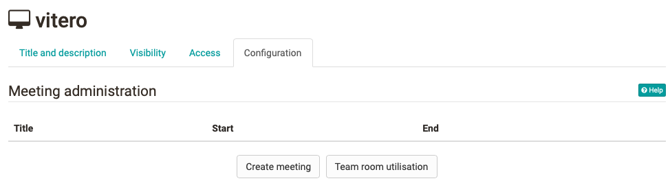
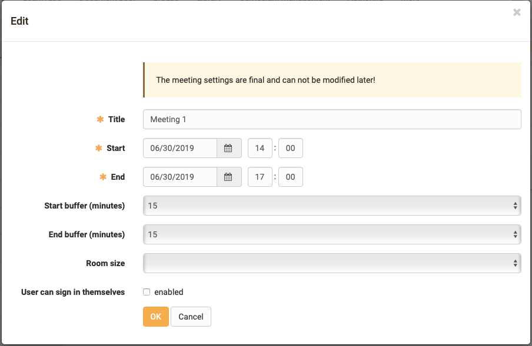

# Course element vitero

## Kursbaustein "vitero"

 **Typ of software**|  Commercial, license and server hosting required  
---|---  
 **Tool-specific**|

With the course element "vitero" you can integrate the vitero system for web
conferencing, e-collaboration, live e-learning and language learning into your
course. vitero (virtual team room) enables you to create appointments for up
to 12 participants plus moderator.

The virtual meeting room allows participants to communicate via text chat,
audio and video as well as document and desktop sharing. The vitero system can
be used for virtual team sessions as well as for frontal lectures. It supports
a role model with the three temporary roles moderator, co-moderator and
participant, and reflects the OpenOlat roles course administrator, coach and
participant.  
  
 **Link to further information**|

You can find out more about the functions of the vitero system on the homepage
of vitero GmbH:  
[http://www.vitero.de](http://www.vitero.de/)  
  
 **Configuration in the course editor**|

You can enter your vitero dates in the course editor or in the published view.
Select the button "Create meeting". Before you do this, you can use the "Team
room utilisation" button to view the current utilisation of the available team
rooms in order to find a free appointment.  
  
 **Configuration in the course run (closed editor)**|

Now enter the start and end date of the appointment and select the size of the
room. With "Start buffer" you can define how many minutes before the start
date the room can be entered. With "End buffer" you define how many minutes
after end of appointment the meeting will be closed definitively.

With the option "User can sign in themselves" you enable all users who have
access to the course element to enter themselves in this appointment
independently. This is possible as long as there are still places available.
If this option is switched off, only course owners can enter users in the
meetings.

For users, meetings are only visible if they are entered in this appointment,
or if the appointment has been configured for free registration.

If a meeting has been created, it cannot be changed after saving the form.

