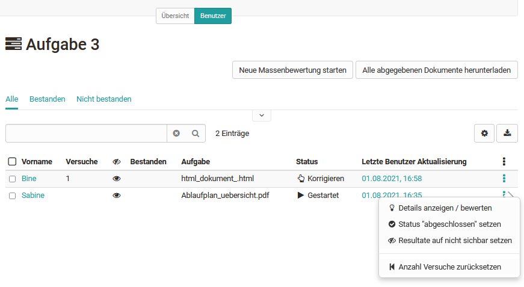
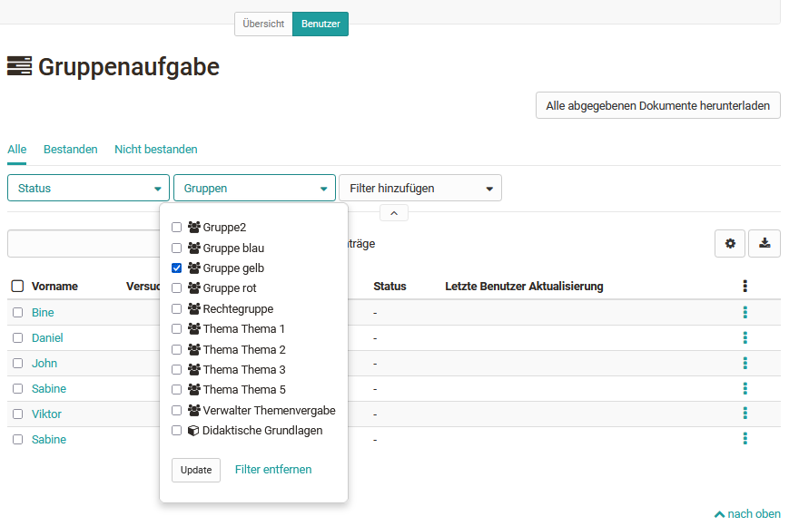
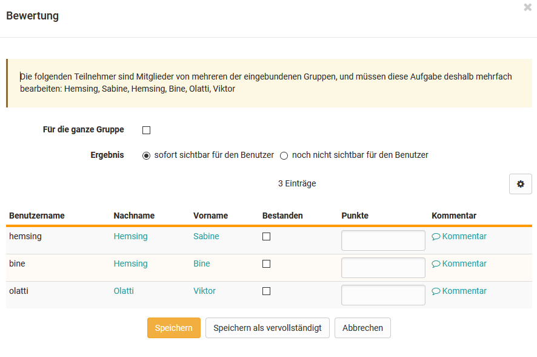
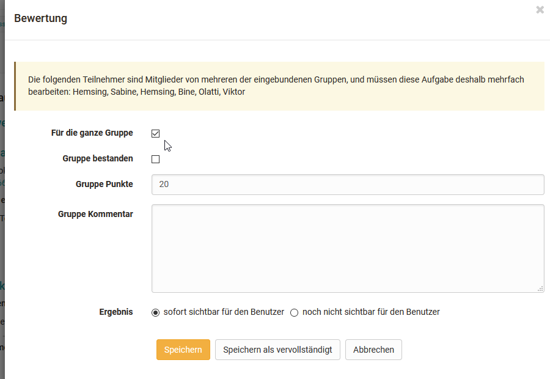

# Aufgaben und Gruppenaufgaben bewerten

Hier erfahren Sie wie man Bewertungen für Aufgaben und Gruppenaufgaben mit
Hilfe des OpenOlat „Bewertungswerkzeugs“ vornimmt.

Gehen Sie in das Bewertungswerkzeug, aktivieren Sie den Tab „Benutzer“ und
wählen Sie eine Aufgabe aus der linken Übersicht der Assessmentbausteine des
Kurses aus.  In der Tabelle werden Ihnen nun diverse Aktionsmöglichkeiten
sowie alle bewertbaren Personen angezeigt.

Kursbetreuer und Kursbesitzer haben über die entsprechenden Buttons die
Möglichkeit…

  * alle abgegebenen Dokumente auf einmal herunterzuladen
  * eine neue Massenbewertung zu starten und damit alle Teilnehmenden auf einmal zu bewerten.
  * die Aufgabe für alle oder mehrere ausgewählte Teilnehmenden auf den Status „abgeschlossen“ zu setzen und damit die Bewertung final zu beenden. Dafür müssen zunächst die gewünschten Teilnehmenden bzw. alle Teilnehmenden ausgewählt werden.
  * die Bewertungen der Aufgabe für alle oder mehrere ausgewählte Teilnehmenden auf einen Schlag sichtbar bzw. unsichtbar zu setzen.
  * Eine E-Mail an alle oder bestimmte Teilnehmende zu verschicken.

Zur Bewertung von Aufgaben und Gruppenaufgaben laden Sie zuerst den vom
Lernenden abgegebenen Lösungsversuch oder die letzte korrigierte Version
herunter.

Wie Sie die Aufgaben einzelner Personen bewerten erfahren Sie hier in einer
[Schritt für Schritt Anleitung](Assessment_of_learners.de.md).

### Alle abgegebenen Dokumente herunterladen

Wenn viele Lösungsversuche hochgeladen wurden, oder Sie viele Lernende
bewerten müssen, empfiehlt es sich, über die Schaltfläche "Alle abgegebenen
Dokumente herunterladen" alle Lösungsversuche auf einmal herunterzuladen. Im
heruntergeladenen Ordner finden Sie ebenfalls alle Aufgabenzuweisungen.

Anschliessend können Sie das [Bewertungsformular

sites/manual_user/docs/course_operation/Assessing_tasks_and_group_tasks.de.md §The_assessment_form.de.md§ 481
](The_assessment_form.de.md)ausfüllen.

### Neue Massenbewertung starten

Wie man eine Massenbewertung für Aufgaben genau erstellt erfahren Sie

sites/manual_user/docs/course_operation/Assessing_tasks_and_group_tasks.de.md §create_a_bulk_assessment_for_submission_tasks.de.md§ 481
[hier](../how-to/create_a_bulk_assessment_for_submission_tasks.de.md).

### Bewertungsflow Kursbaustein „Aufgabe“

Im Bewertungswerkzeug findet man den im folgenden beschriebenen Bewertungsflow
oberhalb des allgemeinen Bewertungsformulars. Alternativ können Lehrende den
Bewertungsflow auch im Kursrun aufrufen. Welche Schritte im Bewertungsflow
genau zur Verfügung stehen, ist abhängig von der konkreten Konfiguration des
Aufgaben Bausteins.

Sobald von einem Lernenden eine Datei über den Button „endgültige Abgabe“
eingereicht wurde, kann sie vom Lehrenden geöffnet und angeschaut werden.

Falls gewünscht und dementsprechend konfiguriert, kann ein Rückgabe-Dokument
hochgeladen werden. Dabei könnte es sich zum Beispiel um eine ausführliche
Bewertungstabelle oder eine überarbeitete Version der Einreichung handeln.
Auch ist es möglich eine Einreichung über den Botton „Benötigt Überarbeitung“
noch einmal an den Lernenden zurückzuspielen und eine Überarbeitungsschleife
auszulösen.

Sobald die Bewertung einer Aufgabe abgeschlossen ist und der User keine
Einreichungen bzw. Überarbeitungen mehr vornehmen soll, kann der Button
"Abgabe akzeptieren" betätigt werden. Dadurch sind die Bearbeitung und die
Bewertung einer Aufgabe definitiv abgeschlossen. Eine entsprechende Meldung
erfolgt an den Benutzer.

Wie weit der Bewertungsflow schon fortgeschritten ist, erkennen sowohl die
Lernenden als auch die Lehrenden an den grünen Haken an den einzelnen
Bewertungsschritten.

Sobald ein Benutzer eine Aufgabe definitiv abgegeben hat, ist eine erneute
Abgabe oder ein Austauschen für ihn nicht mehr möglich. Falls eine Aufgabe
versehentlich abgegeben oder das falsche Dokument hochgeladen wurde, kann der
Betreuer aber die "Abgabe erneut öffnen" und so dem Lernenden ermöglichen eine
weitere Abgabe hochzuladen.

Wie eine Aufgabe oder Gruppenaufgabe bewertet werden kann, z.B. mit einem
„bestanden/nicht bestanden“ oder einer Punktzahl, legen Sie in der
Konfiguration des Kursbausteins

sites/manual_user/docs/course_operation/Assessing_tasks_and_group_tasks.de.md §Task_-_Further_Configurations.de.md§ 481
„[Aufgabe](../task/Task_-_Further_Configurations.de.md)“ bzw. "Gruppenaufgabe"
fest. Im Bewertungswerkzeug können die Bewertungsoptionen nicht mehr geändert
werden.

## Bewertungsflow Kursbaustein „Gruppenaufgabe“

Die Bewertung einer Gruppenaufgabe erfolgt im Tab "Benutzer" durch die
Filterung der gewünschten Gruppe. Im Folgenden werden nur die Personen dieser
Gruppe angezeigt.

Es erscheint der Bewertungsflow ähnlich wie bei der Bewertung von „Aufgaben“.
Es können Rückgabe Dateien bereitgestellt, Überarbeitungen eingefordert,
Punkte vergeben oder ein „bestanden/nicht bestanden“ usw. angegeben werden.

Der Vorteil einer Gruppenaufgabe ist, dass eine Bewertung für alle
Gruppenmitglieder über den Button „Bewerten“ auf einmal vorgenommen werden
kann, gleichzeitig aber auch Anpassungen für einzelne Gruppenmitglieder
möglich sind.

Wenn nicht die gesamte Gruppe bestanden hat oder nicht alle dieselbe Punktzahl
erhalten sollen, darf "Für die ganze Gruppe" nicht ausgewählt sein. Dadurch
wird eine individuelle Bewertung pro Benutzer möglich.

  

Im Kursrun ist die Bewertung der einzelnen Gruppen noch intuitiver, da hier
direkt alle potenziellen zu bewertenden Gruppen angezeigt werden.

Sollen andere bewertbare Kursbausteine anstatt einer „Gruppenaufgabe“ für eine
Gruppe bewertet werden, müssen die Bewertungen für jedes Gruppenmitglied
separat vorgenommen werden.

  

  

