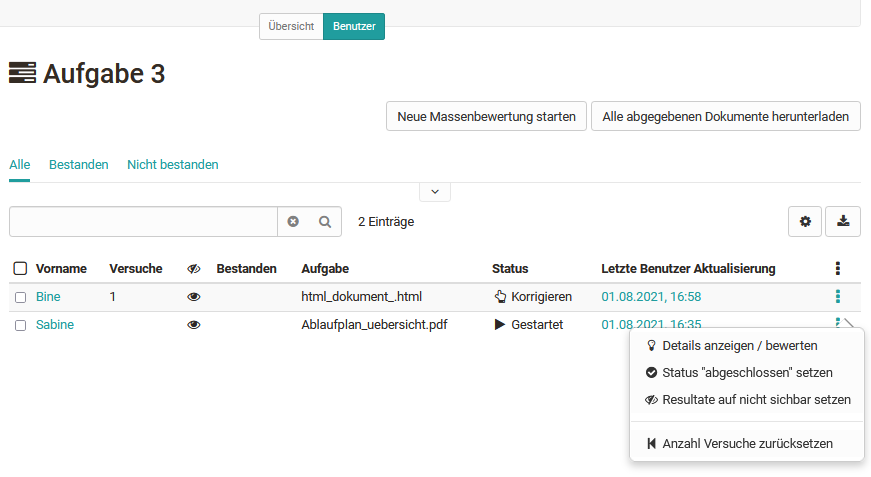
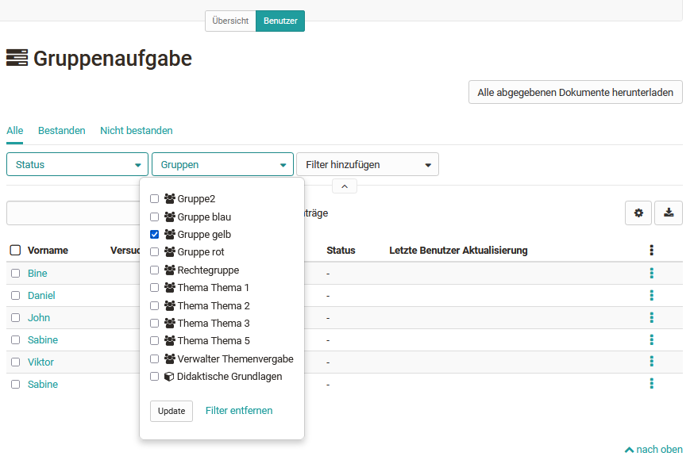
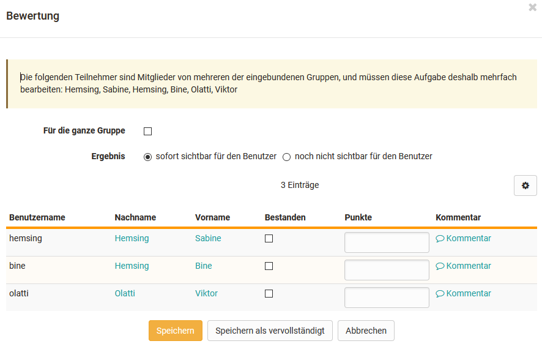

# Assessing tasks and group tasks

Here you will learn how to make assessments for tasks and group tasks using
the OpenOlat "Assessment tool".

Go to the assessment tool, activate the tab "User" and select a task from the
left overview of the assessment elements of the course. In the table you will
now see various action options as well as all assessable persons.

Course coaches and course owners have the possibility via the corresponding
buttons to...

  * download all submitted documents at once
  * start a new bulk assessment and thus assess all participants at once.
  * set the task to the status "completed" for all or several selected participants and thus finally finish the assessment. To do this, the desired participants or all participants must first be selected.
  * set the assessments of the task to visible or invisible for all or several selected participants at once.
  * To send an email to all or specific participants.

To assess tasks and group tasks, first download the solution attempt submitted
by the learner or the last corrected version.

To learn how to assess the tasks of individuals, click here for a [step-by-
step guide](Assessment+of+learners.html).

### Download all submitted documents

If many solution attempts have been uploaded or you need to assess many
learners, it is recommended to download all solution attempts at once using
the "Download all submitted documents" button. In the downloaded folder you
will also find all assignment documents.

Afterwards, you can fill out the [assessment form](The+assessment+form.html).

### Start a new bulk assessment

How to create a bulk assessment for tasks exactly you can learn
[here](+create+a+bulk+assessment+for+submission+tasks.html).

### Assessment workflow course element "Task

In the assessment tool, the assessment workflow described below can be found
above the general assessment form. Alternatively, teachers can also call up
the assessment workflow in the course run. The exact steps available in the
assessment workflow depend on the concrete configuration of the task element.

As soon as a learner has submitted a file via the button "Final submission",
it can be opened and viewed by the teacher.

If desired and configured accordingly, a return document can be uploaded. This
could be, for example, a detailed evaluation table or a revised version of the
submission. It is also possible to return a submission to the learner via the
"Revision" button and trigger a revision loop.

As soon as the assessment of a task is completed and the user should not make
any more submissions or revisions, the button "Accept submission" can be
pressed. This definitely completes the editing and evaluation of a task. A
corresponding message is sent to the user.

Both learners and teachers can see how far the assessment workflow has
progressed by the green ticks next to the individual assessment steps.

Once a user has definitely submitted a task, it is no longer possible for
him/her to re-submit or exchange it. However, if a task was submitted by
mistake or the wrong document was uploaded, the coach can "reopen the
submission" and thus enable the learner to upload another submission.

How a task or group task can be assessed, e.g. with a "pass/fail" or a score,
is defined in the configuration of the course element
"[Task](Task+-+Further+Configurations.html)" or "Group task". In the
assessment tool, the assessment options can no longer be changed.

### Assessment workflow course element "Group task

The evaluation of a group task is done in the "Users" tab by filtering the
desired group. In the following, only the people of this group are displayed.

The assessment workflow appears, similar to the assessment of "Tasks". Return
files can be provided, revisions can be requested, points can be assigned, or
a "pass/fail" can be indicated, etc.

  

The advantage of a group task is that an assessment can be made for all group
members at once using the "Grade" button, but at the same time adjustments can
be made for individual group members.

If not the whole group has passed or not all should receive the same score,
"For the whole group" must not be selected. This makes individual scoring per
user possible.

  

In the course run, the evaluation of the individual groups is even more
intuitive, as all potential groups to be evaluated are displayed directly
here.

If other assessable course elements are to be assessed instead of a "group
task" for a group, the assessments must be made separately for each group
member.

  