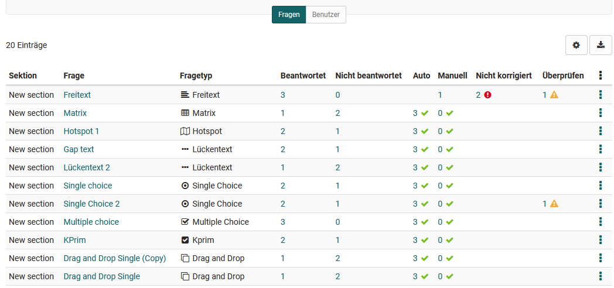
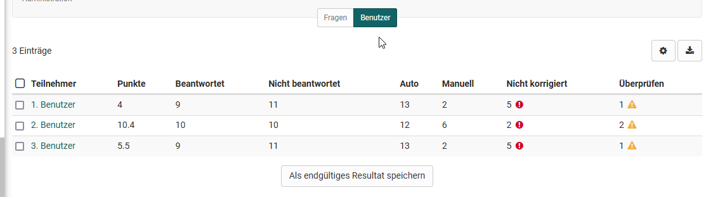
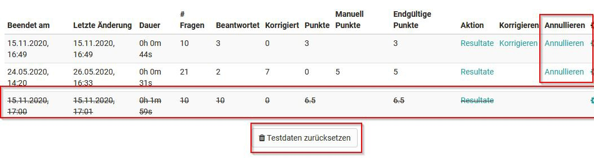
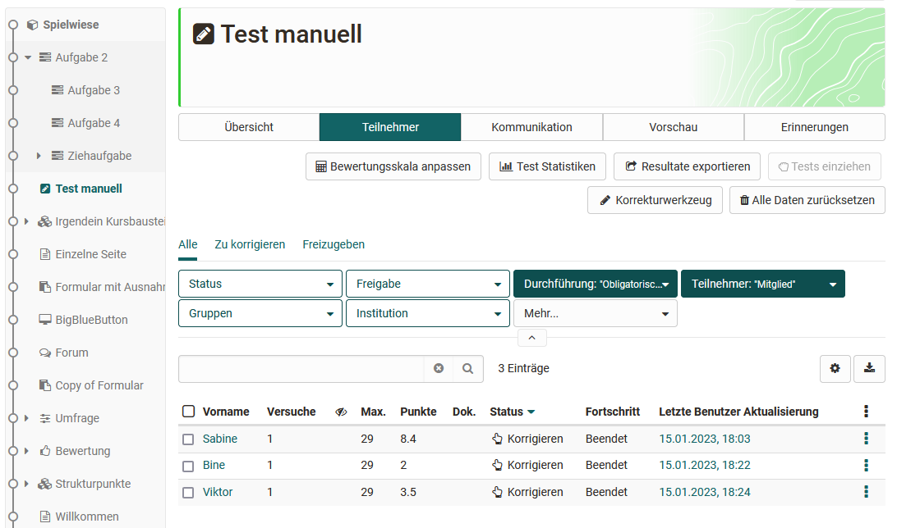

# Tests bewerten

Hier erfahren Sie wie man Bewertungen für Tests mit Hilfe des OpenOlat „Bewertungswerkzeugs“ vornimmt.

Gehen Sie in das Bewertungswerkzeug und wählen Sie in der linken Übersicht, die die Kursstruktur widerspiegelt, den Test aus, den Sie bewerten möchten. Hier finden Sie zwei Tabs: Übersicht und Teilnehmer. 

Im Tab Übersicht erhalten Sie eine Übersicht zur Bewertung dieses Kursbausteins, z.B. wie viele Personen diesen Kursbaustein schon bestanden haben. Im Tab Teilnehmer werden die Kursteilnehmenden angezeigt und die eigentliche Bewertung von Teilnehmenden kann gestartet werden.  

## Tab Teilnehmer

**Generelle Aktionsmöglichkeiten**

{ class="shadow lightbox" }

Kursbetreuer und Kursbesitzer haben über die entsprechenden Buttons die Möglichkeit:

* Sich die Test Statistiken anzuschauen,
* die Resultate aller angezeigten Lernenden als ZIP file zu exportieren,
* Tests einzuziehen, die sich aktuell in Bearbeitung befinden
* die Ergebnisse (Daten) aller bisherigen Tests zurückzusetzen.
* die Bewertung für alle oder mehrere ausgewählte Teilnehmenden auf den Status „abgeschlossen“ zu setzen und damit die Bewertung final zu beenden.
* die Bewertungen der Tests für alle oder mehrere ausgewählte Teilnehmenden auf einen Schlag sichtbar bzw. unsichtbar zu setzen (freigeben).
* die Zeit für die Bearbeitung des Tests zu verlängern.
* eine E-Mail an einen oder mehrere Teilnehmende zu versenden
* die Tests fragenweise zu korrigieren (Button "Korrekturwerkzeug")
* auch die zuvor eingerichtete Bewertungsskala kann noch einmal angepasst werden. 

!!! note "Hinweis"

    Welche Optionen im Detail angezeigt werden hängt teilweise von der Konfiguration des Kursbausteins ab. 

 Die Buttons und Optionen im Detail:   

### Test Statistiken:
Aufrufen der detaillierten Statistik zu jeder Frage eines Tests. Sämtliche Antworten der Lernenden werden dabei berücksichtigt.

### Resultate exportieren:
Hier können die kompletten Testresultate als ZIP file exportiert und somit archiviert werden. Der Titel der ZIP Datei zeigt den Namen des Tests, den zugehörigen Kurs sowie Datum des Downloads an. Der Ergebsnisdownload beinhaltet eine Benutzerübersicht als HTML-Seite, Ordner mit den User-Ergebnissen sowie weitere Dateien. Wenn die Testquittung aktiviert wurde, wird auch diese exportiert.

### Tests einziehen:
Sofern gestartete aber noch nicht abgegebene Tests vorliegen, können diese eingezogen und somit angeschaut werden. Die Tests können auch einmalig nach Ende des Testdurchlaufs eingezogen werden.

### Korrekturwerkzeug: 
Über diesen Button können manuelle Bewertungen _pro Testfrage_ vorgenommen werden. Hier können Punkte vergeben und Kommentare hinzugefügt werden. Die Option erscheint nur bei manueller Bewertung.

!!! note "Hinweis"

    Das Korrekturwerkzeug ist das zentrale Element für die manuelle Bewertung der Tests.

### Testquittung validieren:
Wenn diese Option angewählt wird, wird nach Beenden des Tests eine Testquittung erstellt, welche als XML-File heruntergeladen werden kann. Es dient der Verifizierung des Tests. Das erstellte XML-File kann zusätzlich per Mail an den Teilnehmer verschickt werden, wenn die Option "Testquittung per Mail schicken" aktiviert wird.

### Alle Daten zurücksetzen:
Hiermit werden die Daten des aktuellen Tests zurückgesetzt. Das bedeutet, alle Daten, aller User inklusive Resultate werden unwiderruflich gelöscht. Es ist aber auch möglich nur einzelne Tests von bestimmten Personen zurückzusetzen. Dies erfolgt direkt in den jeweiligen User-Settings.

### Verlängern:
Hier kann die voreingestellte Testzeit verlängert werden.

### Bewertungsskala anpassen
Über diesen Button kann die Bewertungsskala geändert oder ein Wechsel zu einem anderen Bewertungssystem vorgenommen werden.

## Manuelle Bewertung von Testfragen 

Für die manuelle Bewertung der Fragen eines Tests sind grundsätzlich folgende Vorgehensweisen möglich:

a) Bewertung aller User ausgehend von einem einzelnen Test-Item 

b) Bewertung aller manuellen Fragen des Tests ausgehend von einem User 

c) Bewertung einer einzelnen Person

!!! note "Hinweis"

    Für die Bewertung von a) und b) nutzen Sie den Button "Korrekturwerkzeug". 
 

### a) Manuelle Bewertung pro Test-Item - Tab Fragen

Wählen sie den gewünschten Test in der linken Navigation aus und klicken sie auf "Korrekturwerkzeug". Es erscheint eine Übersicht aller Fragen des Tests mit dem Bewertungsstand. 

{ class="shadow lightbox" } 

Die Spalten geben darüber Auskunft an welchen Stellen noch etwas zu tun ist: 

* Auto: Fragen, die automatisch vom System korrigiert wurden, erst einmal kein Handlungsbedarf aber die Punkte können hier auch überschrieben werden.
* Manuell: Fragen, die manuell korrigiert werden müssen
* Nicht korrigiert: Fragen, die noch nicht korrigiert sind. Hier sollte man aber erst mal prüfen ob für diese Frage auch Antworten eingereicht wurden (Spalte "Beantwortet").
* Überprüfen: Fragen, die für eine weitere Überprüfung markiert wurden. 

Sortieren Sie die Test-Items (Fragen) für die Spalte "Manuell" oder "Nicht korrigiert" um sich einen Überblick über die ausstehenden Bewertungen zu verschaffen.

Klicken sie dann auf den Fragentitel des zu korrigierenden Items und Sie gelangen in das Bewertungsformular. Hier können sie nun Punkte und Kommentare hinterlassen und bei Bedarf die Korrektur auch "Zur Überprüfung markieren". 
Für automatisiert auswertbare Items können Sie sich auch die Lösungen anzeigen lassen oder die Punkte überschreiben. 

Mehrere Korrektoren können gleichzeitig Bewertungen für einen Test vornehmen. Ist eine Frage durch eine/n KorrektorIn bereits in Bearbeitung, wird diese automatisch für andere gesperrt. In der Administration kann für diesen Korrekturprozess festgelegt werden, ob die Benutzer dabei anonym (Benutzer 1, Benutzer 2, ...) aufgeführt werden sollen.

Abschliessend speichern Sie die Eingaben und können zum nächsten Benutzer wechseln oder zurück in die Itemübersicht des Korrekturwerkzeug gehen und das nächste Item auswählen 

### b) Manuelle Bewertung pro Benutzer - Tab Benutzer

Wählen sie den gewünschten Test in der linken Navigation aus und klicken sie auf "Korrekturwerkzeug". Es erscheint eine Übersicht aller Fragen des Tests mit dem Bewertungsstand. 

Im Tab Benutzer sehen Sie eine (anonymisierte) Übersicht der zu bewertenden Benutzer sowie deren aktuellen Bewertungsstand für den gewählten Test. 

Wählen sie hier einen bzw. den ersten Benutzer aus und Sie gelangen in die Bewertungsübersicht dieser Person für einen Test. Hier wählen Sie die gewünschte Frage aus und nehmen die Bewertung im Bewertungswerkzeug vor (siehe a)). Anschliessend den nächsten Benutzer wählen bis alle Bewertungen erledigt wurden.

### c) Manuelle Bewertung ausgehend von einer einzelnen Person

Falls nur eine einzelne Person bewertet werden soll bietet sich folgender Weg an: 

Wählen sie den gewünschten Test in der linken Navigation aus und wählen sie den Tab "Teilnehmer". Klicken Sie dann auf den Namen der zu bewertenden Person. Es erscheint eine Liste mit allen Testversuchen dieser Person. Wählen Sie hier den aktuellen Versuch aus und klicken auf "Korrigieren".

{ class="shadow lightbox" }

Man landet wieder in der Test-Item Übersicht mit allen Fragen des Tests und kann sich einen Überblick über den Bearbeitungsstand verschaffen und die Bewertungen vornehmen (siehe a)

## Tests zurücksetzen oder annullieren

Von Lernenden durchgeführte Test-Versuche können auch rückgängig gemacht werden. Dafür wird der entsprechende Test einer Person aufgerufen und dann die Option "Annullieren" oder "Testdaten zurücksetzen" gewählt.

{ class="shadow lightbox" }

Beim **annullieren** wird ein einzelner Versuch als ungültig markiert. Das bedeutet der Versuch erscheint weiter in der Liste und kann vom Lehrenden eingesehen und sogar wieder aktiviert werden, wird aber nicht mehr als Ergebnis für den Lernenden berücksichtigt. Hat der User mehrere Versuche durchgeführt, wird der zeitlich nächste Versuch als Ergebnis berücksichtigt.
Die Anzahl der angezeigten Versuche ändert sich dadurch aber nicht. Ist also ein Test z.B. auf drei Versuche eingeschränkt und hat der User drei Versuche unternommen, stehen ihm keine weiteren Versuche zur Verfügung auch wenn einer oder mehrere der Versuche annulliert wurden.

Liegt nur ein Versuch vor und wird dieser annulliert, ändert sich die Tabellenanzeige im Bewertungswerkzeug nicht. Der annullierte Versuch mit den zugehörigen Punkten wird weiterhin angezeigt.

Im Gegensatz zum annullieren führt **„Testdaten zurücksetzen“** dazu, dass alle Versuche komplett gelöscht werden, die Anzahl der Versuche somit auf 0 gesetzt wird.

## Bewertung im Kursrun

Neben der Bewertung im Bewertungswerkzeug können auch einzelne Tests im Kursrun bei geschlossenem Editor bewertet werden. Die Bewertungsmöglichkeiten in den Tabs "Übersicht" und "Teilnehmer" sind überwiegend identisch. Allerdings gibt es im Kursrun noch die Tabs "Kommunikation", "Vorschau" und "Erinnerungen". 

Die Vorschau zeigt die User-Perspektive an und im Tab "Erinnerungen" besteht die Möglichkeit eine Erinnerungsmail für bestimmte Bedingungen der Test-Bearbeitung z.B. bei einer bestimmten Punktzahl, bestimmter Anzahl der Versuche oder beim bestehen/nicht bestehen zu verschicken (siehe [Erinnerung](Course_Reminders.de.md)). Der Tab "Kommunikation" ist für die Kommunikation während eines laufenden Tests z.B. im Rahmen von Online-Klausuren gedacht.

){ class="shadow lightbox" }
