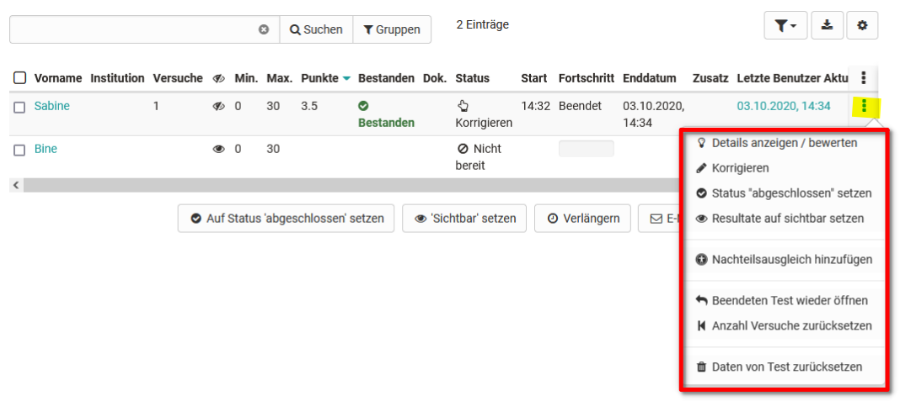
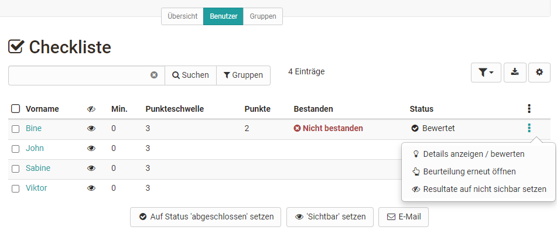
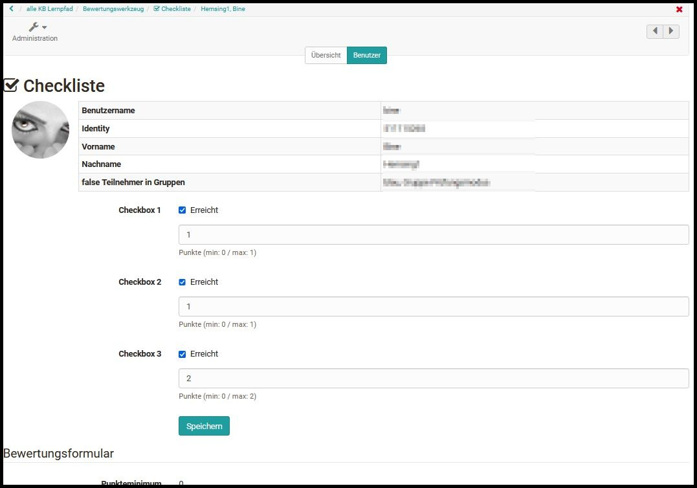
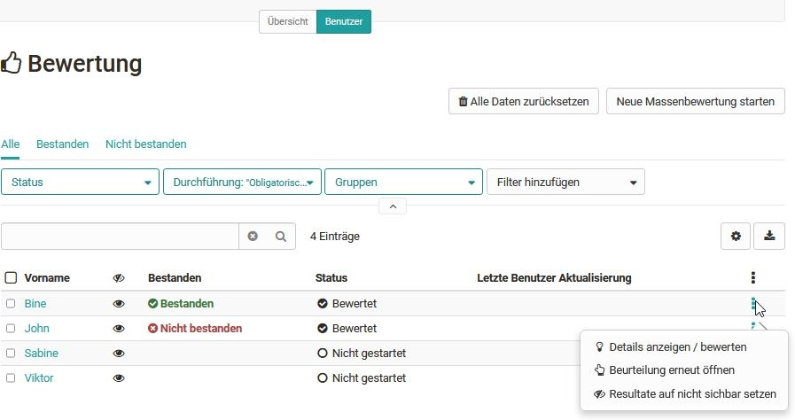
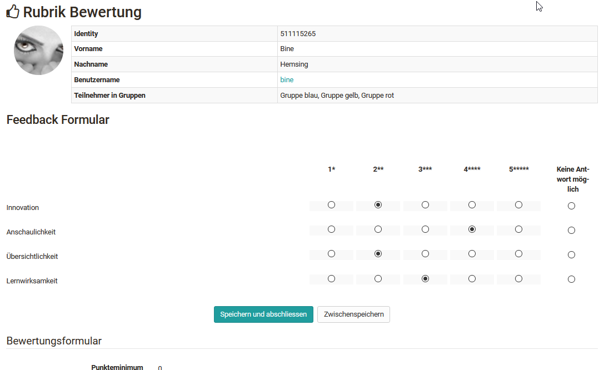
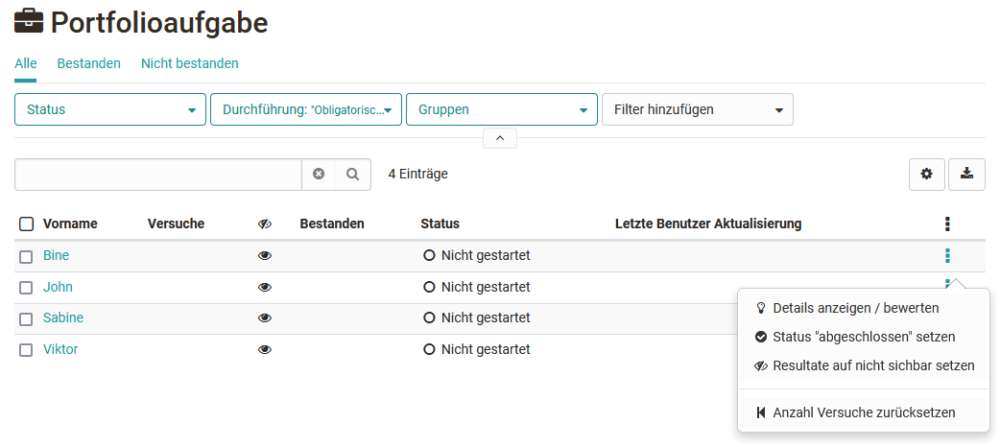
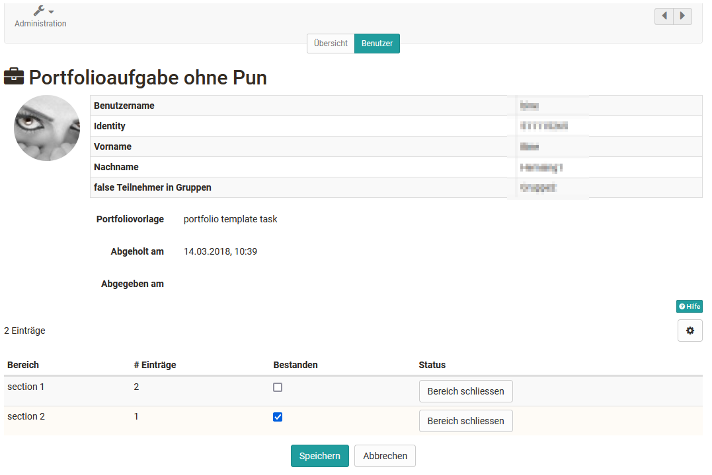

# Bewertung von Kursbausteinen

Im Bewertungswerkzeug können die Bewertungen für die folgenden Kursbausteine vorgenommen werden.

* Checkliste
* Bewertung
* Portfolioaufgabe
* Kursbaustein "Struktur oder gesamte Kursbewertung
* Integrierte externe Bausteine
* [Aufgabe und Gruppenaufgabe](Assessing_tasks_and_group_tasks.de.md)
* [Tests](Assessing_tests.de.md)

Hier werden zunächst die generellen Aspekte erläutert und anschließend die Spezifika der einzelnen bewertbaren Kursbausteine mit den zugehörigen Bewertungsformularen behandelt.

## Das 3-Punkte Menü

{ class="shadow lightbox" }

Über das 3-Punkte Menü stehen zentrale Optionen im Bewertungskontext zur Verfügung:

* **Details anzeigen/bewerten:** um zu den jeweiligen Bewertungen oder Testergebnissen zu gelangen *
* **Korrigieren:** um bei Tests eine manuelle Bewertung vorzunehmen und z.B. Freitextfelder zu bewerten
* **Status auf abgeschlossen setzen** bzw. **Beurteilung erneut öffnen:** je nach vorherigem Status *
* **Resultate auf sichtbar / nicht sichtbar:** so sehen die Lernenden die Ergebnisse bzw. sehen sie nicht *
* **Testzeit verlängern:** wenn sich der Test im Status „gestartet“ befindet
* **Laufenden Test einziehen:** dadurch werden die bisher ausgefüllten Daten für die Bewertung verwendet und können vom Lehrenden eingesehen werden.
* **Nachteilsausgleich hinzufügen:** auf diesem Weg können einzelnen Personen zusätzliche Zeit für die Bearbeitung eines Test erhalten, z.B. aufgrund eines Handicaps.
* **Beendeten Test wieder öffnen:**. Testteilnehmende können den Test dort weiterführen, wo sie aufgehört haben. Falls der Test auf 1 Versuch beschränkt ist, müssen außerdem die Versuche zurückgesetzt werden, damit der Testteilnehmende den Test weiterführen kann.
* **Anzahl Versuche zurücksetzen:** hiermit wird die Anzahl der Versuche eines Assessmentbausteins auf 0 gesetzt, die eigentlichen Daten bleiben erhalten
* **Daten von Test zurücksetzen:** alle Daten werden gelöscht

Die mit einem * gekennzeichneten Optionen stehen für alle Assessmentbausteine zur Verfügung. Die anderen Optionen sind abhängig vom Kursbaustein und der vorgenommenen Konfiguration des Bausteins.

!!! info Hinweis

    Achten Sie darauf, dass in der Tabellenübersicht das 3-Punkte Symbol eingeblendet ist. Hierüber haben Sie schnell Zugriff auf bestimmte Aktionen zur Bewertung der Lernenden.

!!! info Bewertung abschliessen

    Ist der gesamte Bewertungsflow beendet, sollte dies dem User durch Aktivierung der Option **Auf Status 'abgeschlossen' setzen** mitgeteilt werden. Alle (ausgewählten) Benutzer bekommen dann den Status "Bewertet" angezeigt.

## Checkliste

Die Bewertung des Kursbausteins „Checkliste“ umfasst folgende Möglichkeiten:

{ class="shadow lightbox" }

Die Checkboxen der einzelnen Benutzer können manuell nachgetragen und das Bewertungsformular ausgefüllt werden. Abhängig von der Kursbaustein Konfiguration können entweder Punkte und/oder das Attribut Bestanden vergeben werden. Weitere Informationen zur Checkliste finden Sie [hier](../course_elements/Knowledge_Transfer.de.md).

{ class="shadow lightbox" }

## Bewertung

Die Bewertung des Kursbausteins „Bewertung“ umfasst folgende Möglichkeiten:

{ class="shadow lightbox" }

Der Button „Statistik“ steht nur bei der Verwendung einer Rubrik-Bewertung zur Verfügung.

Zur Bewertung des Kursbausteins „Bewertung“ füllen Sie das entsprechende Bewertungsformular aus und nutzen, sofern verknüpft, das zugeordenete Rubrik Bewertungsformular.

{ class="shadow lightbox" }

Haben Sie ein [Rubrik](../forms/Rubric.de.md) als Bewertungsgrundlage hinterlegt, können Sie schnell und effektiv eine Kriterien basierte Bewertung vornehmen. Hier ein
Beispiel:

{ class="shadow lightbox" }

Darüber hinaus ist für den Kursbaustein „Bewertung“ auch eine Massenbewertung möglich.

## Portfolioaufgabe

Die Bewertung des Kursbausteins [Portfolioaufgabe](../portfolio/Creating_Portfolio_Tasks.de.md) umfasst folgende Möglichkeiten:

{ class="shadow lightbox" }

Die Bewertung für das Portfolio ist im Bewertungswerkzeug dieselbe wie im Tab ["Bewertung" im Portfolio](../portfolio/Portfolio_assignment_Grading.de.md) selbst. Hier können die einzelnen Bereiche jedoch nicht geöffnet, sondern nur bewertet werden. Es empfiehlt sich deshalb, die Bewertung direkt im Portfolio vorzunehmen.

{ class="shadow lightbox" }

## Kursbaustein Struktur oder gesamte Kursbewertung

Wird bei der Konfiguration des Kursbausteins „Struktur“ im Tab „Punkte“ die Option „Punkte berechnen“ und/oder bestanden eingerichtet, erscheinen die berechneten Gesamtpunkte auch in der Übersicht im Bewertungswerkzeug. Diese Werte werden automatisch generiert und können im Bewertungswerkzeug nicht verändert werden.

Jeder Baustein, der in die Berechnung miteinbezogen werden soll, muss zuerst ausgewählt werden. Dadurch ist es möglich, die Gesamtsumme nur mit den gewünschten Kursbausteinen zu berechnen, beispielsweise ein Punktwert für alle Einsendeaufgaben und ein Punktwert für alle Tests. Achtung, das funktioniert nur ber herkömmlichen Kursen.

!!! info Hinweis

    Die Einrichtung der Bewertung von [Strukturbausteinen](../course_elements/Course_Element_Structure.de.md) erfolgt im Kurseditor. Im Bewertungswerkzeug werden nur die Ergebnisse angezeigt.

!!! tip Tipp

    Die Anzeige der Punkte per Struktur Baustein bietet sich immer dann an, wenn man für den gesamten Kurs oder für bestimmte Abschnitte eine Kombination von Punkten automatisch berechnen möchte. Verwenden sie in diesem Fall am besten einen herkömmlichen Kurs.

## Integrierte externe Bausteine

### SCORM

Für das SCORM-Element kann das Bewertungsformular ausgefüllt werden. Wichtig ist, dass im Kursbaustein unter Lerninhalt entweder die Punktzahl oder Bestanden übertragen ausgewählt ist. Mehr Informationen dazu finden Sie [hier](../course_elements/Knowledge_Transfer.de.md).

### LTI

Auch für das LTI-Element kann das Bewertungsformular ausgefüllt und angepasst werden. Im Kursbaustein unter Seiteninhalt muss zwingend "Punkte übertragen" ausgewählt sein. Je nachdem muss ein Skalierungsfaktor eingetragen und die Punktzahl für das Bestehen definiert werden. Weitere Informationen zur Konfiguration von LTI-Seiten finden Sie [hier](../course_elements/Knowledge_Transfer.de.md).
