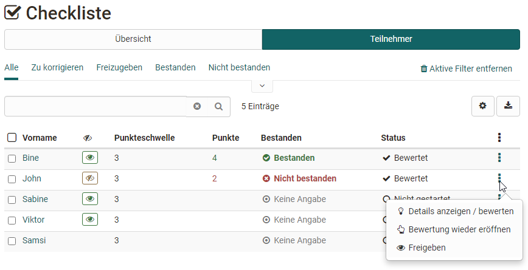
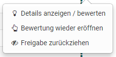
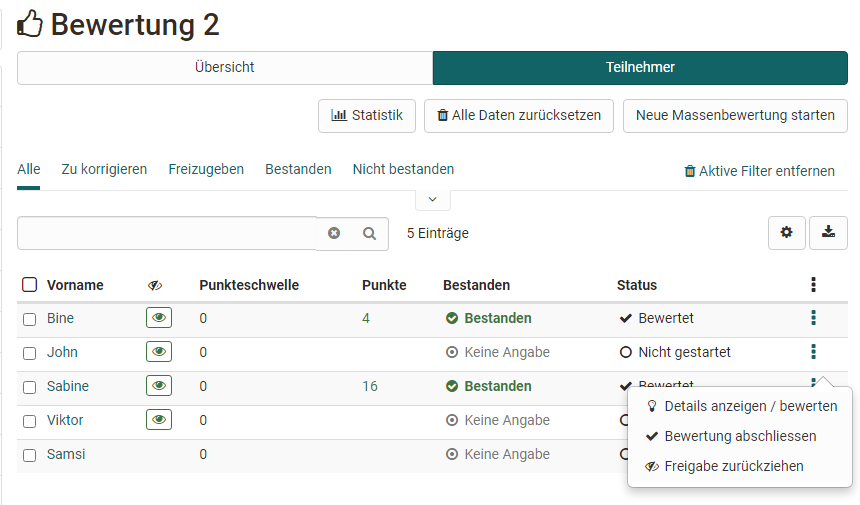
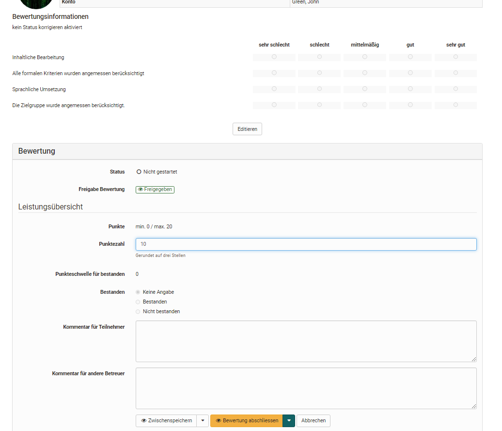

# Bewertung von Kursbausteinen

Hier erfahren Sie welche Optionen Ihnen bei der Bewertung mit den unterschiedlichen Kursbausteinen zur Verfügung stehen. 

Generell können im Bewertungswerkzeug  Bewertungen für die folgenden Kursbausteine vorgenommen werden:

* Checkliste
* Bewertung
* Portfolioaufgabe
* Kursbaustein "Struktur" sowie gesamte Kursbewertung
* Integrierte externe Bausteine wie SCORM
* [Aufgabe und Gruppenaufgabe](Assessing_tasks_and_group_tasks.de.md)
* [Tests](Assessing_tests.de.md)

Es werden zunächst die generellen Aspekte erläutert und anschließend die Spezifika der einzelnen bewertbaren Kursbausteine behandelt. Die Bewertung von Aufgaben/Gruppenaufgaben und Tests finden Sie auf separaten Seiten. 

## Das 3-Punkte Menü
{ class="shadow lightbox" }

Über das 3-Punkte Menü stehen für die Bewertung der Kursbausteine zentrale Optionen im Bewertungskontext zur Verfügung:

* **Details anzeigen/bewerten:** um zu den jeweiligen Bewertungen oder Testergebnissen und dem Bewertungsformular zu gelangen 

* **Bewertung abschliessen** bzw. **Bewertung wieder eröffnen:** je nach vorherigem Status 

* **Freigeben** bzw. **Freigabe zurückziehen** um die Sichtbarkeit zu definieren, visualisiert durch das Auge 

Folgende Optionen stehen zusätzlich für Tests zur Verfügung: 

* **Resultate als PDF** für den Download von Testresultaten
* **Beendeten Test wieder öffnen:** Testteilnehmende können den Test dort weiterführen, wo sie aufgehört haben. Falls der Test auf 1 Versuch beschränkt ist, müssen außerdem die Versuche zurückgesetzt werden, damit der Testteilnehmende den Test weiterführen kann.
* **Anzahl Versuche zurücksetzen:** hiermit wird die Anzahl der Versuche eines Assessmentbausteins auf 0 gesetzt, die eigentlichen Daten bleiben erhalten
* **Daten von Test zurücksetzen:** alle Daten werden gelöscht
* **Nachteilsausgleich hinzufügen:** auf diesem Weg können einzelnen Personen zusätzliche Zeit für die Bearbeitung eines Tests erhalten, z.B. aufgrund eines Handicaps.
* **Testzeit verlängern:** wenn sich der Test im Status „gestartet“ befindet
* **Laufenden Test einziehen:** dadurch werden die bisher ausgefüllten Daten für die Bewertung verwendet und können vom Lehrenden eingesehen werden.

!!! info "Hinweis"

    Achten Sie darauf, dass in der Tabellenübersicht das 3-Punkte Symbol eingeblendet ist. Hierüber haben Sie schnell Zugriff auf bestimmte Aktionen zur Bewertung der Lernenden.

## Checkliste
Die Bewertung des Kursbausteins „Checkliste“ umfasst die drei genannten Optionen:

{ class="shadow lightbox" }

Durch Klick auf den Namen eines Users gelangt man zur konkreten Bewertung. 

Die Checkboxen der einzelnen Benutzer können manuell nachgetragen und das Bewertungsformular ausgefüllt werden. Abhängig von der Kursbaustein Konfiguration können entweder Punkte und/oder das Attribut Bestanden vergeben werden. Weitere Informationen zur Checkliste finden Sie [hier](../course_elements/Course_Element_Checklist.de.md).

{ class="shadow lightbox" }

## Bewertung
Die Bewertung des Kursbausteins „Bewertung“ 
umfasst folgende Optionen:

{ class="shadow lightbox" }

Der Button „Statistik“ steht nur bei der Verwendung einer Rubrik-Bewertung zur Verfügung. 
Der Button "Bewertungsskala anpassen" steht nur zur Verfügung wenn zuvor im Kurseditor eine Bewertungsskala für den Kursbaustein aktiviert wurde. 

Durch Klick auf den Namen eines Users gelangt man zur konkreten Bewertung. Hier füllen Sie das entsprechende Bewertungsformular aus und nutzen, sofern verknüpft, das zugeordnete Rubrik Bewertungsformular.

{ class="shadow lightbox" }

Haben Sie ein [Rubrik](../forms/Rubric.de.md) als Bewertungsgrundlage hinterlegt, können Sie schnell und effektiv eine Kriterien basierte Bewertung vornehmen. Hier ein
Beispiel:

{ class="shadow lightbox" }

Darüber hinaus ist für den Kursbaustein „Bewertung“ auch eine Massenbewertung möglich.

## Portfolioaufgabe
Die Bewertung des Kursbausteins [Portfolioaufgabe](../portfolio/Creating_Portfolio_Tasks.de.md) umfasst folgende Möglichkeiten:

{ class="shadow lightbox" }

Die Bewertung für das Portfolio ist im Bewertungswerkzeug dieselbe wie im Tab ["Bewertung" im Portfolio](../portfolio/Portfolio_assignment_Grading.de.md) selbst. Hier können die einzelnen Bereiche jedoch nicht geöffnet, sondern nur bewertet werden. Es empfiehlt sich deshalb, die Bewertung direkt im Portfolio vorzunehmen.

{ class="shadow lightbox" }

## Kursbaustein Struktur oder gesamte Kursbewertung
Der Kursbaustein „Struktur“ erscheint ebenfalls im Bewertungswerkzeug. Sofern für den Kurs generell Punkte aktiviert wurden werden hier die aufaddierten Punkte der untergeordneten bewertbaren Kursbausteine angezeigt. Allerdings können hier nicht manuell Punkte vergeben oder Bewertungen vorgenommen werden. Stattdessen wird der aktuelle Punkte-Status angezeigt. 

Bei Lernpfad-Kursen werden automatisch die Ergebnisse aller untergeordneten Assessmentbausteine berücksichtigt. Bei herkömmlichen Kursen können die zu berücksichtigenden Kursbausteine im Kurseditor im Tab „Punkte“ gezielt ausgewählt werden.
Der oberste Kursbaustein ist ebenfalls ein Strukturbaustein, deshalb werden hier die Punkte des gesamten Kurses zusammengezählt.

!!! tip "Tipp"

    Die Anzeige der Punkte per Struktur-Baustein bietet sich immer dann an, wenn man für den gesamten Kurs oder für bestimmte Abschnitte eine Kombination von Punkten automatisch berechnen möchte. Verwenden sie in diesem Fall am besten einen herkömmlichen Kurs.

## Integrierte externe Bausteine
### SCORM
Für das SCORM-Element kann das Bewertungsformular ausgefüllt werden. Wichtig ist, dass im Kursbaustein unter Lerninhalt entweder die Punktzahl oder Bestanden übertragen ausgewählt ist. Mehr Informationen dazu finden Sie [hier](../course_elements/Course_Element_SCORM_Learning_Content.de.md).

### LTI
Auch für das LTI-Element kann das Bewertungsformular ausgefüllt und angepasst werden. Im Kursbaustein unter Seiteninhalt muss zwingend "Punkte übertragen" ausgewählt sein. Je nachdem muss ein Skalierungsfaktor eingetragen und die Punktzahl für das Bestehen definiert werden. Weitere Informationen zur Konfiguration von LTI-Seiten finden Sie [hier](../course_elements/Other.de.md)