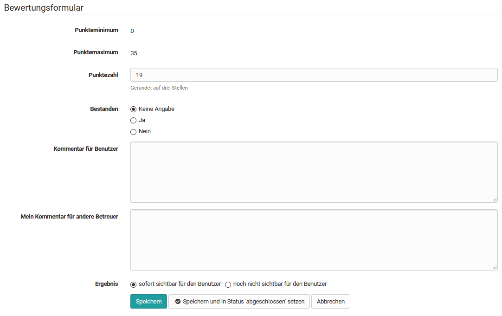

# Assessment of course modules

In the assessment tool, assessments can be made for the following course
elements.

  * [Task and group task](Assessing_tasks_and_group_tasks.md) 
  * [Tests](https://confluence.openolat.org/display/OO153DE/Tests+bewerten)

Here, the general aspects are explained first and then the specifics of the
individual assessable course elements with the associated assessment forms are
addressed.

### The 3-point menu

The gear wheel icon provides key options in the assessment context. These
include:

  * * " **Show details/assess** " to access the respective evaluations or test results.
  * " **Correction** " to make a manual assessment in the case of tests and to assess free text fields, for example.
  * * **"Set status 'done'** " or " **Reopen assessment** ", depending on the previous status.
  * * " **Set** **results visible / not yet visible for user**. This allows learners to see or not see the results.
  * " **Extend test time** " if the test is in "started" status.
  * " **Retract running test** ", this way the previously completed data will be used for assessment and can be viewed by the teacher.
  * " **Add disadvantage compensation** ", this way individuals can get additional time to complete a test, e.g. due to a handicap.
  * " **Reopen finished test** ". The test taker can continue the test where they left off. In addition, if the test is limited to 1 attempt, the attempts must be reset in order for the test taker to continue the test.
  * " **Reset number of attempts** ", this will set the number of attempts of an assessment module to 0 but the actual data will remain.
  * " **Reset data from test** ". All data will be deleted.

The options marked with * are available for all assessment elements. The other
options depend on the course element and the configuration of the element.

Make sure that the 3-point menu icon is displayed in the table overview. This
gives you quick access to specific actions for assessing learners.

Once the entire rating flow is complete, the user should be notified of this
by activating the "Set to status 'completed'" option. All (selected) users
will then be shown the status "Assessed".

## Checklist

The assessment of the course element "Checklist" includes the following
options:

The checkboxes of the individual users can be added manually and the
assessment form can be filled in. Depending on the course element
configuration, either points and/or the attribute Passed can be assigned.
Further information on the checklist can be found

sites/manual_user/docs/course_operation/Assessment_of_course_modules.md §Course_Element_Checklist.md§ 481
[here](../course_elements/Course_Element_Checklist.md).

## Assessment

The assessment of the course element "Assessment" includes the following
options:

The button "Statistics" is only available when using a rubric assessment.

To assess the course element "Assessment", fill in the corresponding
assessment form.

If you have stored a rubric as the basis for assessment, you can quickly and
effectively carry out a criteria-based assessment. Here is an example:

In addition, bulk assessment is also possible for the course element
"Assessment".

## Portfolio task

The assessment of the course element "[Portfolio

sites/manual_user/docs/course_operation/Assessment_of_course_modules.md §Creating_Portfolio_Tasks.md§ 481
task](../portfolio/Creating_Portfolio_Tasks.md)" includes the following options:

The assessment for the portfolio is the same in the assessment tool as in the

sites/manual_user/docs/course_operation/Assessment_of_course_modules.md §Process_of_an_assessment_portfolio.md§ 481
["Assessment" tab in the portfolio](../portfolio/Process_of_an_assessment_portfolio.md)
itself. However, the individual areas cannot be opened here, only assessed. It
is therefore recommended to perform the assessment directly in the portfolio.

## Course element "Structure" or total course assessment

If the option "Calculate score" and/or passed is set up in the " Score" tab
when configuring the course element "Structure", the calculated total points
will also appear in the overview in the assessment tool. These values are
generated automatically and cannot be changed in the assessment tool.

Each module that is to be included in the calculation must first be selected.
This makes it possible to calculate the total using only the desired course
elements, for example, one point value for all the assignments and one point
value for all the tests.

Setting up the assessment of [structural

sites/manual_user/docs/course_operation/Assessment_of_course_modules.md §Course_Element_Structure.md§ 481
elements](../course_elements/Course_Element_Structure.md) is done in the course
editor. Only the results are displayed in the assessment tool.

The display of scores per structure module is always useful if you want to
automatically calculate a combination of scores for the entire course or for
certain sections.

## Integrated external modules

###  
SCORM

For the SCORM element the assessment form can be filled in. It is important
that either Score or Transfer Passed is selected in the course element under
Learning Content. More information can be found

sites/manual_user/docs/course_operation/Assessment_of_course_modules.md §Course_Element_SCORM_Learning_Content.md§ 481
[here](../course_elements/Course_Element_SCORM_Learning_Content.md).

### LTI

The assessment form can also be filled out and customized for the LTI element.
In the course element under Page content, it is mandatory that "Transfer
points" is selected. Depending on this, a scaling factor must be entered and
the passing score defined. Further information on configuring LTI pages can be

sites/manual_user/docs/course_operation/Assessment_of_course_modules.md §Other.md§ 481
found [here](../course_elements/Other.md).

  

