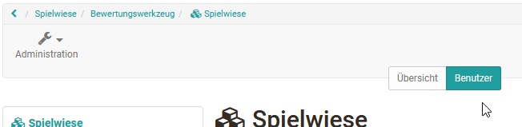
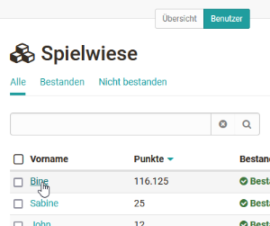
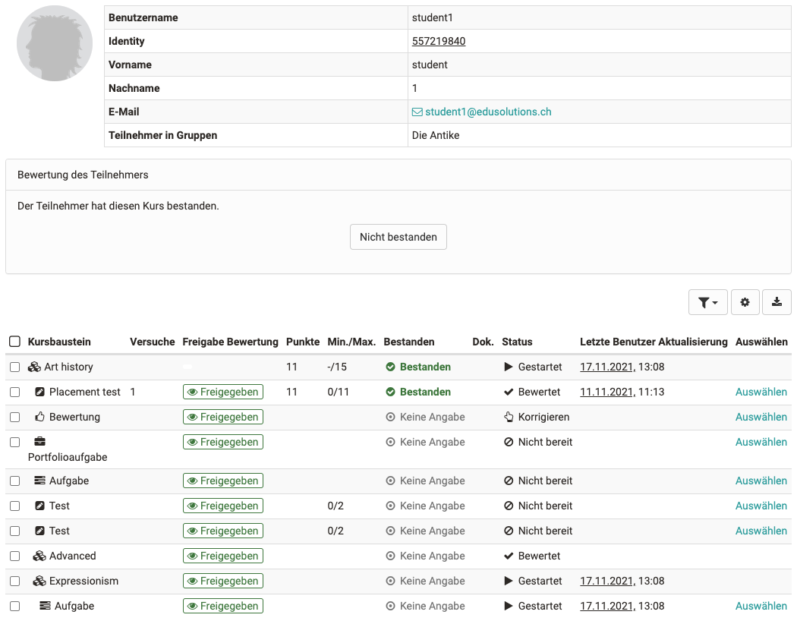
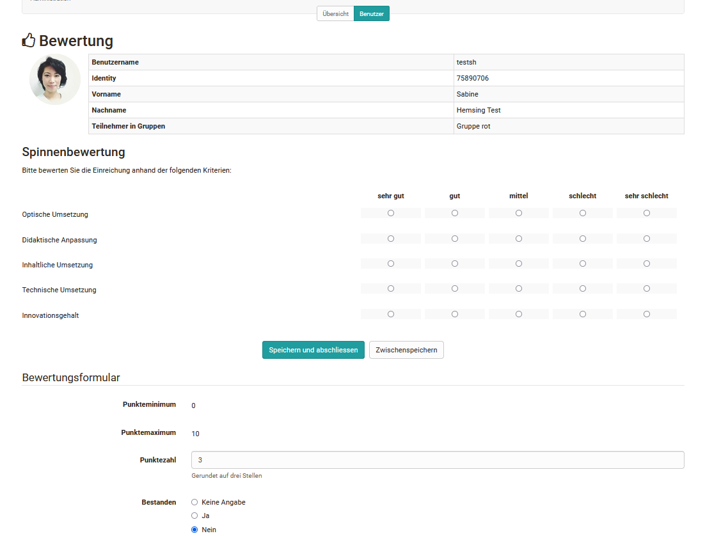
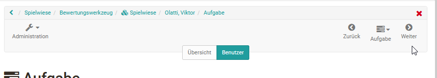
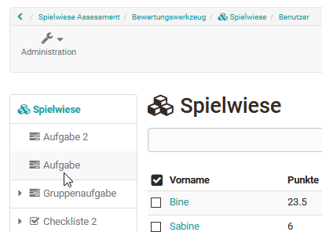
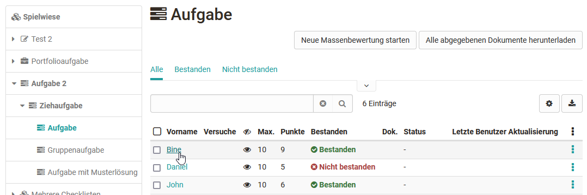
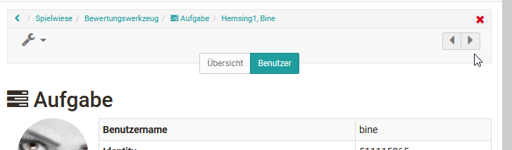

# Lernende bewerten

## So bewerten Sie alle bewertbaren Kursbausteine einer Person:

Gehen Sie in das Bewertungswerkzeug und folgen Sie diesen Schritten:

1\. Tab Benutzer auswählen

|

  
  
---|---  
  
2\. Hier wählen Sie nun die gewünschte Person aus, indem Sie auf den
jeweiligen Namen klicken.

|

  
  
3\. Es erscheint eine Übersicht mit allen Assessmentbausteinen des Kurses
inklusive Bearbeitungsstand der Person (Leistungsnachweis). Hier wählen Sie
nun nacheinander die Kursbausteine aus die Sie bewerten möchten.

|

  
  
4\. Sie gelangen nun zum [Bewertungsformular ](The_assessment_form.de.md)des
jeweiligen Kursbausteins. Die genauen Möglichkeiten sind vom Bausteintyp und
den zugehörigen Einstellungen abhängig.

|

  
  
5\. Über die "Weiter" Pfeile rechts oben können sie bei Bedarf zum nächsten
bewertbaren Kursbaustein für diese Person navigieren.

|

  
  
## So bewerten Sie die Lösungen eines bestimmten Kursbausteins:

1\. Tab Benutzer auswählen

|

  

  
---|---  
  
2\. Gewünschten Kursbaustein in der linken Liste auswählen. Anschließend
erscheinen die Bearbeitungen zu diesem Baustein in der Tabellenübersicht.

|

  
  
3\. Hier wählen Sie nun die gewünschte einzelne Person aus, indem Sie auf den
jeweiligen Namen klicken.

|

  
  

sites/manual_user/docs/course_operation/Assessment_of_learners.de.md §The_assessment_form.de.md§ 481
4\. Sie gelangen nun zum [Bewertungsformular](The_assessment_form.de.md) des
jeweiligen Kursbausteins. Die genauen Möglichkeiten sind vom Bausteintyp und
den zugehörigen Einstellungen abhängig.

|

  
  
5\. Über die Pfeile rechts oben können sie bei Bedarf zur nächsten bewertbaren
Person für diesen Baustein navigieren.

|

  
  

sites/manual_user/docs/course_operation/Assessment_of_learners.de.md §Assessing_tasks_and_group_tasks.de.md§ 481
Die Kursbausteine „[Aufgabe](Assessing_tasks_and_group_tasks.de.md)“ und

sites/manual_user/docs/course_operation/Assessment_of_learners.de.md §Assessment_of_course_modules.de.md§ 481
„[Bewertung](Assessment_of_course_modules.de.md)“ bieten auch die Möglichkeit
der Massenbewertung.

Wollen Sie alle oder sehr viele Benutzer auf einmal bewerten können Sie eine
„Neue Massenbewertung starten“. Hierfür erstellen Sie eine Bewertung in einem
Tabellenprogramm und fügen die Daten per copy+paste in das Feld der
Massenbewertung ein. Weitere Informationen zur Massenbewertung finden Sie

sites/manual_user/docs/course_operation/Assessment_of_learners.de.md §create_a_bulk_assessment_for_submission_tasks.de.md§ 481
[hier](../how-to/create_a_bulk_assessment_for_submission_tasks.de.md).

Um alle Mitglieder einer Gruppe zu bewerten können Sie sich über die
Filterfunktion im Tab "Benutzer" ausschließlich die jeweiligen
Gruppenmitglieder anzeigen lassen und diese dann entsprechend der
Kursbausteine oder pro Person, wie zuvor beschrieben, bewerten.

  

  

