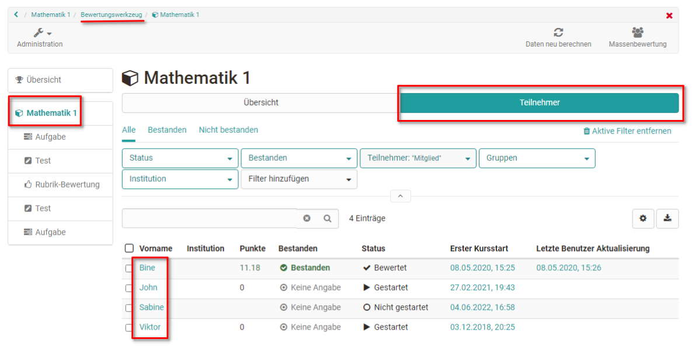
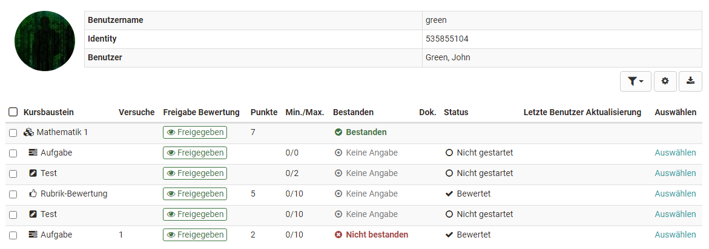
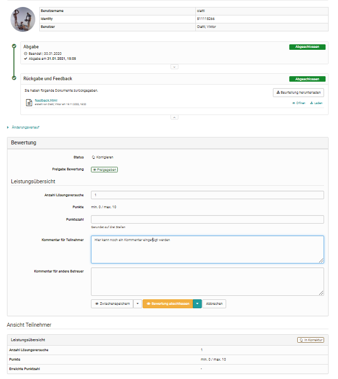
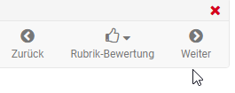

# Lernende bewerten

## So bewerten Sie alle bewertbaren Kursbausteine einer Person

Gehen Sie in das Bewertungswerkzeug und folgen Sie diesen Schritten:

1. Klicken sie in der linken Spalte auf den Namen des Kurses (oberster Kursknoten) und wählen Sie den Tab "Teilnehmer".

      
      
2. Es erscheint der aktuelle Gesamtbewertungsstand aller Kursteilnehmenden. Wählen Sie nun die Person aus, die Sie bewerten wollen indem Sie auf den jeweiligen Namen klicken.
  
3. Nun sieht man den aktuellen Bewertungsstand der gewählten Person für alle bewertbaren Kursbausteine in einer Gesamtübersicht. 

    
Wählen Sie einen Kursbaustein aus um die Bewertung vorzunehmen. 
  
4. Sie gelangen zum [Bewertungsformular](The_assessment_form.de.md) des
jeweiligen Kursbausteins und können dort alle relevanten Aktionen vornehmen. Die genauen Möglichkeiten sind vom Bausteintyp und den zugehörigen Einstellungen abhängig.

    
  
5. Über die "Weiter" Pfeile rechts oben können sie bei Bedarf zum nächsten
bewertbaren Kursbaustein für diese Person navigieren.

  
  
## So bewerten Sie die Lösungen ausgehend von einem bestimmten Kursbaustein

1. Wählen Sie in der linken Navigation den gewünschten Kursbaustein aus und klicken Sie auf den Tab "Teilnehmer". 

    

    Es werden wieder alle zu bewertenden Teilnehmenden angezeigt, dieses Mal aber nicht für den gesamten Kurs, sondern nur für den gewählten Kursbaustein. 

2. Klicken Sie auf den Namen der Person, die Sie für den gewählten Kursbaustein bewerten wollen und Sie gelangen zum passenden [Bewertungsformular](The_assessment_form.de.md). 
     Die genauen Möglichkeiten sind vom Bausteintyp und den zugehörigen Einstellungen abhängig.

3. Über die Pfeile rechts oben können sie bei Bedarf zur nächsten bewertbaren
Person für diesen Baustein navigieren.

## Massenbewertung  
Die Kursbausteine „[Aufgabe](Assessing_tasks_and_group_tasks.de.md)“ und
„[Bewertung](Assessment_of_course_modules.de.md)“ bieten auch die Möglichkeit
der Massenbewertung.

Wollen Sie alle oder sehr viele Benutzer auf einmal bewerten können Sie eine
„Neue Massenbewertung starten“. Hierfür erstellen Sie eine Bewertung in einem
Tabellenprogramm und fügen die Daten per copy+paste in das Feld der
Massenbewertung ein. Weitere Informationen zur Massenbewertung finden Sie
[hier](../how-to/create_a_bulk_assessment_for_submission_tasks.de.md).

## Filtermöglichkeiten

Sowohl für den gesamten Kurs als auch für Kursbausteine können auch Filter verwendet werden um eine Übersicht bestimmter Personengruppen zu generieren und diese dann zu bewerten. So können beispielsweise die Mitglieder einer bestimmten Gruppe, alle Personen die den Kurs oder Kursbaustein noch nicht bestanden haben oder nur die Mitglieder einer bestimmten Institution gefiltert angezeigt und dann gezielt bewertet werden.

