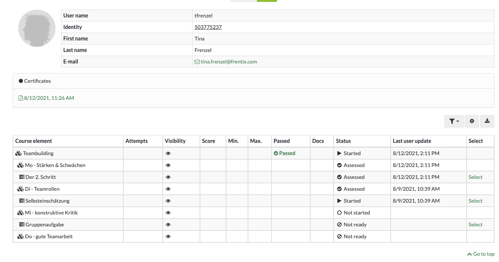
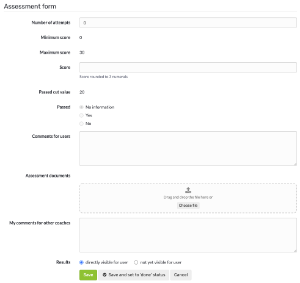
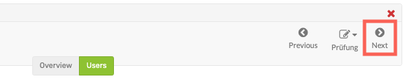
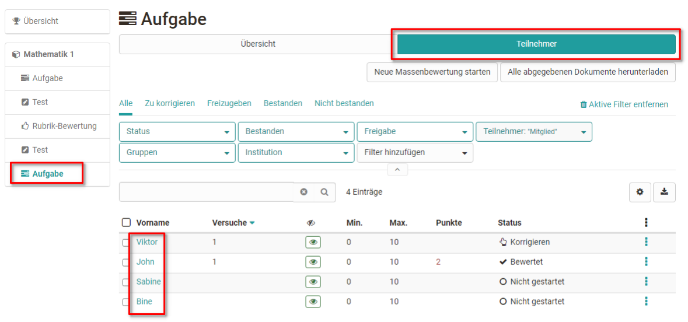
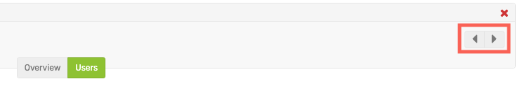

# Assessment of learners

## This is how you assess all assessable course elements of a person

Go to the assessment tool and follow these steps:

1. Klicken sie in der linken Spalte auf den Namen des Kurses (oberster Kursknoten) und wählen Sie den Tab "Teilnehmer".

      
  
2. Es erscheint der aktuelle Gesamtbewertungsstand aller Kursteilnehmenden. Wählen Sie nun die Person aus, die Sie bewerten wollen indem Sie auf den jeweiligen Namen klicken.
  
3. An overview appears with all assessment elements of the course including the processing status of the person (evidence of achievement). 

  

Wählen Sie einen Kursbaustein aus um die Bewertung vorzunehmen. 
  
4. You will now be taken to the [assessment form](The_assessment_form.md) of the respective course element. The exact possibilities depend on the course element type and the corresponding settings.

  
  
5. Use the arrows in the upper right corner to navigate to the next assessable course element for this person, if needed.

  
  
## This is how you evaluate the solutions of a particular course element

1. Wählen Sie in der linken Navigation den gewünschten Kursbaustein aus und klicken Sie auf den Tab "Teilnehmer". 

    

    Es werden wieder alle zu bewertenden Teilnehmenden angezeigt, dieses Mal aber nicht für den gesamten Kurs, sondern nur für den gewählten Kursbaustein.
  
2. Here you now select the desired individual person by clicking on the respective name. You will now be taken to the [assessment form](The_assessment_form.md) of the respective course element. The exact possibilities depend on the course
element type and the corresponding settings.

  
  
3. Use the arrows in the upper right corner to navigate to the next assessable person for this module, if necessary.

  
  
## Bulk assessment

The course elements "[Task](Assessing_tasks_and_group_tasks.md)" and
"[Assessment](Assessment_of_course_modules.md)" also offer the possibility
of bulk assessment.

If you want to assess all or many users at once, you can start a "New bulk
assessment". To do this, create an assessment in a spreadsheet program and
paste the data into the mass assessment field using copy+paste. You can find
more information about bulk assessment
[here](../how-to/create_a_bulk_assessment_for_submission_tasks.md).

## Filter options

Sowohl für den gesamten Kurs als auch für Kursbausteine können auch Filter verwendet werden um eine Übersicht bestimmter Personengruppen zu generieren und diese dann zu bewerten. So können beispielsweise die Mitglieder einer bestimmten Gruppe, alle Personen die den Kurs oder Kursbaustein noch nicht bestanden haben oder nur die Mitglieder einer bestimmten Institution gefiltert angezeigt und dann gezielt bewertet werden.

