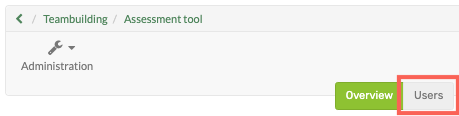
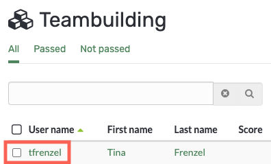
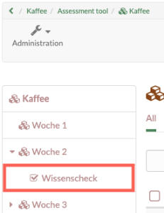
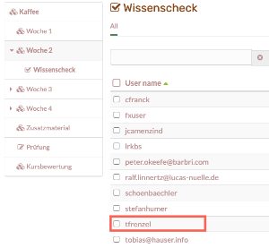

# Assessment of learners

## This is how you assess all assessable course elements of a person:

Go to the assessment tool and follow these steps:

1. Select user tab

|

  
  
---|---  
  
2\. Here you can select the desired person by clicking on the respective name.

|

  
  
3. An overview appears with all assessment elements of the course including the processing status of the person (evidence of achievement). Here you select the course elements you want to assess one after the other.

|

  
  
4. You will now be taken to the [assessment form](The_assessment_form.md) of the respective course element. The exact possibilities depend on the course element type and the corresponding settings.

|

  
  
5. Use the arrows in the upper right corner to navigate to the next assessable course element for this person, if needed.

|

  
  
## This is how you evaluate the solutions of a particular course element:

1. Select user tab

|

  
  
---|---  
  
2. Select the desired course element in the list on the left. Subsequently, the edits for this course element appear in the table overview. 

|

  
  
3. Here you now select the desired individual person by clicking on the respective name.

|

  
  

sites/manual_user/docs/course_operation/Assessment_of_learners.md §The_assessment_form.md§ 481
4\. You will now be taken to the [assessment form](The_assessment_form.md)
of the respective course element. The exact possibilities depend on the course
element type and the corresponding settings.

|

  
  
5. Use the arrows in the upper right corner to navigate to the next assessable person for this module, if necessary.

|

  
  

sites/manual_user/docs/course_operation/Assessment_of_learners.md §Assessing_tasks_and_group_tasks.md§ 481
The course elements "[Task](Assessing_tasks_and_group_tasks.md)" and

sites/manual_user/docs/course_operation/Assessment_of_learners.md §Assessment_of_course_modules.md§ 481
"[Assessment](Assessment_of_course_modules.md)" also offer the possibility
of bulk assessment.

If you want to assess all or many users at once, you can start a "New bulk
assessment". To do this, create an assessment in a spreadsheet program and
paste the data into the mass assessment field using copy+paste. You can find
more information about bulk assessment

sites/manual_user/docs/course_operation/Assessment_of_learners.md §create_a_bulk_assessment_for_submission_tasks.md§ 481
[here](../how-to/create_a_bulk_assessment_for_submission_tasks.md).

To rate all members of a group you can use the filter function in the tab
"Users" to display only the respective group members and then rate them
according to the course elements or per person as described before.

  

  

