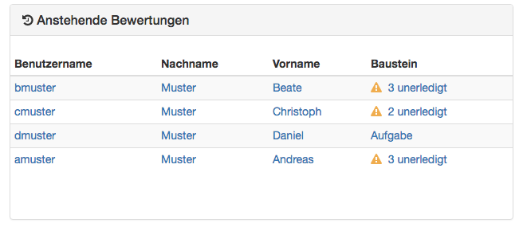
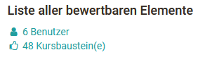

# Bewertungswerkzeug - Übersicht

Das Bewertungswerkzeug ist die zentrale Schaltstelle für die Bewertungen eines
OpenOlat-Kurses. Kursbesitzer und Betreuer erhalten hier einen Gesamtüberblick
über sämtliche im Kurs enthaltenen bewertbaren Bausteine und können hier die
Bewertungen vornehmen.

Über die Kursadministration gelangt man in das Bewertungswerkzeug. Wenn Sie
das Bewertungswerkzeug aufrufen, erscheint zunächst die Übersichtsseite mit
zentralen Informationen sowie eine Übersicht der aktuell anstehenden
Bewertungen. So wissen Sie schnell, was aktuell zu tun ist.

Von der Übersichtsseite aus gelangen Sie auch zu den konkreten
Bewertungsbereichen der einzelnen [Kursbausteine
](Assessment_of_course_modules.de.md)und
[Personen](Assessment_of_learners.de.md).

## Tab „Übersicht“ des Bewertungswerkzeugs

### Anstehende Bewertungen

Auf einen Blick ist hier ersichtlich, für welche Nutzer eine oder mehrere
Bewertung(en) offen sind. Auch wird angezeigt, wie viele Bausteine des
jeweiligen Benutzers zu bewerten sind. Sofern nur ein Baustein bewertet werden
muss, wird dieser direkt aufgelistet. Mit einem Klick auf diesen Baustein
kommt man zur entsprechenden Bewertung.

Hier werden nur die unerledigten Bewertungen angezeigt. Bereits durchgeführte
Bewertungen werden hier nicht aufgelistet.

### „Liste aller bewertbaren Elemente“

In diesem Bereich wird angezeigt, wie viele Benutzer und Kursbausteine
generell in diesem Kurs vorhanden sind. Ferner gelangt man über die
Verlinkungen direkt an die passende Stelle im Bewertungswerkzeug.

### „Benachrichtigungsservice“

Hier können Betreuer einschalten, dass sie bei neuen Einsendungen,
Testresultaten und sonstigen Einreichungen eine E-Mail erhalten. Auch können
Benachrichtigungen über neu erzeugte Zertifikate (sofern generell aktiviert)
abonniert werden.

### „Schnellzugang“

Wurde für den gesamten Kurs ein "Bestehen" konfiguriert, wird die Anzahl der
jeweiligen Kursmitglieder angezeigt, die den Kurs bestanden bzw. nicht
bestanden haben. Durch die Verlinkung können Betreuer schnell zu den
entsprechenden Teilnehmenden navigieren und auch die passenden
Teilnehmerlisten generieren und herunterladen. Wurde kein bestanden aktiviert,
erscheint in der Anzeige in beiden Fällen eine 0.

### „Statistiken Übersicht“

Angezeigt wird die Anzahl der registrierten Teilnehmenden sowie die Anzahl der
nicht-registrierten Benutzer. Hierzu zählen Kursbetreuer und Kursbesitzer
sowie ehemalige Teilnehmende. Ferner wird angezeigt wie viele dieser Personen
den Kurs mindestens einmal geöffnet haben. So erkennt man rasch, ob sich alle
Teilnehmenden bereits eingeloggt haben oder nicht.

Sofern eine Punkteberechnung für den Kurs definiert wurde, wird unter
„Durchschnitt“ der entsprechende Durchschnittswert angezeigt. Ferner wird
angezeigt wie hoch der Anteil der Personen ist, die den gesamten Kurs
bestanden haben (sofern diese Option aktiviert wurde).

### Daten neu berechnen

Über diesen Link des Menüs kann eine Neuberechnung des Kurses angestoßen
werden. So können die Kursbewertungen und Leistungsnachweise aktualisiert, die
Berechnung für bestanden und auch manuell gesetztes "bestanden" zurückgesetzt
werden.

### Massenbewertung

Mit dem Werkzeug "Massenbewertung" können für mehrere Teilnehmer
Bewertungsdaten wie Punkte, Statusinformationen, Kommentare sowie
Rückgabedateien in einem Schritt übermittelt werden. Wie man eine
Massenbewertung erstellt erfahren Sie
[hier](viewpage.action%EF%B9%96pageId=108593558.html).

## Im Prüfungsmodus

Befindet sich der Kurs im [Prufungsmodus
](viewpage.action%EF%B9%96pageId=108593203.html)wird dies ebenfalls im
Bewertungswerkzeug angezeigt. Auch ist erkennbar wie viele Personen bereits
eingeloggt sind und auf den Start der Prüfung warten.
