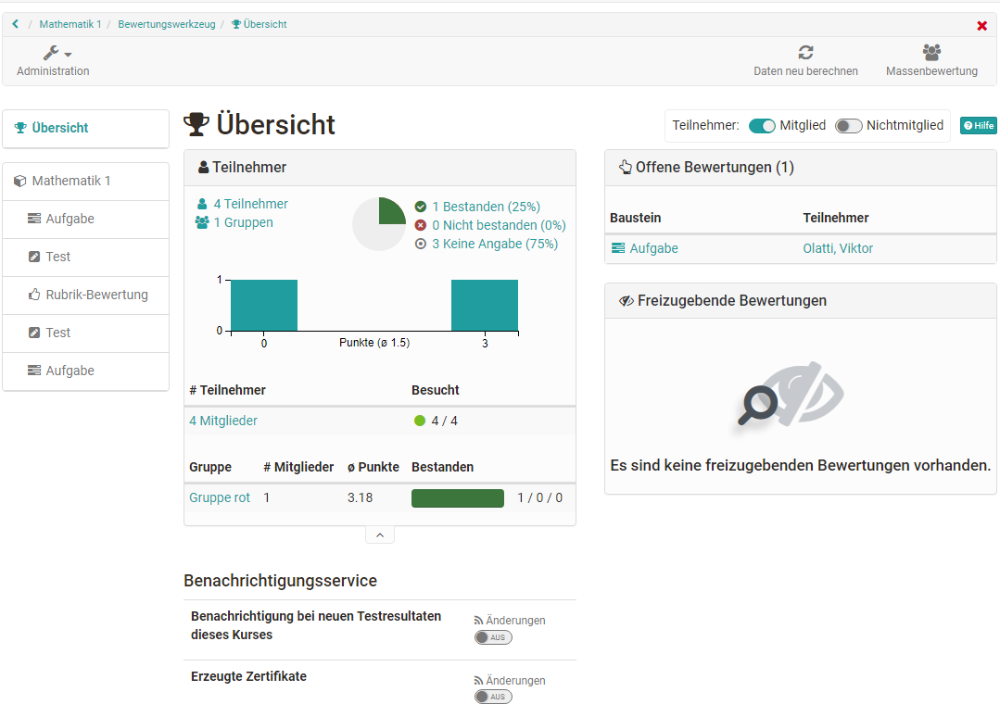
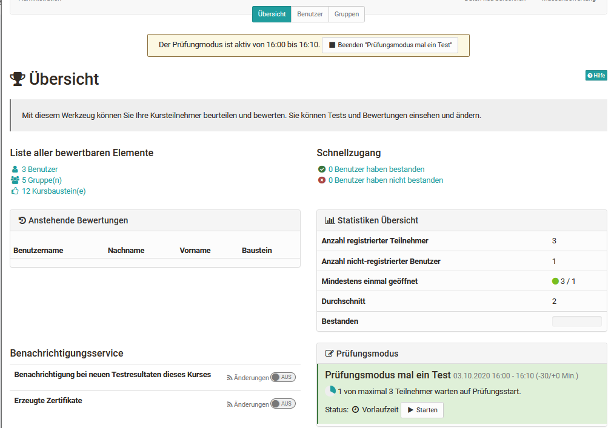

# Bewertungswerkzeug - Übersicht

Das Bewertungswerkzeug ist die zentrale Schaltstelle für die Bewertungen eines
OpenOlat-Kurses. Kursbesitzer und Betreuer erhalten hier einen Gesamtüberblick
über sämtliche im Kurs enthaltenen bewertbaren Bausteine und können die
Bewertungen vornehmen.

Über die Kursadministration gelangt man in das Bewertungswerkzeug. Wenn Sie
das Bewertungswerkzeug aufrufen, erscheint zunächst die Übersichtsseite mit
zentralen Informationen sowie eine Übersicht der aktuell anstehenden
Bewertungen. So wissen Sie schnell, was aktuell zu tun ist.

Von der Übersichtsseite aus gelangen Sie auch zu den konkreten
Bewertungsbereichen der einzelnen Kursbausteinen und Personen.

## Die „Übersicht“ des Bewertungswerkzeugs

### Übersicht -> Offene Bewertungen

Auf einen Blick ist hier ersichtlich, für welche Nutzer eine oder mehrere
Bewertung(en) offen sind. Auch wird angezeigt, wie viele Bausteine des
jeweiligen Benutzers zu bewerten sind. Sofern nur ein Baustein bewertet werden
muss, wird dieser direkt aufgelistet. Mit einem Klick auf diesen Baustein
kommt man zur entsprechenden Bewertung.

In der Übersicht werden nur die unerledigten Bewertungen angezeigt. Bereits durchgeführte Bewertungen werden an dieser Stelle nicht aufgelistet.

### Übersicht -> Freizugebende Bewertungen
Sollte es im Kurs Bewertungen geben die noch nicht für die Teilnehmenden sichtbar gemacht wurden, erscheinen sie hier. 

### Übersicht -> Teilnehmer 

In diesem Bereich wird angezeigt, wie viele Benutzer, Gruppen und Kursbausteine generell im konkreten Kurs vorhanden sind. 

Wurde für den gesamten Kurs ein "Bestehen" konfiguriert, wird die Anzahl der jeweiligen Kursmitglieder angezeigt, die den Kurs bestanden bzw. nicht bestanden haben. 

Durch die Verlinkung können Betreuer schnell zu den
entsprechenden Teilnehmenden navigieren und auch die passenden Teilnehmerlisten generieren und herunterladen. 

### Übersicht -> Benachrichtigungsservice

Hier können Betreuer einschalten, dass sie bei neuen Einsendungen, Testresultaten und sonstigen Einreichungen eine E-Mail erhalten. Auch können
Benachrichtigungen über neu erzeugte Zertifikate (sofern generell aktiviert) abonniert werden.

## Übersicht der Bewertungsbausteine des Kurses
In der linken Navigation des Bewertungswerkzeugs sieht man alle bewertbaren Kursbausteine. Alle Bausteine werden mit den Tabs "Übersicht" und "Teilnehmer" angezeigt. Ein Download der Bewertungen ist ebenfalls möglich. 

 Wie genau Bewertungen vorgenommen werden können erfahren Sie im Kapitel ["Bewertung von Kursbausteinen"](../course_operation/Assessment_of_course_modules.de.md) bzw. ["Lernende bewerte](../course_operation/Assessment_tool_-_tab_Users.de.md).

**Oberster Kursknoten**

Der automatisch generierte oberste Kursknoten zählt ebenfalls als bewertbarer
Baustein. Ist auf dem oberersten Kursbaustein, der genau genommen ein
Kursbaustein "[Struktur](../course_elements/Knowledge_Transfer.de.md/#structure)" ist,
eine Punkteberechnung eingerichtet, können auf der obersten Ebene der Benutzeransicht auch die Gesamtpunkte eines Kurses bzw. die
für den obersten Baustein definierten Punkte, angezeigt und die
Gesamtergebnisse der Kursteilnehmenden heruntergeladen werden. 

### Daten neu berechnen

Über diesen Link des Menüs kann eine Neuberechnung des Kurses angestoßen
werden. So können die Kursbewertungen und Leistungsnachweise aktualisiert, die
Berechnung für bestanden und auch manuell gesetztes "bestanden" zurückgesetzt
werden.

### Massenbewertung

Mit dem Werkzeug "Massenbewertung" können für mehrere Teilnehmer
Bewertungsdaten wie Punkte, Statusinformationen, Kommentare sowie
Rückgabedateien in einem Schritt übermittelt werden. Wie man eine
Massenbewertung erstellt erfahren Sie
[hier](../how-to/create_a_bulk_assessment_for_submission_tasks.de.md).

## Im Prüfungsmodus

Befindet sich der Kurs im [Prüfungsmodus
](../e-assessment/Assessment_mode.de.md) wird dies ebenfalls im
Bewertungswerkzeug angezeigt. Auch ist erkennbar wie viele Personen bereits
eingeloggt sind und auf den Start der Prüfung warten.

