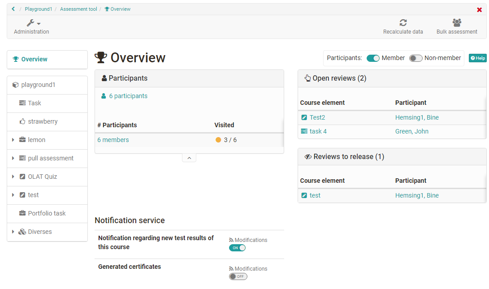

# Assessment tool - overview

The assessment tool is the central switch point for assessments of an OpenOlat
course. Here course owners and tutors will get a general overview of all
assessable elements of their course and can carry out assessments.

Via course administration you will get to the assessment tool. When you open
the assessment tool you will first see an overview page with central
information as well as an overview of currently pending assessments.  This way
you will quickly know what you have to do. From the overview page you can also access the concrete assessment areas of
the individual course elements and
persons.

Let's take a closer look at the individual areas of the overview:

## Tab "Overview" of the assessment tool

### Overview -> "Open reviews"

Here you can see at a glance for which users one or more ratings are open.  It
also shows how many modules of the respective user are to be rated. If only
one building block needs to be rated, it is listed directly. By clicking on
this module, you can access the corresponding rating.

Only the unfinished assessments are displayed here. Reviews that have already
been completed are not listed here.

### Overview -> "Review o release"
If there are assessments in the course that have not yet been made visible to participants, they will appear here. 

### Overview -> "Participants" 

This area shows how many users, groups and course elements are generally
available in this course.

If a calculation of points has been defined on the topmost course element the
corresponding average value will be displayed under "Average". Furthermore it
will be displayed what percentage of participants has passed the entire course
(if this option has been activated).

The linking allows coaches to quickly navigate to the appropriate participants and also generate and download the appropriate participant lists. 

### Overview ->  "Notification Service"

Here coaches can activate the option to receive an e-mail for new submissions,
test results and other submissions.  Notifications about newly generated
certificates (if generally activated) can also be subscribed to.

## Overview of the assessment elements of the course.
In the left navigation of the assessment tool you can see all assessable course elements. All elements are displayed with the tabs "Overview" and "Participants". A download of the assessments is also possible. 

 To learn how exactly assessments can be made, please refer to the chapter ["Assessment of course modules"](../course_operation/Assessment_of_course_modules.md) or ["User assessment](../course_operation/Assessment_tool_-_tab_Users.md).

**First course node**

The automatically generated top course node is also counted as a assessable
element. If on the topmost course element, which strictly speaking is a
course element "[structure](../course_elements/Knowledge_Transfer.md/#structure)",
you have set up a point calculation, you can also display the total points of a course on the top level of the participant view, display the
points defined for the first course element and download the overall results of the course participants. 

### Recalculate data

This link can be used to trigger a recalculation of the course. Thus, the
course assessments and certificates of achievement can be updated, the
calculation for passed and also manually set "passed" can be reset.

### Bulk assessment

With the tool "bulk assessment", evaluation data such as points, status
information, comments as well as return files can be transmitted for several
participants in one step. You can find out how to create a mass evaluation
[here](../how-to/create_a_bulk_assessment_for_submission_tasks.md).

## Assessment mode

If the course is in [assessment
mode](https://confluence.openolat.org/display/OO152EN/Assessment+mode), this
is also displayed in the assessment tool. You can also see how many people are
already logged in and waiting for the exam to start.

