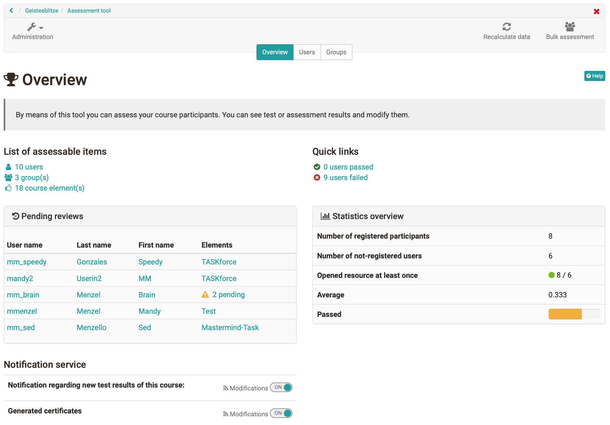
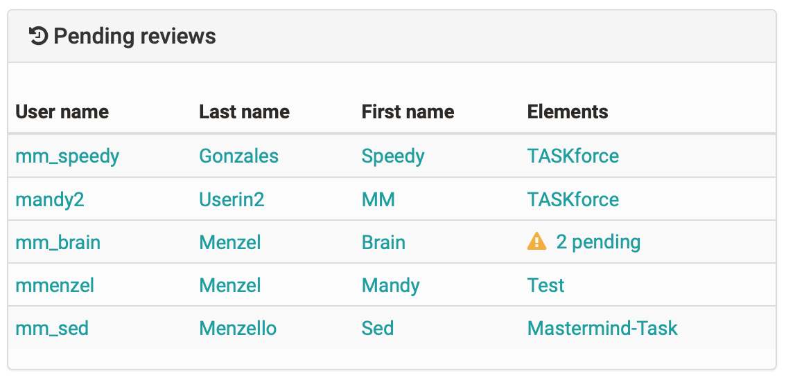
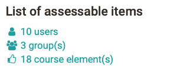

# Assessment tool - overview

The assessment tool is the central switch point for assessments of an OpenOlat
course. Here course owners and tutors will get a general overview of all
assessable elements of their course and can carry out assessments.

Via course administration you will get to the assessment tool. When you open
the assessment tool you will first see an overview page with central
information as well as an overview of currently pending assessments.  This way
you will quickly know what you have to do.

From the overview page you can also access the concrete assessment areas of
the individual [course elements](Assessment+of+course+modules.html) and
[persons](Assessment+of+learners.html).

## Tab "Overview" of the evaluation tool

### Pending reviews

Here you can see at a glance for which users one or more ratings are open.  It
also shows how many modules of the respective user are to be rated. If only
one building block needs to be rated, it is listed directly. By clicking on
this module, you can access the corresponding rating.

Only the unfinished assessments are displayed here. Reviews that have already
been completed are not listed here.

### "List of assessable items"

This area shows how many users, groups and course elements are generally
available in this course.  Furthermore links will take you directly to the
appropriate place in the assessment tool.

### "Notification Service"

Here coaches can activate the option to receive an e-mail for new submissions,
test results and other submissions.  Notifications about newly generated
certificates (if generally activated) can also be subscribed to.

### "Quick links"

If the option "passed" has been activated for the top course element the
number of course members for whom the course is considered passed or failed
will be displayed.  By means of links coaches can quickly navigate to the
corresponding participants and also generate and download appropriate
participant lists. If no passed has been activated, a 0 will appear in both
cases in the display.

### "Statistics overview"

The number of registered participants and the number of unregistered users is
displayed. This includes course coaches and course owners as well as former
participants. It also shows how many of these people have opened the course at
least once.  So you can quickly see whether all participants have already
logged in or not.

If a calculation of points has been defined on the topmost course element the
corresponding average value will be displayed under "Average". Furthermore it
will be displayed what percentage of participants has passed the entire course
(if this option has been activated).

In addition to that you will find further options in the tab "Overview" at the
top right of the pull-down menu.

### Recalculate data

This link can be used to trigger a recalculation of the course. Thus, the
course assessments and certificates of achievement can be updated, the
calculation for passed and also manually set "passed" can be reset.

### Bulk assessment

With the tool "bulk assessment", evaluation data such as points, status
information, comments as well as return files can be transmitted for several
participants in one step. You can find out how to create a mass evaluation
[here](+create+a+bulk+assessment+for+submission+tasks.html).

## Assessment mode

If the course is in [assessment
mode](https://confluence.openolat.org/display/OO152EN/Assessment+mode), this
is also displayed in the assessment tool. You can also see how many people are
already logged in and waiting for the exam to start.

