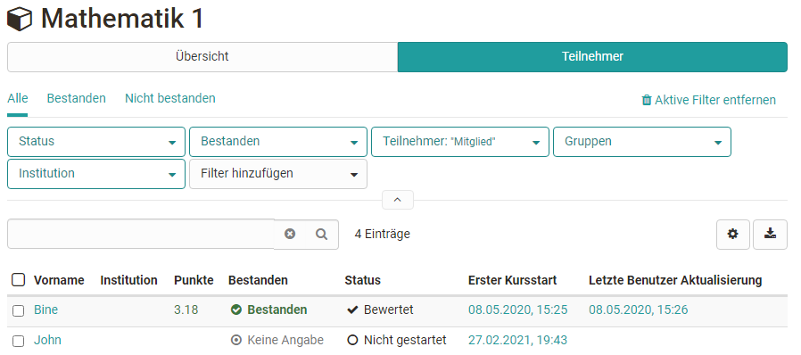

# Assessment tool - overview

The assessment tool is the central switch point for assessments of an OpenOlat
course. Here course owners and tutors will get a general overview of all
assessable elements of their course and can carry out assessments.

Via course administration you will get to the assessment tool. When you open
the assessment tool you will first see an overview page with central
information as well as an overview of currently pending assessments.  This way
you will quickly know what you have to do. From the overview page you can also access the concrete assessment areas of
the individual course elements and
persons.

Schauen wir uns die einzelnen Bereiche der Übersicht genauer an:

## Tab "Overview" of the assessment tool

### Overview -> "Open reviews"

Here you can see at a glance for which users one or more ratings are open.  It
also shows how many modules of the respective user are to be rated. If only
one building block needs to be rated, it is listed directly. By clicking on
this module, you can access the corresponding rating.

Only the unfinished assessments are displayed here. Reviews that have already
been completed are not listed here.

### Overview -> "Review o release"
Sollte es im Kurs Bewertungen geben die noch nicht für die Teilnehmenden sichtbar gemacht wurden, erscheinen sie hier. 

### Overview -> "Participants" 

This area shows how many users, groups and course elements are generally
available in this course.

If a calculation of points has been defined on the topmost course element the
corresponding average value will be displayed under "Average". Furthermore it
will be displayed what percentage of participants has passed the entire course
(if this option has been activated).

Durch die Verlinkung können Betreuer schnell zu den
entsprechenden Teilnehmenden navigieren und auch die passenden Teilnehmerlisten generieren und herunterladen. 

### Overview ->  "Notification Service"

Here coaches can activate the option to receive an e-mail for new submissions,
test results and other submissions.  Notifications about newly generated
certificates (if generally activated) can also be subscribed to.

## Übersicht der Bewertungsbausteine des Kurses
In der linken Navigation des Bewertungswerkzeugs sieht man alle bewertbaren Kursbausteine. Alle Bausteine werden mit den Tabs "Übersicht" und "Teilnehmer" angezeigt. Ein Download der Bewertungen ist ebenfalls möglich. 

 Wie genau Bewertungen vorgenommen werden können erfahren Sie im Kapitel ["Bewertung von Kursbausteinen"](../course_operation/Assessment_of_course_modules.de.md) bzw. ["Lernende bewerte](../course_operation/Assessment_tool_-_tab_Users.de.md).

**Oberster Kursknoten**

Der automatisch generierte oberste Kursknoten zählt ebenfalls als bewertbarer
Baustein. Ist auf dem oberersten Kursbaustein, der genau genommen ein
Kursbaustein "[Struktur](../course_elements/Knowledge_Transfer.de.md/#structure)" ist,
eine Punkteberechnung eingerichtet, können auf der obersten Ebene der Benutzeransicht auch die Gesamtpunkte eines Kurses bzw. die
für den obersten Baustein definierten Punkte, angezeigt und die
Gesamtergebnisse der Kursteilnehmenden heruntergeladen werden. 

### Recalculate data

This link can be used to trigger a recalculation of the course. Thus, the
course assessments and certificates of achievement can be updated, the
calculation for passed and also manually set "passed" can be reset.

### Bulk assessment

With the tool "bulk assessment", evaluation data such as points, status
information, comments as well as return files can be transmitted for several
participants in one step. You can find out how to create a mass evaluation
[here](../how-to/create_a_bulk_assessment_for_submission_tasks.md).

## Assessment mode

If the course is in [assessment
mode](https://confluence.openolat.org/display/OO152EN/Assessment+mode), this
is also displayed in the assessment tool. You can also see how many people are
already logged in and waiting for the exam to start.

