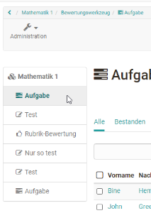
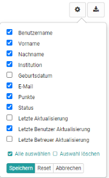
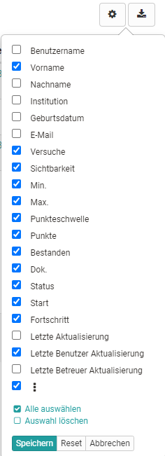
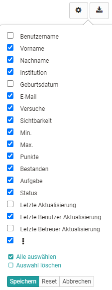

# Bewertungswerkzeug - Tab Detailansicht

Die eigentliche Bewertung von Lernenden findet im Bewertungswerkzeug im Tab
„Detailansicht“ statt.

Sie haben zwei generelle Möglichkeiten die Bewertung vorzunehmen. Entweder Sie
gehen von einer Person aus und bewerten die von dieser Person vorgenommenen
Bearbeitungen. Oder Sie gehen von der Kursstruktur und einem konkreten
Assessment Baustein aus und bewerten alle Personen für diese Aufgabe, diesen
Test bzw. sonstigen Assessment Kursbaustein.

Ganz links sehen Sie die Kursstruktur mit allen bewertbaren Kursbausteinen.
Hier können Sie direkt zu einem der Bausteine navigieren um Ihre Bewertung
vorzunehmen. Klicken Sie einen der bewertbaren Bausteine an, wird die
zugehörige Bewertungsübersicht mit allen Teilnehmenden des Kurses aufgerufen.

Der automatisch generierte oberste Kursknoten zählt ebenfalls als bewertbarer
Baustein. Ist auf dem oberersten Kursbaustein, der genau genommen ein
Kursbaustein "[Struktur](viewpage.action%EF%B9%96pageId=108593217.html)" ist,
bei herkömmlichen Kursen eine Punkteberechnung eingerichtet, können auf der
obersten Ebene der Benutzeransicht auch die Gesamtpunkte eines Kurses bzw. die
für den obersten Baustein definierten Punkte, angezeigt und die
Gesamtergebnisse der Kursteilnehmenden
(../e-assessment/Performance_assessment.de.md)) als PDF
Datei gespeichert werden.

### Anzeige und Spaltenauswahl

Welche Tabellenspalten genau zur Verfügung stehen ist abhängig vom
Kursbausteintyp und der jeweiligen Konfiguration. Je nach Auswahl der
aktivierten Spalten werden Ihnen unterschiedliche Informationen angezeigt.
Neben Basisinformationen wie Name oder Matrikelnummer, können hier auch
Informationen zum Status oder der letzten Aktualisierung angezeigt werden.

Kursbaustein "Struktur"

|

Kursbaustein "Test"

|

Kursbaustein "Aufgabe"  
  
---|---|---  
  
Eine Spaltenanpassung ist hilfreich um einen schnellen Überblick zu erhalten.
Besonders die Informationen zu den Punkten, Versuchen, dem Status, und der
letzten Aktualisierung werden häufig benötigt. Richten Sie sich am besten die
Spalten so ein, wie es für Ihren Kontext sinnvoll ist.

Nach Auswahl einer oder mehrerer Personen eines Assessment Bausteins
erscheinen weitere Funktionen z.B. kann der Status auf abgeschlossen gesetzt
werden, die Sichtbarkeit aktiviert werden, eine E-Mail versendet oder ein Test
verlängert werden. Je nach Assessment-Kursbaustein variieren die Optionen.

Darüber hinaus können bestimmte Personen z.B. alle die diesen Kursbaustein
noch "nicht bestanden" haben gefiltert angezeigt werden oder auch gezielt nach
bestimmten Teilnehmernamen gesucht werden.

 
