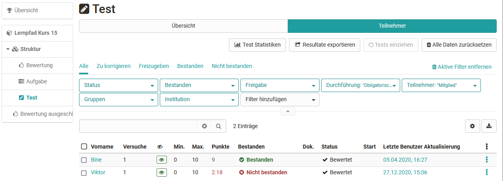
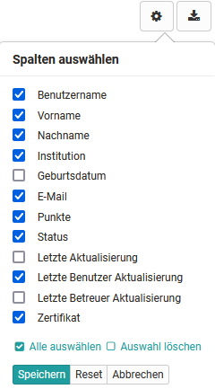
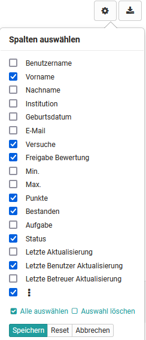
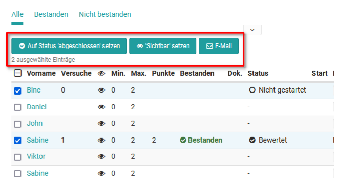

# Assessment tool - tab Users

You have two general options for the assessment. Either you start from one
person and assess the work done by this person or you start from the course
structure and a concrete assessment element and assess all persons for this
task, this test, and so on.

On the far left you will see the course structure with all assessable course
elements. Here you can navigate directly to one of the elements to make your assessment. 
For each course element, a tab with the "Overview" and a tab with the "Participants" are displayed. 

The exact procedure is described in the chapters [Assessing participants](../course_operation/Assessment_of_learners.md) and [Assessment of course elements](../course_operation/Assessment_of_course_modules.md).

## Participants tab in the assessment tool
In the tab Participants all course participants are listed that can be evaluated. 
In addition, specific people, e.g. all those who have not yet "passed" this
course element, can be displayed in a filtered manner, or specific participant
names can be searched for.

### Display and column selection

The information displayed in the "Participants" tab can be further customized by selecting the desired columns. To do this, click on the gear wheel. 

Which table columns are exactly available depends on the course element type
and the respective configuration. Depending on the selection of the activated
columns, different information will be displayed. In addition to basic
information such as name or matriculation number, information on the status or
the last update can also be displayed here.

Column customization is helpful to get a quick overview. Especially the information about scores, attempts, status and last update is often needed. It
is best to set up the columns as it makes sense for your context.

Set up the columns as it makes sense for your context and check in the settings if it is also activated when you miss a piece of information.

Here are examples of selectable column with the gear: 

Course element "Structure"

Course element "Test"

Course element "Task"  
  
### Activate further options

After selecting one or more people in an assessment module, further functions
appear, e.g. the status can be set to completed, visibility can be activated,
an e-mail can be sent or a test can be extended. The options vary depending on
the assessment module.

