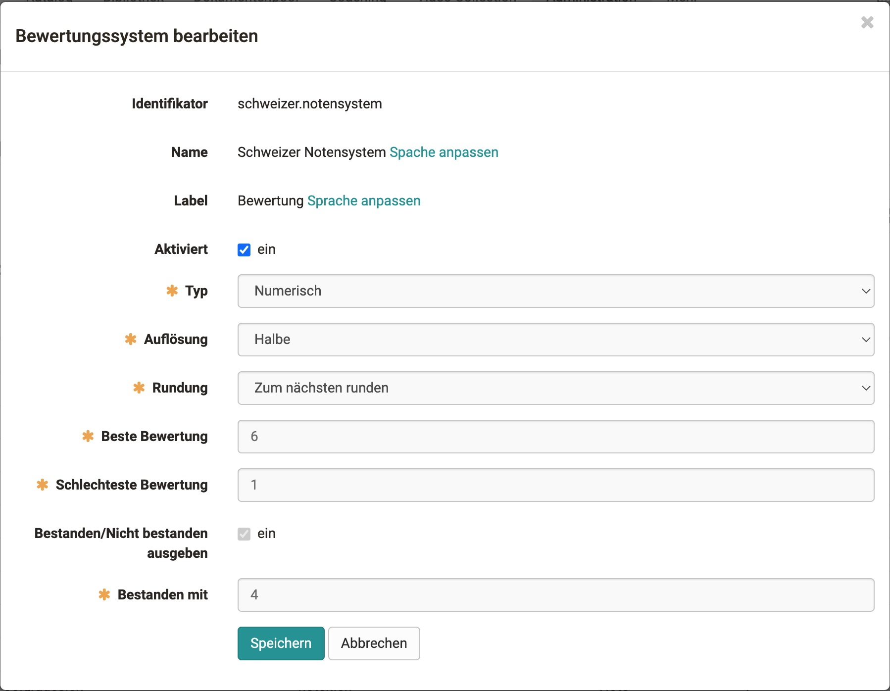

# Einstufung/Noten

## Allgemein

Punkte können in eine Note übersetzt werden.
Der Begriff „Note“ wird hier als Platzhalter für alle möglichen Ausgabeformate verwendet. (Beispiele könnten sein: 1-6, A-F, „sehr gut“ - „ungenügend“, „Einsteiger“/„Spezialist“/„Experte“ etc.) Um dies kalkulieren und bestimmen zu können, benötigt man ein Bewertungssystem, eine Bewertungsskala und einen bewertbaren Kursbaustein

??? Veränderungen gegenüber der Bewertung ohne Noten

    Sind die Noten eingeschaltet gibt es Veränderungen in der Bewertung:
    
    * Die Punkteschwelle der Lernressource wird überschrieben.
    * Bestanden wird vom Bewertungssystem und Bewertungsskala gesetzt und nicht von der Testressource oder anderen Einstellungen des Kursbausteines.

### Bewertungssystem

{class="shadow"}

Das Bewertungssystem definiert die Leistungsklasse, den Bewertungstyp und die Punkteschwelle, ab der die Note als bestanden gilt. Leistungsklassen sind die Einteilungen der Berurteilungsskala.

#### Bewertungstyp

* **Numerischer Typ**: Numerische Bewertungstypen können in ihrer Auflösung (Ganze-, Halbe-, Viertel-, Zentelnoten) und ihrem Rundeverhalten angepasst werden. Dabei werden die Leistungsklassen anhand der eingegeben maximalen Punktzahl und der Bewertungsschwelle berechnet und ergeben den Bewertungsschlüssel.

* **Textueller Typ**: Bei textuellen Bewertungstypen definiert man die Anzahl der Leistungsklassen und deren Name/Label. Die maximale Punktzahl und die jeweilige Notenuntergrenze bestimmen dann die Rahmenbedingungen des Bewertungsschlüssels

### Bewertungsskala

In der Bewertungsskala legt man die Punkte der Leistungsklassen für den jeweiligen Kursbaustein fest.

### Label

Für jedes Bewertungssystem kann das Label benamt werden. Standardmässig ist es "Bewertung". Dies ist vorallem bei unterschiedlichen System günstig. Beispiele hierfür sind: Einsteiger, Fortgeschritten, Profi = Label: Stufe; 1-6 = Label: Note; Smileys = Label: Bewertung

### Berechnung der Stufen / Noten

Die Berechnung des Bewertungsschlüsseln folg einigen Besonderheiten.

* Die letzte und erste Leistungsklasse bei der Berechnung hat eine halb so grosse Spanne, als die restlichen.

* **Numerischer Typ**: Bei Berechnung mit Knick,wird der Knick nicht als harte Untergrenze einer Performanceklasse gesehen. Die eingegebene Punktzahl muss nur der Note XY entsprechen, d.h. sie enthalten.

* **Textueller Typ**: Die Untergrenze einer Performanceklasse ist gleich die Punktzahl..

*Quelle:* [https://www.lehrerfreund.de](https://www.lehrerfreund.de)

## Konfigurieren eines Kursbausteins für Einstufungen und Noten

??? Vorraussetzungen

    Modul Einstufung/Noten auf ihren System eingeschaltet.
    Eines oder mehrere Bewertungssystem sind angelegt.

1. **Modul einschalten** Unter  `Editor>Bewertung` (bei Test "Testkonfiguration") Einstufung/Noten für diesen Kursbaustein einschalten.
2. **Zuweisung wählen** (Manuelle Zuweiseung / Automatisch)

3. **Bewertungsskala anlegen** Unter Bewertungsskala bearbeiten, das Einstellungsfenster öffnen, ein Bewertungssystem auswählen und die minimale, maximal Punktzahl sowie die Punkteschwelle festlegen.

    {class="shadow"}

4. **Speichern**

## Noten im Bewertungswerkzeug

* **Tab: Übersicht** Die Kennzahlen für die Bewertung wurden um Noten erweitert. Man sieht die Normalverteilung und wichtige Einstellungen.

* **Tab: Teilnehmer** Im Bewertungswerkzeug sieht man die Noten neu in einer seperaten Spalte hinter der Punktzahl. Man kann, wenn auf manuell gestellt, hier auch Noten manuell übernehmen.

### Bewertungsskala anpassen

Um die Bewertungsskala nachträglich anzupassen, oder um neue Noten zu vergeben, klicken sie oben auf den Button. Es öffnet sich ein Wizard, wo sie die Bewertungsskala korrigieren können.
