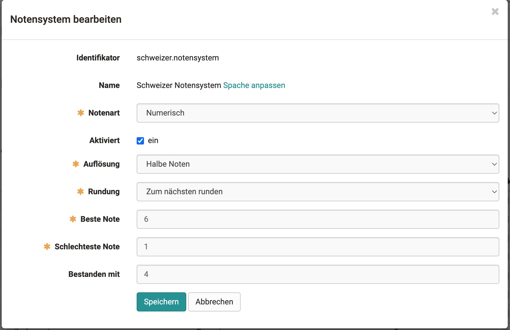
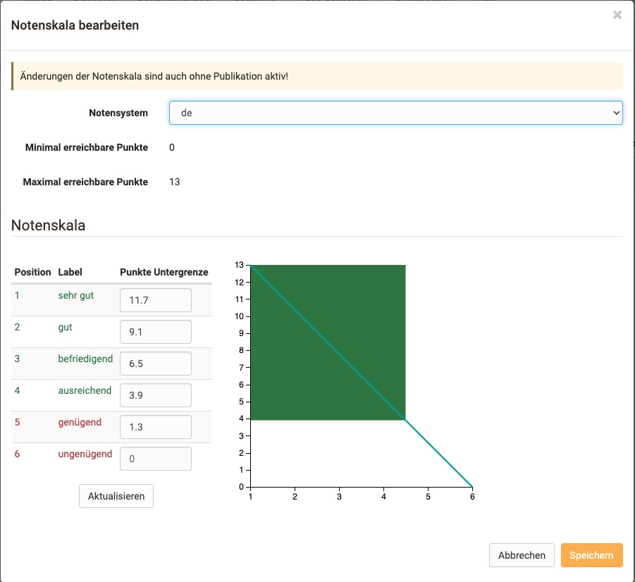

# Bewertungskala / Punkte in Noten umrechnen

## Allgemein

Punkte können in eine Note übersetzt werden.
Der Begriff „Note“ wird hier als Platzhalter für alle möglichen Ausgabeformate verwendet. (Beispiele könnten sein: 1-6, A-F, „sehr gut“ - „ungenügend“, „Einsteiger“/„Spezialist“/„Experte“ etc.) Um dies kalkulieren und bestimmen zu können, benötigt man ein Notensystem, eine Notenskala und einen bewertbaren Kursbaustein

??? Veränderungen gegenüber der Bewertung ohne Noten

    Sind die Noten eingeschaltet gibt es Veränderungen in der Bewertung:
    
    * Die Punkteschwelle der Lernressource wird überschrieben.
    * Bestanden wird vom Notensystem und Notenskala gesetzt und nicht von der Testressource oder anderen Einstellungen des Kursbausteines.

### Notensystem

{class="shadow"}

Das Notensystem definiert die Leistungsklasse, den Notentyp und die Punkteschwelle, ab der die Note als bestanden gilt. Leistungsklassen sind die Einteilungen der Berurteilungsskala.

#### Notentyp

* **Numerischer Typ**: Numerische Notentypen können in ihrer Auflösung (Ganze-, Halbe-, Viertel-, Zentelnoten) und ihrem Rundeverhalten angepasst werden. Dabei werden die Leistungsklassen anhand der eingegeben maximalen Punktzahl und der Notenschwelle berechnet und ergeben den Notenschlüssel.

* **Textueller Typ**: Bei textuellen Notentypen definiert man die Anzahl der Leistungsklassen und deren Name/Label. Die maximale Punktzahl und die jeweilige Notenuntergrenze bestimmen dann die Rahmenbedingungen des Notenschlüssels

### Notenskala

In der Notenskala legt man die Punkte der Leistungsklassen für den jeweiligen Kursbaustein fest.

### Berechnung der Noten

Die Berechnung des Notenschlüsseln folg einigen Besonderheiten.

* Die letzte und erste Leistungsklasse bei der Berechnung hat eine halb so grosse Spanne, als die restlichen.

* **Numerischer Typ**: Bei Berechnung mit Knick,wird der Knick nicht als harte Untergrenze einer Performanceklasse gesehen. Die eingegebene Punktzahl muss nur der Note XY entsprechen, d.h. sie enthalten.

* **Textueller Typ**: Die Untergrenze einer Performanceklasse ist gleich die Punktzahl..

*Quelle:* [https://www.lehrerfreund.de](https://www.lehrerfreund.de)

## Konfigurieren eines Kursbausteins für Noten

??? Vorraussetzungen

    Modul Noten auf ihren System eingeschaltet.
    Eines oder mehrere Notensystem sind angelegt.

1. **Noten einschalten** Unter  `Editor>Bewertung` (bei Test "Testkonfiguration") Noten für diesen Kursbaustein einschalten.
2. **Notenzuweisung wählen** (Manuelle Zuweiseung / Automatisch)

3. **Notenskala anlegen** Unter Notenskala bearbeiten, das Einstellungsfenster öffnen, ein Notensystem auswählen und die minimale, maximal Punktzahl sowie die Punkteschwelle festlegen.

    {class="shadow"}

4. **Speichern**

## Noten im Bewertungswerkzeug

* **Tab: Übersicht** Die Kennzahlen für die Bewertung wurden um Noten erweitert. Man sieht die Normalverteilung und wichtige Einstellungen.

* **Tab: Teilnehmer** Im Bewertungswerkzeug sieht man die Noten neu in einer seperaten Spalte hinter der Punktzahl. Man kann, wenn auf manuell gestellt, hier auch Noten manuell übernehmen.

### Notenskala anpassen

Um die Notenskala nachträglich anzupassen, oder um neue Noten zu vergeben, klicken sie oben auf den Button. Es öffnet sich ein Wizard, wo sie die Notenskala korrigieren können.
