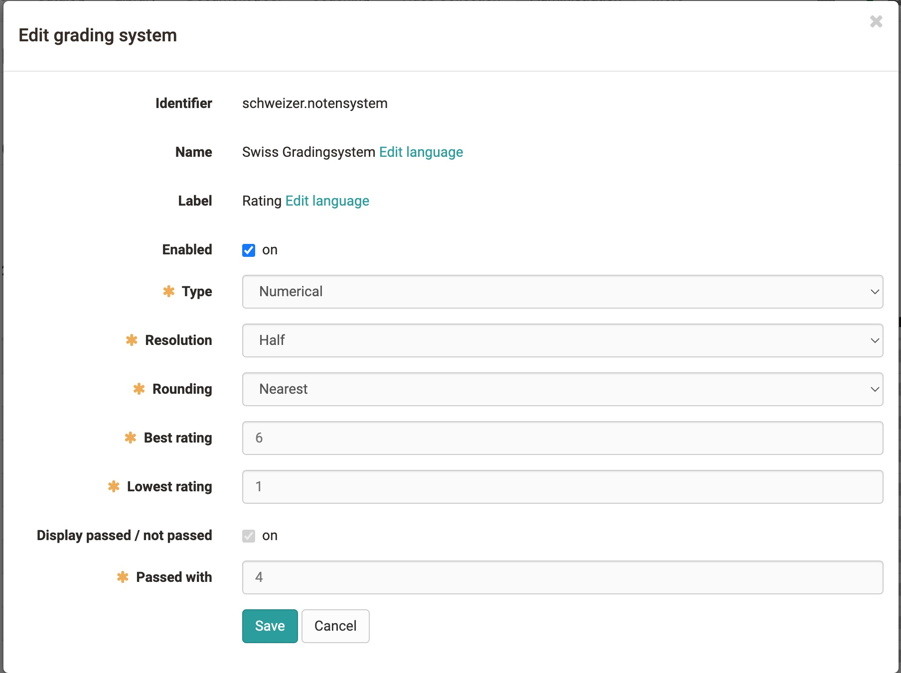

# Translate points into rating or grades

:octicons-tag-24: Release 16.2

## General

Points can be translated into a more diversive level or grade.
The term level or grade is used here as a placeholder for all possible output formats. (Examples could be: 1-6, A-F, "very good" - "unsatisfactory", "beginner"/"specialist"/"expert" etc.) In order to be able to calculate and determine this, one needs a grading system, a grading scale and an assessable course element.

!!! Changes compared to assessment without rating

    If the rating are switched on, there are changes in the assessment:
    
    * The point threshold of the learning resource is overwritten.
    * Pass is set by the grading system and grading scale and not by the test resource or other settings of the course element.

### Grading system

{class="shadow"}

The grading system defines the performance class, the type and the point threshold above which the rating is considered passed.Performance classes are the divisions of the grading scale.

#### Type

* **Numeric type**: Numeric types can be customised in their resolution (whole, half, quarter, cent) and rounding behaviour. In this case, the performance classes are calculated on the basis of the entered maximum number of points and the grade threshold and result in the grade key.

* **Textual type**: With textual types, one defines the number of performance classes and their name/label. The maximum number of points and the respective grade threshold then determine the general conditions of the grading scale

### Grading scale

In the grading scale you define the points of the performance classes for the respective course element.

### Label

The label can be named for each grading system. The defaultlabel is "Rating". This is particularly useful for different systems. Examples are: Beginner, Advanced, Professional = Label: Level; 1-6 = Label: Grade; Smileys = Label: Rating

### Calculation of rating

The calculation of the grading scale follows some special features.

* The last and first performance class in the calculation has a half-size range than the rest.

* **Numerical type**: When calculating with kink,the kink is not seen as a hard lower limit of a performance class. The score entered must only correspond to grade XY, i.e. it must contain.

* **Textual type**: The lower limit of a performance class is equal to the score....

*Source:* [https://www.lehrerfreund.de](https://www.lehrerfreund.de)

## Configuring a course element for rating

!!! Prerequisites

    Module Levels/Grading activated on your system.
    One or more staffs have been created. 1.

1. **Switch on Levels/Grading**Switch on rating for this course element under `Editor>Evaluation` (for test "Test configuration").

2. **Select Assignment** (Manual Assignment / Automatic)

3. **Create grading scale** Under Edit grading scale, open the settings window, select a grading system and define the minimum, maximum and threshold number of points.

    {class=shadow}

4. **Save**

## Evaluation in the grading tool

* **Tab: Overview** rating have been added to the key figures for grading. You can see the normal distribution and important settings.

* **Tab: Participants** In the evaluation tool, the rating are now shown in a separate column behind the score. If set to manual, you can also take over rating manually here.

### Adjust grading scale

To adjust the grading scale later or to assign new rating, click on the button at the top. A wizard opens where you can correct the grading scale.
