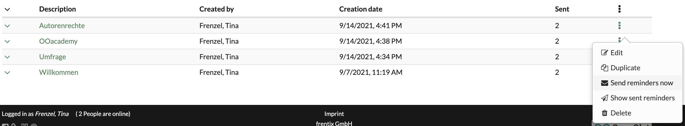
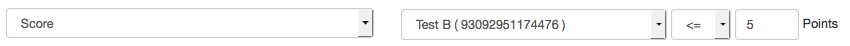

# Course Reminders

The course reminder feature allows you to create sets of rules / conditions,
which, when met, automatically trigger a previously defined e-mail to a
specified user group. Intervals and sending times are determined systemwide by
the administrator. Regardless of that, course authors can trigger
notifications at any given time. Only those users that already met the
conditions/rules will receive a reminder though.

On the overview page you can see all the reminders already created for a
course. In the tab "Sent reminder log" you will find a list of all reminders
that have already been sent. This list contains information about the
recipient as well as the sending time. Individual reminders can be easily sent
from this list via the "Resend" link.

### Create course reminder

Reminders can be set up at any time. Click the button "Add reminder".

To do this, click on the "Create reminder" button. A wizard will appear that
will guide you step by step through the creation process.

First, enter the description for the reminder. This description is only
visible to the authors and is used for a clear and informative presentation of
all reminders of a course. Then select the conditions for sending. In the next
step, the conditions are checked and displayed again. In the last step you
enter the concrete e-mail text and can also select whether supervisors or
owners should also receive a copy or whether a copy should be sent to an
external address.

In addition to the configuration in the course administration, reminders for
certain assessment course elements can also be set up directly for the
respective course element. In this case, the corresponding course element is
already preselected. This way, for example, a reminder can be quickly created
for learners who have not yet taken a certain test (attempts = 0) or an e-mail
can be sent to all persons who have passed an assignment.

### Conditions for sending reminders

Various conditions are available for the configuration of reminders, which can
be combined as desired. This allows various reminders tailored to individual
needs to be triggered by mail.

The link is an "and" link. This means that only if all conditions are met, the
reminder email will be triggered.

Define the conditions needed for a reminder to be triggered. Select the kind
of condition in the drop-down men, and specify the condition in the following
form fields by e.g. defining a date or a score. The buttons to the right of a
condition either deletes the current one or adds a new condition. At least one
criterion must be selected to trigger a dispatch.

There are different types of conditions: You will find a short explanation
concerning those six types below as well as a simple example.

a) Time span  
---  
  
These conditions work with duration, i.e. the time until something is going to
happen or how long ago an event took place.

|  **Example** : 5 weeks befor the task assignment slot closes.  
  
  * Enrollment date
  * Begin date of execution period
  * End date of execution period
  * Initial course launch date
  * Recent course launch date
  * Deadline: Task assignment
  * Deadline: Task documents submission
  * Initial attempt date
  * Deadline Form completition

  
  
b) Attempts  
---  
  
Assessable course elements with an attempt counter return that value to
OpenOlat, which then can be used as a condition.

|  **Example** : A test has not been (0) attempted yet.  
Attempts  
  
The two conditions "Attempts" and "Score" require operators in order to
accurately display the relation states "greater than, less than, greater or
equal to, less or equal to, equal" and "not equal" between two expressions or
entities. Depending on the value of the expression, the return value will be
either "True" or "False".

<|

less than

| true if a less than b|

  

  

Our conditions are comparing e.g. the results of a test (a) with the value
entered in the  
condition rule (b). If the logical return value is equal to "True", meaning
that the condition  
was met, OpenOlat will trigger the reminder.  
  
---|---|---|---  
<=| less or equal to| true, if a less than or equal to b  
=| equal to| true if a equal to b  
=>| greater or equal to| true if a greater than or equal to b  
>| greater than| true if a greater than b  
!=| not equal to| true if a not equal to b  
  
An example: An author wants a reminder to be sent once a participant achieved
a score of 5 or less in a test. This condition will look in the reminder
function in OpenOlat as follows:

c) Assessment  
---  
  
Assessable course elements with either a configured passed state or a score.

|  **Example** : The score in a checklist is less than 3 points.  
  
  * Passed
  * Score

  
  
d) Date  
---  
  
A deadline: a reminder will be sent as soon as possible after the recorded
date.

|  **Example** : 06/24/2020 16:30  
  
  * after date
  * until date

|  
  
  
e) Affiliation  
---  
  
Specify which course or group members should receive the reminder.

|  **Example** : Send to all owners and coaches.  
  
  * Course role
  * Group member

  
  
f) User property|  
  
---|---  
  
This condition also specifies the recipients. Reminders will be sent to all
course members with the specified user property.

|  **Example** : All users with the zip code 8000  
  
g) Progress (only for [learning path courses](../course_create/Learning_path_course.md))|  
  
---|---  
  
Here the dispatch is based on the percentage course progress of the
participants as configured in the administration settings.

  

|  **Example:** Users who have successfully completed at least 80% of a
course.  
  
  

You can combine as many conditions as required. It would be wise to give some
thoughts in advance as to who should receive a reminder under which condition.
Adapting the mail body to the particular set of rules allows for creating
specific e-mail reminders.

### E-mail Text

The email text, which can be customized as needed, allows you to create very
specific email reminders tailored to the situation.

We advise you to make use of the available variables in order to create a
meaning- and helpful reminder

    
    
    $firstName

| The users first name  
---|---  
      
    
    $lastName

| The users last name  
      
    
    $fullName

| The users full name, depending on the system configuration. The default
style ist "lastname, firstname"  
      
    
    $email

| The users mail address  
      
    
    $userName

| The users username  
      
    
    $courseUrl

| The internet address of the course  
      
    
    $courseName

| The name of the course as defined in the course info page  
      
    
    $courseDescription

| The description of the course as defined in the course info page  
  
  

The top course node also lists all reminders that are not linked to a specific
course element. Further configurations can also be made here as well as for
other assessment elements with the tab "Reminders", e.g. configured reminders
can be edited, duplicated, sent, deleted. It is also possible to display the
dispatch.

  

