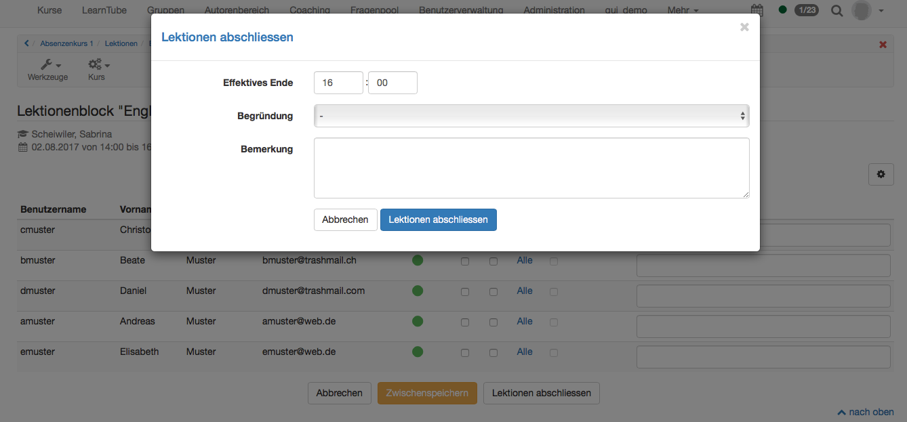

# Lektionen - Sicht Dozent

Dozierende können die Absenzenkontrolle in der Toolbar des entsprechenden
Kurses öffnen.

Falls beim Login ein Kurs einen aktiven Lektionenblock aufweist, kann die
Absenzenkontrolle direkt geöffnet werden. Mit "Start" wird die
Absenzenkontrolle für die Desktopansicht geöffnet, mit "Wizard starten" die
mobile Ansicht.

## Übersicht Lektionenblöcke

Mit Klick auf das Buchsymbol
{class="size24"}
in der Toolbar öffnet sich die Übersicht über die aktuellen, pendenten,
nächsten und abgeschlossenen Lektionenblöcke.

 **Aktueller Lektionenblock:** Auch von hier kann die Absenzenkontrolle
gestartet werden. Wiederum kann entweder die Desktop oder die mobile Ansicht
geöffnet werden.

 **Pendente Lektionenblöcke:** Hier befinden sich die Lektionenblöcke, für
welche die Absenzenkontrolle erfasst werden soll. Sie befinden sich entweder
im Status "Aktiv" oder "Wiedergeöffnet".

 **Nächste Lektionenblöcke:**  Lektionenblöcke deren Starttermin in der
Zukunft liegt, können nicht bearbeitet werden. Geplante Absenzen wie z.B. eine
Sportdispens aufgrund einer Verletzung können nicht im Voraus erfasst werden.

 **Abgeschlossenene Lektionenblöcke:** Hier werden alle Lektionenblöcke
aufgelistet welche entweder manuell (Status "Erledigt") oder automatisch
(Status "Autoerledigt") abgeschlossen worden sind. Ein Lektionenblock wir
automatisch abgeschlossen, wenn die Sperrfrist erreicht worden ist. Vor
Erreichen wird eine Erinnerung an den Dozierenden verschickt, um auf die
ausstehende Absenzenkontrolle hinzuweisen. Die Sperrfrist wird systemweit in
der Administration hinterlegt.

Über
{class="size24"}
lassen sich verschiedene Dokumente erstellen. Mit Export wird eine Excel-Liste
erstellt. In dieser Excelliste sind alle Teilnehmer inklusive Absenzen,
Begründung und Kommentar aufgelistet. Die "Absenzenliste" (alphabetisch nach
Nachnamen sortiert) wird als PDF generiert und zeigt einen ähnlichen Inhalt
wie das "Export"-Excel. Auch hier werden die eingetragenen Absenzen angezeigt,
die Begründung hingegen nicht. Zum Schluss kann eine "Präsenzliste"
(alphabetisch nach Nachnamen sortiert) auch als PDF erstellt werden. Diese
Präsenzliste kann ausgedruckt und von den Teilnehmenden unterschrieben werden.

## Lektionen erfassen - Absenzenkontrolle durchführen

Hier kann der Status für die einzelnen Lektionen eines Blocks sowie für alle
Lektionen des Blocks eingestellt werden. Standardmäßig wird davon ausgegangen,
dass die aufgelisteten Personen anwesend waren. Abwesenheiten werden durch
aktivieren der entsprechenden Checkbox bzw. durch die Auswahl "Alle" wenn die
Abwesenheit für alle Lektionen gilt, gesetzt. Anschließend kann definiert
werden, ob die Abwesenheit entschuldigt war oder nicht, sofern diese Option in
der Administration aktiviert wurde. Für die entschuldigte Abwesenheit muss
eine Begründung hinzugefügt werden. Zu jeder personenbezogenen Abwesenheit
kann ferner ein Kommentar ergänzt werden. Dieser Kommentar ist in der
Absenzenkontrolle für den Dozenten (Kursbetreuer) und in der Auswertung für
den Kursbesitzer sichtbar. Die Kursteilnehmenden sehen diesen Kommentar nicht.

Lektionen können zwischengespeichert, abgesagt oder abgeschlossen werden. Mit
"Zwischenspeichern" wird der aktuelle Stand der Absenzenkontrolle gespeichert
und die Erfassung kann zu einem späteren Zeitpunkt weitergeführt werden.

Ist ein Termin ausgefallen, z.B. weil der Dozent krank war, sollte die Option
"Lektionen absagen" gewählt werden. Hier muss eine Begründung gewählt werden.
Die Begründungen werden systemweit in der Administration erfasst und können
nicht durch den Dozenten hinzugefügt werden.

Sobald die Absenzenkontrolle abgeschlossen ist, kann man die "Lektionen
abschliessen". Hier muss das "Effektive Ende" eingetragen werden.
Standardmässig wird das geplante Ende angezeigt. In der Auswertung erhalten
Kursbesitzer so einen Überblick, ob die Lektionenblöcke jeweils wie geplant
beendet wurden oder weshalb sie zu einem anderen Zeitpunkt beendet wurden.
Denn auch hier muss eine Begründung ausgewählt werden. So kann zum Beispiel
das frühere Beenden des Lektionenblocks mit dem Durcharbeiten von Pausen
begründet werden. Falls gewünscht kann eine Bemerkung zum gesamten
Lektionenblock hinzugefügt werden. Diese Bemerkung ist nur für den
Kursbesitzer sichtbar.

Sobald der Lektionenblock abgeschlossen ist, beginnt für die Kursteilnehmenden
die Rekursfrist. Falls beispielsweise ein Rekurs erfolgreich eingereicht wird
(z.B. ein Arztzeugnis bei Krankheit) kann nachträglich der Lektionenblock
wiedereröffnet und die Absenzenkontrolle angepasst werden. Anschliessend muss
der Lektionenblock erneut abgeschlossen werden.

## Coaching Tool

Um eine Übersicht der Absenzen über mehrere Kurse oder über ein gesamtes
Semester zu erhalten, kann das [Coaching Tool](../e-assessment/Coaching.de.md) genutzt werden.
Im Coaching Menü wird der Tab "Lektionen" gewählt und man kommt zum selben
Menü wie unter der zuvor beschriebenen "Übersicht Lektionenblöcke".

Im Coaching Tool können aber auch bestimmte Personen, Gruppen oder Kurse
angezeigt werden oder die Benutzersuche verwendet werden. Anschließend werden
dann alle Kurse mit Absenzenmanagement von dem/den gewählten Benutzer/n
angezeigt.

Weiter kann eine Klasse angezeigt werden. Dafür wird aus einer Klassenliste
beispielsweise die Spalte mit den Benutzernamen oder der E-Mail kopiert und in
das Feld "Benutzernamen, E-Mail oder Institutionsnummer" eingefügt.

Unter Durchführungszeitraum kann zusätzlich ein Semester ausgewählt werden.
Semester können nur ausgewählt werden, wenn diese in der Administration
erfasst worden sind. Ansonsten wird manuell ein Beginn- und Enddatum
ausgewählt. So können zum Beispiel die erforderlichen Daten für die
Zeugniserstellung ausgelesen werden.

