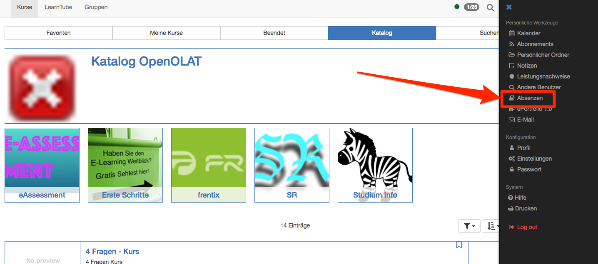
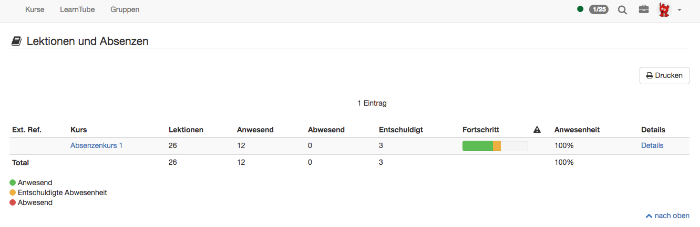
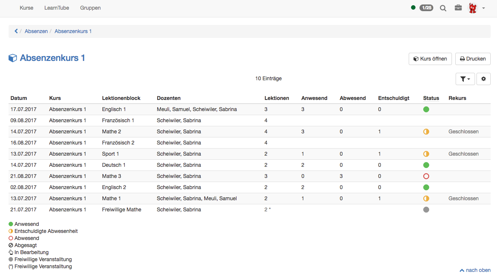

# Lektionen - Sicht Benutzer

Ein Benutzer kann seine Absenzen im persönlichen Menu öffnen

## Übersicht der Kurse

Hier sieht der Benutzer (Kursteilnehmer) seine Kurse, in denen das
Absenzenmanagement verwendet wird. Er erfährt wieviele Lektionen pro Kurs
erfasst sind und wie sich seine Anwesenheit bzw. Abwesenheit pro Kurs
verteilt. Auch der bisherige Fortschritt wird angezeigt. Dabei steht grün für
anwesende Lektionen, orange für entschuldigte und rot für abwesende. Darüber
hinaus können über die Option "Details" weitere Einzelheiten angezeigt werden.
In der Spalte

erscheint ein rotes Ausrufezeichen, wenn die Anwesenheitsquote unter das
geforderte Minimum fällt.

## Detailansicht eines Kurses

Lässt sich der Benutzer die Details zu einem Kurs anzeigen, werden die
einzelnen Termine, Lektionenblöcke, Dozenten (Betreuer) sowie die die
Einzelheiten bezüglich Anwesenheit angezeigt. In de folgenden Spalten wird die
Anzahl Lektionen für Anwesend, Abwesend und Entschuldigt angezeigt. Die
Legende links unten erläutert die farblichen Bedeutungen des jeweiligen
Status.

  * Abgesagt: Wenn ein Lektionenblock abgesagt wurde, zählt er nicht zur Anwesenheitsquote.
  * In Bearbeitung: Bedeutet, dass ein Lektionenblock das Enddatum zwar erreicht, die Absenzenkontrolle jedoch noch nicht abgeschlossen worden ist.
  * Freiwillige Veranstaltung: Die Lektionen sind zwar als Lektionenblock erfasst, werden jedoch nicht für die Anwesenheitsquote berechnet. Für die freiwilligen Lektionen wird keine Absenzenkontrolle durchgeführt.

Wenn ein Teilnehmer mit der eingetragenen Absenz nicht einverstanden ist, kann
ein Rekurs eingereicht werden. Nachdem der Lektionenblock zu Ende ist,
erscheint ein Datum, ab welchem der Rekurs eingereicht werden kann. Dies wird
berechnet aus der Endzeit des Lektionenblocks plus die Tage der Sperrfrist.
Sobald ein Lektionenblock automatisch (nach Ende der Sperrfrist) oder manuell
durch den Dozenten (Kursbetreuer) auf "Erledigt" gesetzt worden ist, erscheint
ein neues Datum, bis zu welchem der Rekurs eingereicht werden kann.
Anschliessend wird "Geschlossen" angezeigt. Die Fristen werden systemweit in
der Administration hinterlegt. Der Rekursantrag wird an die Dozenten des
entsprechenden Lektionenblocks gesendet.

