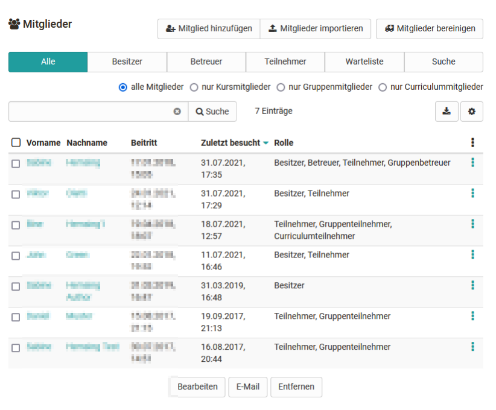
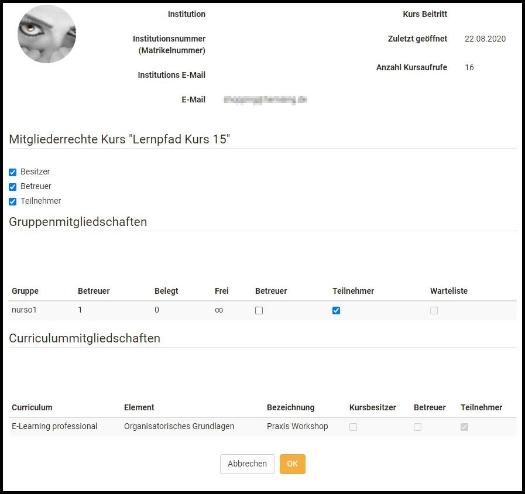
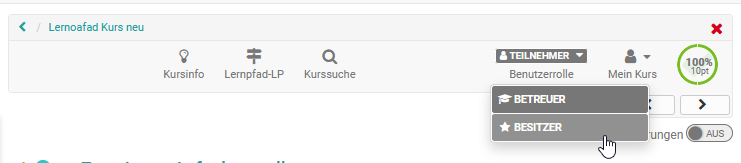

# Mitgliederverwaltung

In der Mitgliederverwaltung sehen Kursbesitzer alle Benutzer und Gruppen eines
Kurses und können diese umfassend organisieren z.B. bestimmte kursbezogene
Rechte vergeben, Teilnehmer kontaktieren und Kurs-Gruppen organisieren. Das
Rechtemanagement und die Verwaltung der Einwilligungen zu kursbezogenen
Nutzungsbedingungen bzw. Datenschutzerklärung erfolgt ebenfalls hier.  

  * 1 Mitgliederverwaltung 
    * 1.1Bereich "Mitglieder"
    * 1.2Bereich "Gruppen"
    * 1.3Bereich "Buchungen"
    * 1.4 Bereich "Rechte"
    * 1.5 Bereich "Einwilligungen"

## Bereich "Mitglieder"

Wenn Sie die Mitgliederverwaltung öffnen befinden Sie sich im Bereich
"Mitglieder" und sehen Sie eine tabellarische Auflistung aller Personen die
Zugriff auf den Kurs bzw. die Lernressource haben. Über verschiedene Tabs
können Sie sich alle oder bestimmte Kursmitglieder z.B. alle Betreuer oder
ausschließlich die Teilnehmer anzeigen lassen. Sie können die Rollenzuordnung
der Personen bearbeiten, sie aus dem Kurs entfernen oder ihnen eine E-Mail
schicken. Des weiteren können Sie die jeweiligen Mitglieder als Excel Tabelle
exportieren.

Über den Tab „Suche“ in der Mitgliederverwaltung kann nach Mitgliedern eines
Kurses gesucht werden, was bei vielen Teilnehmenden hilfreich ist.

Wählen Sie die für Sie relevanten Spalten über das 3-Punkte Menü aus und
sortieren Sie die Liste nach Ihren Wünschen.

  

 **Benutzerinformationen bearbeiten  
**

Wenn Sie eine Person aus der Liste auswählen, erhalten Sie weitere
Informationen zu dieser Person z.B. sehen Sie die Anzahl der Kursaufrufe und
können der Person weitere Rollen zuordnen.

Es gibt drei spezifische Kurs-Rollen:  

  * **Besitzer**   
Besitzer haben alle Rechte innerhalb eines Kurses und können auf alle Menüs
der [Kurs-Administration](Using_Course_Tools.de.md) zugreifen. Sie legen
die Kursstruktur an und erstellen in der Regel den OpenOlat Kurs. Die Person,
die einen Kurs anlegt ist automatisch Kurs-Besitzer. Kurs-Besitzer können auch
weitere Besitzer des Kurses hinzufügen.

  *  **[Betreuer](../general/Coach.de.md)**  
Betreuer spielen in der Regel bei der Kursdurchführung eine Rolle, sind jedoch
bei der Erstellung nicht involviert. Kurs-Betreuer haben Zugriff auf das
Bewertungswerkzeug und die Statistiken sowie je nach Einstellung auf weitere
Optionen und Kursbausteine.

  *  **Teilnehmer**  
Die Teilnehmer sind in der Regel die Lernenden bzw. Personen, die an einem
Online-Kurs teilnehmen. Teilnehmer können nur im Rahmen der vom Besitzer
bereitgestellten Möglichkeiten agieren. Teilnehmer haben standardmäßig keinen
Zugriff auf die Kurs Administration und die darin enthaltenen Menüs.

Ein Kursmitglied kann im Kurs gleichzeitig über mehrere Rollen verfügen. In
diesem Fall erscheint bei den Personen in der Toolbar des Kurses die
Möglichkeit, einen [Rollenwechsel](Rollen+und+Rechte.html#RollenundRechte-
_rollenwechsel) vorzunehmen und sich so den Kurs aus verschiedenen Kursrollen
anzuschauen.  

  

Häufig ist es sogar sinnvoll, sich als Kurs-Besitzer zusätzlich noch als Kurs-
Teilnehmer einzutragen, um sich den Kurs aus der entsprechenden Perspektive
anzusehen.

Besitzt der User noch darüberhinausgehende bestimmte [System-
Rollen](../general/Roles_and_Rights.de.md),  wie Lernressoucrenverwalter oder
Administrator, werden diese ebenfalls als Auswahlelement für die entsprechende
Perspektive angezeigt.

  

### Mitglieder hinzufügen

Benutzer können auf verschiedene Arten einem Kurs hinzugefügt werden:

a) durch das direkte Eintragen in die Mitgliederliste durch den Kursbesitzer
über die Button "Mitglied hinzufügen" oder "Mitglieder importieren".

b) durch Buchung des Kurses durch den Lernenden (siehe
[Zugangskonfiguration](../course_create/Access_configuration.de.md))

c) durch Hinzufügen einer OpenOlat Gruppe

d) durch ein übergeordnetes OpenOlat [Curriculum](../curriculum/Curriculum_Management.de.md)

Wir empfehlen nur mit Gruppen zu arbeiten, wenn dies aus didaktischen oder
organisatorischen Gründen wirklich notwendig ist und einen Mehrwert bietet,
z.B. wenn die Gruppen eine zentrale organisatorische Komponente darstellen.
Für die meisten Kurse sind die Varianten a) und b) zu empfehlen.

## Bereich "Gruppen"

Hier können Sie dem Kurs OpenOlat Gruppen hinzufügen, erstellen und aus dem
Kurs entfernen, sowie die dem Kurs zugehörigen Gruppen tabellarisch anzeigen
lassen. So erhält man rasch einen Überblick über die kursspezifischen Gruppen
und die Anzahl der Gruppen Teilnehmenden.

Klickt man auf einen Gruppennamen oder auf "Ändern" öffnet sich die Gruppe
selbst in einem neuen OpenOlat-Tab und man gelangt als Gruppen-Betreuer in die
Gruppenadministration. Wie Gruppen erstellt und konfiguriert werden, und man
Gruppenmitglieder verwaltet, wird im Kapitel „[Gruppen](Gruppen.html)“
behandelt.

Gruppen können in einem OpenOlat Kurs unterschiedliche Funktionen besitzen.
Typische Beispiele sind:

  * Bündelung von Einzelpersonen für selektive Freigaben bei herkömmlichen Kursen
  * Gruppen für Gruppenarbeiten (gemeinsame Aktionen)
  * Gruppen für die Organisation des kursbezogenen Rechtemanagements

## Bereich "Buchungen"

Unter  **Buchungen**  können Sie sich alle Buchungen für diesen Kurs ansehen,
sortiert nach Status, sofern der Kurszugang über die [Buchungsmethode
](../course_create/Access_configuration.de.md)organisiert wird.

##  Bereich "Rechte"

Im Bereich "Rechte" erscheinen alle kursspezifischen Gruppen, unterteilt nach
Gruppen-Betreuer und Gruppen Teilnehmer und die der jeweiligen Gruppe
zugeordneten Rechtegruppen.

Häufig kommt es vor, dass man Benutzern weitere Rechte übergeben möchte ohne
ihnen aber volle Besitzerrechte zu übertragen oder eine weitere
kursspezifische Rolle zu vergeben. Dies können Sie im Bereich Rechte der
Mitgliederverwaltung erledigen. Zu beachten ist dabei, dass hier keine
Einzelrechte, sondern Rechte für bestimmte _Kurswerkzeuggruppen_ vergeben
werden wie z.B. Zugriff auf den Kurseditor mit allen integrierten
Möglichkeiten oder das komplette Bewertungswerkzeug.  Alle Personen, die in
die jeweilige Gruppe in der entsprechenden Rolle eingetragen sind erhalten
dann automatisch die Berechtigung das jeweilige Werkzeug mit allen Optionen
Kurs weit zu verwenden. Die Kursrechte einer Gruppe sind immer an einen
einzelnen Kurs gebunden und gelten nicht pauschal.

Folgende Kursrechte können an einzelne Benutzergruppen vergeben werden:

  

 **Gruppen-Verwaltung**|

Es erscheint zusätzlich das Menü "Administration".

Alle Aktionen aus dem Bereich "Gruppen" der Mitgliederverwaltung also z.B.
Gruppen erstellen, zum Kurs hinzufügen oder entfernen, Mails an Gruppen
verschicken sowie die Aktionen aus dem Bereich "Einwilligungen" stehen zur
Verfügung.  
  
---|---  
 **Mitglieder-Verwaltung**|

Es erscheint zusätzlich das Menü "Administration".

Alle Aktionen der Bereiche "Mitglieder", Gruppen" und "Buchungen" und
"Einwilligungen" der Mitgliederverwaltung stehen zur Verfügung aber kein
Rechtemanagement  
  
 **Kurseditor**|

Es erscheint zusätzlich das Menü "Administration".

Bei Aktivierung dieser Rechte-Gruppe können auch Nicht-Autoren den Kurseditor
mit allen dazu gehörenden Funktionalitäten verwenden. Darüber hinaus werden
noch weitere Menüs wie der Ablageordner, Lektionen und Absenzen, Lernbereich
u.a.  bereitgestellt.  
  
 **Datenarchivierung**|

Es erscheint zusätzlich das Menü "Administration".

Mitglieder haben Zugriff alle Bereiche der [Datenarchivierung
](Data_archiving.de.md)und damit auf alle Daten des Kurses. Sie dürfen
Kursdaten wie z.B. Foren oder Testresultate von allen Teilnehmenden
archivieren.  
  
 **Bewertungs-Werkzeug**|

Es erscheint zusätzlich das Menü "Administration" mit dem
[Bewertungswerkzeug](Assessment_tool_-_overview.de.md).

Auch ohne Betreuerrechte können so Mitglieder mit diesem Recht sämtliche
Leistungen der Kursteilnehmenden bewerten und kommentieren. Ein Zugriff auf
die Bewertung im Kursrun besteht dabei aber nicht.  
  
 **Glossar-Werkzeug**|  Dieses Recht erlaubt es den Mitgliedern das Glossar
des Kurses zu bearbeiten, was natürlich nur Sinn macht, wem dem Kurs auch ein
[Glossar ](Using_Additional_Course_Features.de.md)zugeordnet ist.
Der Zugriff erfolgt direkt über das Werkzeug "Glossar" in der Toolbar.  
 **Statistiken**|

Es erscheint zusätzlich das Menü "Administration"

Mitglieder mit diesem Recht erhalten Zugriff auf alle für diesen Kurs zur
Verfügung stehenden Statistikbereiche, also Kurs-Statistiken, Fragebogen
Statistiken und Test Statistiken. Die Daten können angezeigt und
heruntergeladen werden.  
  
 **Prüfungsmodus**|

Es erscheint zusätzlich das Menü "Administration"

Mitglieder dürfen neue [Prüfungskonfigurationen
](../e-assessment/Assessment_mode.de.md)einrichten,
bearbeiten und löschen.  
  
 **Kurs Datenbank**|

Es erscheint zusätzlich das Menü "Administration" mit dem Bereich "Kurs DB".

Mitglieder können hier Kursdatenbanken erstellen, zurücksetzen, löschen und
exportieren.  
  
Häufig ist die gezielte Vergabe bestimmter Rechte, anstatt des Eintrags als
Besitzer schon aus Datenschutzgründen sinnvoll oder notwendig.

Achtung: Gruppenbetreuer erhalten grundsätzlich auch Zugang zum
Bewertungswerkzeug und können alle Mitglieder der Gruppe auch bewerten. Ferner
dürfen sie Änderungen an den betreuten Gruppen vornehmen.

Tipp: Meist ist es sinnvoller ergänzende Rechte nur an die _Teilnehmenden_
einer Gruppe zu vergeben

##  Bereich "Einwilligungen"

Sind kursbezogene Nutzungsbedingungen bzw. die kursbezogene
Datenschutzerklärung [aktiviert](../course_create/Course_Settings.de.md), werden die
gespeicherten Einwilligungen der einzelnen Benutzer hier aufgelistet.
Ausgewählte Einwilligungen können an dieser Stelle widerrufen oder auch
gelöscht werden. Beim Widerruf wird die Einwilligung zurückgesetzt, der
Eintrag bleibt aber erhalten. Wird ein Benutzer in OpenOlat gelöscht, so
werden auch alle kursbezogenen Einwilligungen des Benutzers entfernt.

  

