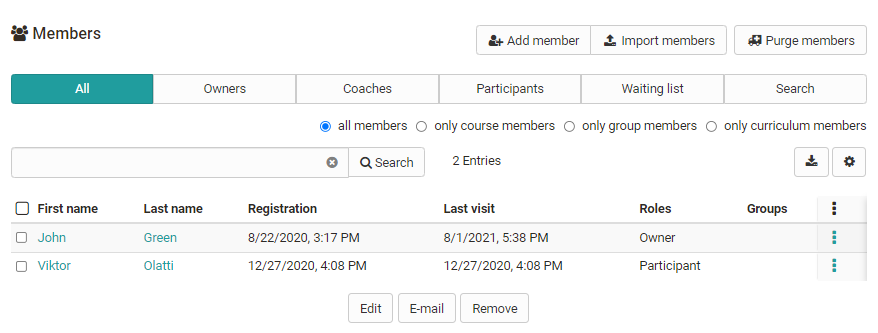
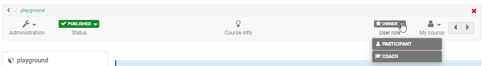

# Members management

In the member administration, course owners see all users and groups of a
course and can organize them comprehensively, e.g. assign certain course-
related rights, contact participants and organize course groups. Rights
management and the administration of consents to course-related terms of use
or privacy policy also take place here.

  * 1 Members management 
    * 1.1Members
    * 1.2Groups
    * 1.3Bookings
    * 1.4 Rights
    * 1.5 Consents

## Members

When you open the members management you will see a tabular list of all users
who have access to the course as course or group member. Several tabs filter
the member list according to member roles. Under each tab you can view and
manage (edit, remove) the corresponding users as well as add or import new
persons or send e-mails to one or more persons. You can also export the
respective members as Excel table.

The "Search" tab in Member Management can be used to search for members of a
course, which is helpful for many participants.

Select the columns that are relevant for you via the 3-point menu and sort the
list according to your wishes.

### User information

If you select a person from the list, you will get further information about
this person, e.g. information about the person's attendance behavior, which
role he/she plays within the course, in which groups he/she is a member and
his/her curriculum memberships.

There are three specific course roles:

  *  **Owner**  
Owners have all rights within a course and can access all menus of the course
administration. They create the course structure and usually create the
OpenOlat course. The person who creates a course is automatically the course
owner. Course owners can also add other owners to the course.

  *  **[Coaches](../general/Coach.md)**  
Coaches typically play a role in course delivery, but are not involved in
course creation. Course coaches have access to the assessment tool and
statistics, as well as other options and course elements depending on their
settings.

  *  **Participants**  
Participants are usually the learners or people who participate in an online
course. Participants can only act within the scope of the options provided by
the owner. By default, participants do not have access to the course
administration and the menus it contains.

A course member can have multiple roles in the course at the same time. In
this case these persons will see the possibility to [change
roles](../general/Roles_and_Rights.md#RolesandRights-_rollenwechsel) in the course
toolbar and thus to view the course from different course roles.

Multiple roles are often useful for course owners in order to quickly
recognize all user-specific possibilities. The normal participant usually does
not need any further global membership rights.

If the user has additional [system roles](Roles+and+Rights.html), such as
learning resource manager or administrator, these are also displayed as
selection elements for the corresponding perspective.

### Adding members

Users can be added to a course in several ways:

a) by directly entering them in the member list by the course owner via the
button "Add member" or "Import members".

b) by booking the course by the learner (see [access
configuration](Access+configuration.html))

c) by adding a group

d) by a superordinate OpenOlat [Curriculum](Curriculum+Management.html)

We recommend working with groups only if it is absolutely required, hence for
didactic or organizational reasons. For most courses, enrolling directly in a
course is the better choice.

## Groups

Here you can add, create and remove groups from the OpenOlat course, as well
as display the groups associated with the course in tabular form. This gives
you a quick overview of the course-specific groups and the number of group
participants.

Clicking on a group name or on "Modify" opens the group itself in a new
OpenOlat tab and takes you as a group coach to the group administration. How
to create and configure groups and how to manage group members is covered in
the chapter "[Groups](Groups.html)".

Groups can have different functions in an OpenOlat course. Typical examples
are:

  * Bundling of individuals for selective releases
  * Groups for group work (joint actions)
  * Groups for the organization of the course-related rights management

## Bookings

Under Bookings you can view all bookings for this course, sorted by status, if
the course access is organized via the [booking
method](Access+configuration.html).

##  Rights

In the "Rights" area, all course-specific groups appear, divided into group
coaches and group participants and the rights groups assigned to the
respective group.

It often happens that you want to give users additional rights without giving
them full ownership rights. You can do this in the **Rights** section. Please
keep in mind that here no individual rights are granted but rights for certain
course tool groups, e.g. access to the course editor with all its integrated
options or to the complete assessment tool. Here you can differentiate between
group coaches and participants. All persons registered in that group will then
have the right to use that tool in all courses. Course rights of a group are
always bound to a single course.

Group coaches always have access to the assessment tool and can also assess
the members of the group. Furthermore they are allowed to make changes to the
coaches of a group.

The following course rights can be assigned to individual user groups:

 **Group management**|

The "Administration" menu also appears.

All actions from the "Member administration" → "Groups", e.g. members can
create groups, add or remove them to a course, send mails to groups as well as
the actions from the "Consents" section are available.  
  
---|---  
 **Member management**|

The "Administration" menu also appears.

All actions of the areas "Members", "Groups" and "Bookings" and "Consents" of
the member administration are available but no rights management.  
  
 **Course editor**|

The "Administration" menu also appears.

Even non-authors can use the course editor with all its functionalities. In
addition there are further menus such as storage folder, lessons and absences,
learning area, etc.  
  
 **Archive tool**|

The "Administration" menu also appears.

Members have access to data archiving and thus to all data of the course. They
may archive course data such as forums or test results.  
  
 **Assessment tool**|

The "Administration" menu also appears.

Even without coach rights, members with these rights can use the [assessment
tool](Assessment+tool+-+overview.html) to evaluate and comment on all of the
course participants' achievements.  
  
 **Glossary tool**|

This right allows members to edit the glossary, which of course only makes
sense if a [glossary](Using+Additional+Course+Features.html) is assigned to
the course.  
  
 **Statistics**|

The "Administration" menu also appears.

Members are allowed to access and download course statistics.  
  
 **Assessment mode**|

The "Administration" menu also appears.

Members are allowed to set up the [test configuration](Assessment+mode.html)
of the course.  
  
 **Course database**|

The "Administration" menu also appears.

Members have access to the course database and can create, reset, delete or
export it.  
  
Often, the specific assignment of certain rights, instead of the entry as
owner, is already useful or necessary for data protection reasons.

Attention: Group coaches basically also get access to the [assessment
tool](Assessment+tool+-+overview.html) and can also assess all members of the
group. Furthermore, they may make changes to the coached groups.

Tip: In most cases, it makes more sense to grant additional rights only to the
_participants_ of a group.

##  Consents

If course-related terms of use or the course-related privacy policy are
[activated](Course+Settings.html), the stored consent of the individual users
is listed here. Selected consents can be revoked or deleted at this point.
When revoking, the consent is reset, but the entry is retained. If a user is
deleted in OpenOlat, all course-related consents of the user are also removed.

  

