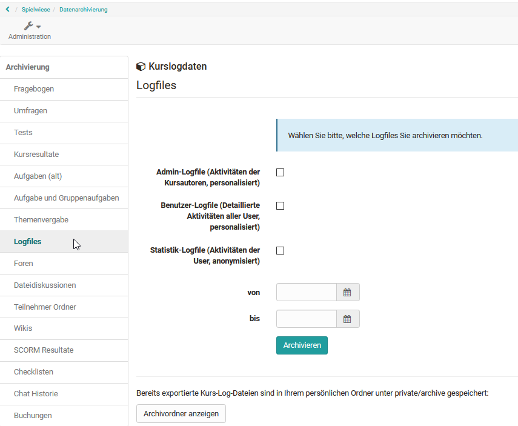
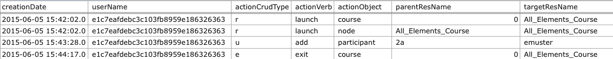

# Aufzeichnung der Kursaktivitäten

OpenOlat zeichnet Kursaktivitäten der Kursteilnehmer und Kursautoren in
Logfiles auf.

Innerhalb eines Kurses können über die
[Datenarchivierung](../display/OO161DE/Einsatz+der+Kurswerkzeuge.html#EinsatzderKurswerkzeuge-
_datenarchivierung) folgende Logfiles heruntergeladen werden

  * Admin-Logfile mit personalisierten Daten der Kursautoren
  * Benutzer-Logfile mit personalisierten Aktivitäten der User
  * Statistik-Logfile mit den anonymisierten Daten der Kursteilnehmenden

Aus Datenschutzgründen ist das Benutzer-Logfile mit den personalisierten User-
Daten nur für Systemadministratoren verfügbar.

Kursbesitzer und sonstige Personen, welche die Berechtigung zur Archivierung
haben, können die gewünschten Logfiles als ZIP-Datei (z.B.
_CourseLogFiles_2010-01-28_14-55-55.zip_ ) in Ihrem persönlichen Ordner (
_Persönlicher Ordner_ -> _private_ -> _archive_ ) abspeichern. Die ZIP-Datei
enthält dann alle gewünschten Dateien _course_statistic_log.csv_ ,
_course_admin_log.csv_ und _course_user_log.csv_.

Beachten Sie, dass in der Datei course_statistic_log.csv die Kursteilnehmer
folgendermassen anonymisiert sind:  
Jeder Kursteilnehmer erhält eine zufällig erzeugte Nummer (z.B.
*7FFBA8C371B1A3DACCF5F12227A75CE82D6C4CE6), die innerhalb eines Kurses
konstant bleibt. Sie können so die Aktivitäten des Kursteilnehmer X im Kurs Y
verfolgen, jedoch keine Vergleiche mit seinen Aktivitäten im Kurs Z machen, da
der Kursteilnehmer X im Kurs Z eine neue Nummer erhält.

Mögliche Einträge in den Logfile-Spalten **actionCrudType**
(Datenbankoperation), **actionVerb** (Aktion) und **actionObject**
(bearbeitetes Kursobjekt)(alphabetisch zusammen gefasst)

actionCrudType| actionVerb| actionObject  
---|---|---  
  
c

r

u

d

e

|

add

copy

denied

do

edit

exit

hide

launch

lock

move

open

remove

view

|

calendart, chat, course, cpgetfile

editor, efficency

feed, feeditem, file, folder, forummessage, forumthread

glossar, gotonode, groupmanagement, group, grouparea, groupareaempty

help

layout

node

owner

participant, publisher

quota

resource, rights, rightsempty

sharedfolder, spgetfile

testattempts, testcomment, testid, testscore, testsuccess, tools, toolsempty

waitingperson  
  
In der Spalte **actionCrudType** werden die ausgeführten Aktionen in
grundlegenden Datenbankoperationen zusammengefasst. Da diese in der Spalte
actionVerb weiter aufgeschlüsselt werden, ist sie nicht weiter relevant.
Dennoch hier der Schlüssel:

  * C=Create (erstellen)
  * R=Read / Retrieve (lesen/holen)
  * U= Update / Modify (Verändern)
  * D=Delete (entfernen)
  * E=Exit (beenden)  
  

In der Spalte **actionVerb** wird nun genauer betrachtet welche Aktion vom
Benutzer unter „userName“ mit dem Kursobjekt aus Spalte actionObject
vorgenommen wurde. Der Eintrag in der Spalte **actionObject** ist also das
Objekt das „verändert“ wurde, zumindest aus Datenbanksicht.

Also z.B. aus der dritten Zeile:

    
    
     u / add / participant / [Gruppenname] / [Benutzername]

wird folgendermassen gelesen: (Datenbankoperation: update / modify): Füge
Benutzer [Benutzername] zu [Gruppe] hinzu.

Grafikbasierte Auswertungsmöglichkeiten der Logfiles werden unter dem Punkt
[„Statistiken"](../display/OO161DE/Einsatz+der+Kurswerkzeuge.html#EinsatzderKurswerkzeuge-
_statistiken) erklärt.
