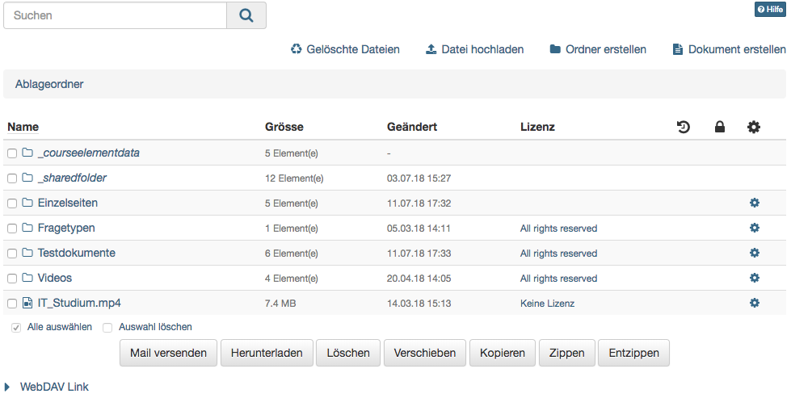
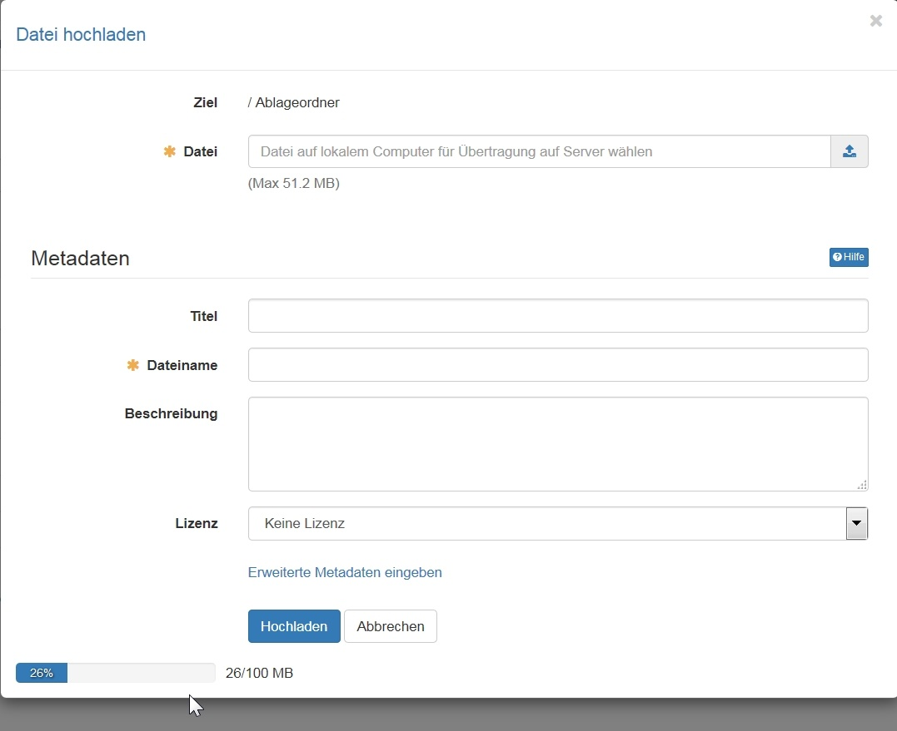

# Ablageordner

##

Der „Ablageordner“ eines Kurses dient dem Kursersteller als Ablage der im Kurs
verwendeten Dateien. Hierzu zählen z.B. alle verwendeten HTML-Seiten, Grafiken
und Dateien, die über den Kursbaustein "Ordner" zur Verfügung gestellt werden.
Die Dateien liegen sozusagen griffbereit im Hintergrund und können jederzeit
über die entsprechenden Kursbausteine bereitgestellt werden.

Kursteilnehmende haben keinen direkten, sondern nur einen indirekten Zugriff
auf Dateien des Ablageordners. Um auf die Dateien zugreifen zu können, müssen
diese über entsprechende Kursbausteine verlinkt sein. Ein Ablageordner ist
immer kursspezifisch.

Im Ablageordner können Dateien hochgeladen, gelöscht, verschoben, gesucht,
gezippt, ausgepackt oder erstellt werden. Standardmässig können in OpenOlat
HTML Dokumente erstellt werden. Sind in der Administration ergänzende
Dokumenteneditoren aktiviert, können auch noch weitere Dateiformate erstellt
werden. Beispielsweise können bei Verwendung von Only Office auch Word, Excel
oder PowerPoint Dateien erstellt werden.

Werden Dateien hochgeladen muss die Grössen Begrenzung sowohl für die einzelne
Datei als auch das Speicherlimit des gesamten Ablageordners berücksichtigt
werden. Dieses Limit gilt auch wenn die Dateien per
[WebDAV](../supported_tech/Using_WebDAV.de.md) in den Ablageordner hochgeladen werden.

Ferner kann der Ablageordner sinnvollerweise mit weiteren Unterordnern
versehen werden und so eine systematische Strukturierung von kursbezogenen
Dateien umgesetzt werden.

Zusätzlich legt OpenOlat, wenn der Kurs mindestens einen [Kursbaustein
"Ordner"](../course_elements/Knowledge_Transfer.de.md#Wissensvermittlung-_ordner) enthält oder der
Kurs mit einem Ressourcenordner verknüpft wird, automatisch die Ordner „
**_courseelementdata** “ bzw. „ **_sharedfolder** " an.

Im Unterordner „ **_courseelementdata** “ befinden sich alle Kursbausteine
"[Ordner](../../pages/viewpage.action%EF%B9%96pageId=108593373.html)" und
"[Teilnehmer Ordner](../learning_activities/Working_With_Course_Elements.de.md)" eines Kurses. Die
entsprechenden Ordner mit den jeweiligen Dateien erscheinen hier nachdem sie
im Kurseditor angelegt wurden automatisch und können im Ablageordner auch
editiert werden.

Ein dem Kurs zugewiesener [Ressourcenordner
](../authoring/Various_Types_of_Learning_Resources.de.md)kann im Ablageordner über den
Unterordner „ **_sharedfolder** “ eingesehen, jedoch per default nicht
editiert werden. Soll eine Bearbeitung über den Ablageordner möglich sein,
muss in den Kurs Optionen bei der Wahl des Ressourcenordners die Option
"schreibgeschützt" deaktiviert werden.

#### Verbindung von Ablageordner und dem Kursbaustein "Einzelne Seite":

Einzelne webspezifische Seiten (z.B. HTML, PDF) die im Ablageordner abgelegt
werden, können über den Kursbaustein "Einzelne Seite" im Kurs sichtbar gemacht
werden. Zudem kann im Kursbaustein "Einzelne Seite" die Checkbox "Link in
gesamten Ablageordner erlauben" ausgewählt werden. Dadurch wird es möglich,
Dateien, welche sich im Ablageordner befinden, direkt in dieser HTML-Datei zu
verlinken. Das ist hilfreich für die Anzeige von verknüpften Grafiken einer
HTML-Seite sowie sonstigen verknüpften Dateien.

Sobald diese Checkbox aktiviert ist, ist der Pfad für andere Dateien im
Ablageordner ersichtlich. Es ist dadurch möglich, auch Dateien aufzurufen,
welche sich zwar im Ablageordner befinden, jedoch nicht im Kurs selbst
publiziert sind.

