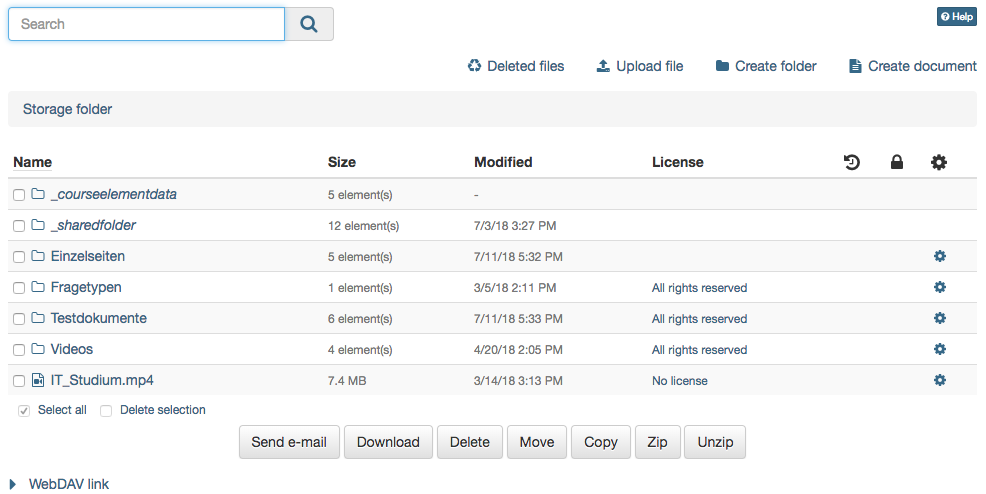
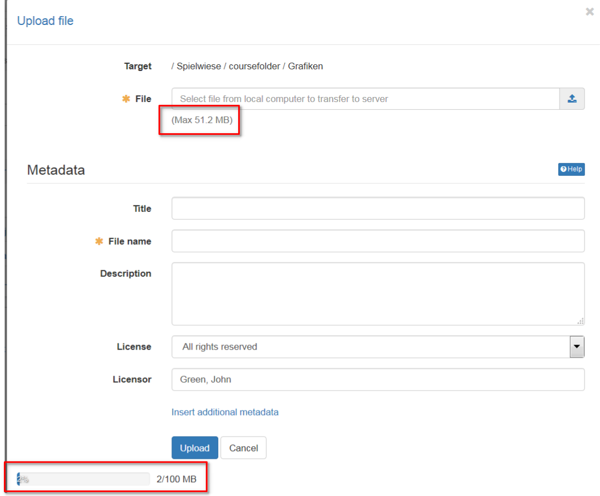

# Storage folder

##

The editor tool "Storage folder" in a course serves the storage of files used
in the course, e.g. all used HTML pages or documents from folders. A storage
folder is course specific. It the central place for the storage of course
related files. However, the content of the storage folder cannot be viewed
directly by learners, but can be accessed indirectly, e.g. via the course
elements "single page" or "folder". A storage folder is always course-
specific.  

  

In the storage folder files can be uploaded, deleted, moved, searched for,
zipped, un-zipped or created. By default, HTML documents can be created in
OpenOlat. If additional document editors are activated in the administration,
further file formats can be created. For example, if Only Office is used,
Word, Excel or PowerPoint files can also be created.

When uploading a file the file size limit as well as the folder space limit
has to be taken into consideration. Also those limits apply when uploading
files via [WebDAV](../../manual_admin/administration/WebDAV.de.md) to the storage folder.

  

In the storage folder subfolders can be used to create a systematical
structure of course related files. In addition OpenOlat automatically creates
the folders „ **_courseelementdata** “ and „ **_sharedfolder** ",
respectively, when a course contains at least one course element "Folder" or a
course is linked with a resource folder.

In the subfolder **"_courseelementdata"** you can find all course elements
"folder" of this course. The corresponding folders appear here automatically
after they have been created in the course editor and can be edited here as
well.

Via the subfolder „ **_sharedfolder** “ you can view the linked resource
folder of the course, but you can not edit it by default. Editing can be
enabled in the course options by deactivating the option "read only" for the
selected resource folder.

### Link course element "Single page" to storage folder:

Single web specific pages (e.g. html, pdf) which are stored in the storage
folder can be made visible in the course with the course element "Single
page".

Additionally the checkbox "Allow links in the entire storage folder" can be
selected. Thus it becomes possible to link html-files, which can be found in
the storage folder, directly. This is helpful to show linked charts of a html-
page or other linked files.

As soon as the checkbox is activated, the path for other files of the storage
folder is visible. Thus it becomes possible, to call up files, which are
determined in the storage folder but aren't published in the course itself.

