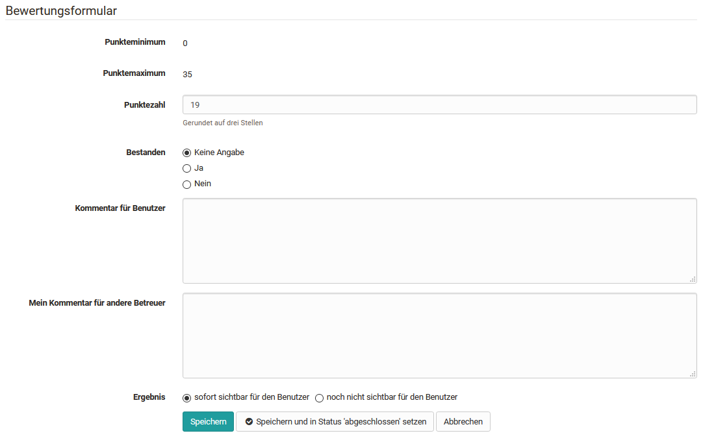
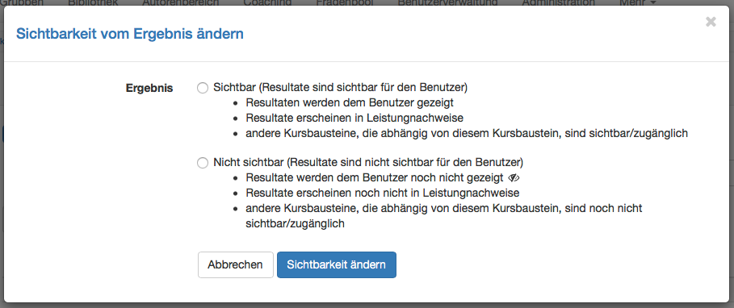

# Das Bewertungsformular

Für alle bewertbaren Kursbausteine steht ein Bewertungsformular zur Verfügung.
Die konkreten Möglichkeiten variieren je nach Kursbaustein und nach konkreter
Konfiguration des Bausteins.

Grundsätzlich können im Bewertungsformular:

  * kurze Feedbacks erstellt,
  * ein bestanden/nicht bestanden definiert,
  * Punkte vergeben,
  * die Sichtbarkeit der Rückmeldung für den Lernenden eingestellt,
  * Kommentare für andere Betreuter hinterlassen,
  * Bewertungsdokumente verteilt,
  * die Bewertung abgeschlossen werden.

Bei den Kursbausteinen [Aufgabe und Gruppenaufgaben
](Assessing_tasks_and_group_tasks.de.md)werden neben dem
Bewertungsformular auch der Einreichungsprozess angezeigt. Hier können in den
einzelnen Bewertungsschritten Bewertungen vorgenommen werden.

Sofern über den bewerteten Kursbaustein Dateien eingereicht werden, kann auch
die Anzahl der Versuche der Lernenden manuell angepasst werden.

Bei dem Kursbaustein „[Bewertung](Bewertung+von+Kursbausteinen.html)“ steht,
sofern entsprechend aktiviert, ergänzend ein [Rubrik ](Rubrik.html)zur
Bewertung zur Verfügung.

##  Sichtbarkeit des Ergebnisses

Sobald im Bewertungswerkzeug Ergebnisse hinzugefügt werden, egal ob als Punkte
oder bestanden/nicht bestanden, sind diese für den Benutzer sichtbar. In
einigen Fällen sollen jedoch die Ergebnisse für alle Benutzer gleichzeitig zur
Verfügung gestellt werden. Dies kann eine Aufgabe, eine Seminararbeit oder
auch ein Test sein. Für solche Szenarien kann die Sichtbarkeit des Ergebnisses
eingeschränkt und erst zum gewünschten Zeitpunkt auf sichtbar gestellt werden.

Standardmässig werden alle Ergebnisse der bewertbaren Bausteine sofort
angezeigt. Einzige Ausnahme bildet der Test, wenn die Korrektur auf manuell
gestellt wurde.

Um die Sichtbarkeit für einen einzelnen Benutzer einzustellen, öffnen Sie den
gewünschten Benutzer. Unten im Bewertungsformular sehen Sie bei Ergebnis zwei
Möglichkeiten.

  * sofort sichtbar für den Benutzer: sobald das Bewertungsformular gespeichert wird, ist das Ergebnis für den Benutzer sichtbar. 
  * noch nicht sichtbar für den Benutzer: Wenn Sie das Bewertungsformular speichern, wird zwar das Ergebnis im Bewertungswerkzeug gespeichert, ist jedoch für den Benutzer noch nicht sichtbar. Es wird für den Benutzer erst sichtbar, wenn Sie das Ergebnis manuell auf sichtbar stellen.

Der Status abgeschlossen hat keine Auswirkung auf die Sichtbarkeit.

In dieser Spalte wird angezeigt, bei welchen Benutzern das Ergebnis sichtbar
(),
respektive noch nicht sichtbar
()
ist. Sofern kein Icon angezeigt wird, gilt die Standardeinstellung. Um die
Sichtbarkeit zu ändern, können die gewünschten Benutzer in der Spalte ganz
links ausgewählt werden. Anschliessend mit der Schaltfläche `Sichtbar`setzen
bestätigen.

Es erscheint der folgende Dialog:

Alle ausgewählten Benutzer können nun entweder sichtbar oder nicht sichtbar
gesetzt werden. Sobald ein Benutzer auf sichtbar gesetzt wird, kann er sein
Ergebnis sehen, der Leistungsnachweis wird aktualisiert und Kursbausteine, die
von diesem abhängig sind, sind nun sichtbar und zugänglich.

## Finalisierung der Bewertung

Mit der Schaltfläche "Auf Status 'abgeschlossen' setzen" wird der Status in
der Spalte Status geändert. Alle ausgewählten Benutzer, welche auf
abgeschlossen gesetzt wurden, erhalten den Status "Bewertet". Änderungen sind
dann nur noch möglich, wenn "erneut für Beurteilung öffnen" gewählt wird.
Dieser Status hilft Ihnen den Überblick über die bereits bewerteten Benutzer
zu behalten. Dieser Status hat keine Auswirkung auf die Sichtbarkeit der
Ergebnisse für den Benutzer.

  

  

