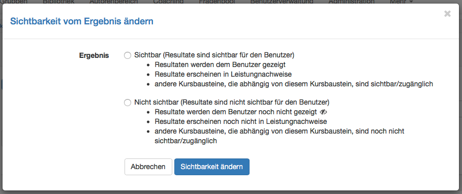

# The assessment form

## For all assessable course elements an assessment form is available. The
corresponding setting options vary between course elements.

## In general here you can:

  * create short feedback
  * define passed/failed
  * score
  * set the visibility of the feedback for the learners
  * make comments for other coaches
  * distribute assessment documents
  * close the assessment

For the course elements [Task and Group
tasks](Assessing_tasks_and_group_tasks.md), the submission process is
displayed in addition to the assessment form. Here, assessments can be made in
the individual assessment steps.

If files are submitted via the assessed course element, the number of attempts
by the learners can also be adjusted manually.

In the case of the course element "[Assessment](../e-assessment/Performance_assessment.md)",
if activated accordingly, a [rubric](../forms/Rubric.md) for assessment is also
available.

##  Visibility of the result

Once results are added in the assessment tool, whether as points or pass/fail,
they are visible to the user. In some cases, however, the results should be
made available to all users at the same time. This can be an assignment, a
term paper or even a test. For such scenarios, the visibility of the result
can be restricted and set to visible only at the desired time.

By default, all results of the assessable modules are displayed immediately.
The only exception is the test, if the correction was set to manual.

To set the visibility for a single user, open the desired user. At the bottom
of the assessment form you will see two options.

  * Immediately visible for the user: as soon as the assessment form is saved, the result is visible for the user. 
  * Not yet visible to the user: when you save the assessment form, the result is saved in the assessment tool, but it is not yet visible to the user. It will not be visible to the user until you manually set the result to visible.

The status completed has no effect on the visibility.

This column shows the users for whom the result is visible
()
or not yet visible
().
If no icon is displayed, the default setting applies. To change the
visibility, the desired users can be selected in the leftmost column. Then
confirm with the button 'Set visible'.

The following dialog appears:

All selected users can now be set to either visible or not visible. Once a
user is set to visible, he/she will be able to see his/her result, the
evidence of achievement will be updated and course elements that depend on it
will now be visible and accessible.

## Finalization of the assessment

The button "Set to status 'completed'" changes the status in the Status
column. All selected users that have been set to completed will receive the
status "Assessed". Changes are then only possible if "Reopen for assessment"
is selected. This status helps you to keep track of the users that have
already been assessed. This status has no effect on the visibility of the
results for the user.

  

