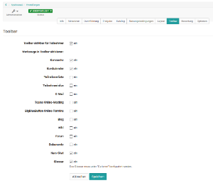
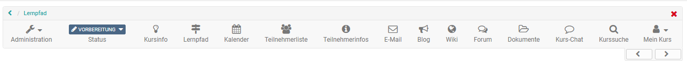
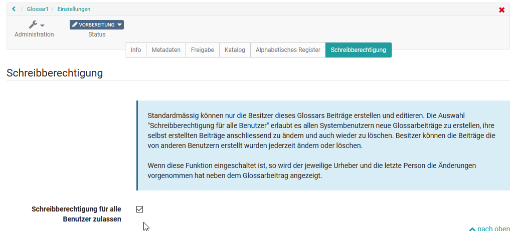

# Einsatz weiterer Kursfunktionen der Toolbar

In der Kurs "Administration" unter "Einstellungen" können Sie im Tab "Toolbar"
die folgenden weiteren Funktionen einrichten.

  

## Kurssuche

Neben der [Volltextsuche ](../personal/Full-Text_Search.de.md)für das gesamte OpenOlat kann
pro Kurs eine Kurssuche aktiviert werden. In dieser Suche werden folgende
Elemente gefunden:

  * Titel, Kurztitel und Beschreibung aller Kursbausteine
  * Inhalt von HTML-Seiten
  * Dokumente in Ordnern
  * Titel Inhalt von Forumsbeiträgen
  * Titel und Inhalt von Mitteilungen
  * Wiki Beiträge

## Kurskalender

Pro Kurs kann ein Kalender aktiviert werden. Für die Einbindung gibt es zwei
Optionen. Der Kalender kann entweder als [Kursbaustein](../course_elements/Administration_and_Organisation.de.md)oder an zentraler Position oben in der
Kurstoolbar angezeigt werden und somit einen guten Überblick geben.

Neue Termine werden einfach mit Klick auf das gewünschte Datum erstellt.
Anschließend können Titel, Beschreibung, Beginn und Ende sowie eventuell ein
Ort, mögliche Wiederholungen sowie die Sichtbarkeit eingestellt werden.
Anschließend erscheint der Termin im Kalender bzw. in allen Instanzen des
Kurskalenders und kann mit Klick auf das Datum und der Option „Editieren“
überarbeitet werden.

Mit dem „Editieren“ erhält man auch Zugriff auf weitere Kalendertabs und kann
Verlinken zu im Kurs verwendeten Kursbausteinen oder externen Webseiten
setzen. Möchten sie alle Termine eines Kurskalenders löschen, klicken Sie
einfach auf das Zahnradsymbol im Kalenderbereich und wählen Sie "Kalender
zurücksetzen".

Kurskalender werden ferner automatisch in den [persönlichen Kalender](../personal/Calendar.de.md) der Kursmitglieder übertragen. So können alle Termine auch
direkt über den persönlichen OpenOlat Kalender aufgerufen werden. Gleiches
gilt für Gruppenkalender. Bei Gruppenkalendern kann in der
Gruppenadministration eingestellt werden welche Schreib-/bzw. Leserechte die
Mitglieder erhalten.

Standardmässig haben nur Besitzer eines Kurses Schreibrechte im Kalender.
Kursteilnehmer haben lediglich Leserechte, können also keine neuen Termine
verfassen oder bestehende Termine editieren. Fügt man den Kalender allerdings
als Kursbaustein ein, kann man die Berechtigung im Kurseditor im Tab "Zugang"
konfigurieren.

## Teilnehmerliste

Hier können alle Kursbesitzer, Betreuer und Teilnehmenden eines Kurses zentral
angezeigt werden. Kursteilnehmende können über die Teilnehmerliste E-Mails an
bestimmte Personen, auch an einzelne Kursmitglieder, verschicken. Anders als
im [Kursbaustein Teilnehmerliste](../learning_activities/Working_With_Course_Elements.de.md) können
hier jedoch keine weiteren Konfigurationen vorgenommen werden.  

## Teilnehmer Infos

Das Tool entspricht dem [Kursbaustein „Mitteilungen"](../course_elements/Administration_and_Organisation.de.md). Teilnehmende können das Tool abonnieren und somit benachrichtigt
werden, wenn es neue Informationen gibt. Anders als im Kursbaustein können
hier jedoch keine weiteren Konfigurationen vorgenommen werden.  

## E-Mail

Hier kann der Kursbesitzer konfigurieren an wen die Lernenden über diesen Link
Mails verschicken können. Zur Auswahl stehen die drei Kursrollen
„Kursbesitzer“, „Betreuer“ und „Teilnehmer“. Eine weitere Differenzierung ist
nicht möglich. Falls Sie differenziertere Einstellungen für den Versand an
Kursmitglieder benötigen, sollten Sie den [Kursbaustein "E-Mail"](../course_elements/Administration_and_Organisation.de.md#mail)
oder den [Kursbaustein „Teilnehmerliste](../course_elements/Communication_and_Collaboration.md)“ nutzen.

## Teams Online-Meeting

Ähnlich wie im Kursbaustein Microsoft Teams können hier Räume für synchrone
Meetings angelegt werden.

## BigBlueButton Online-Termine

Ähnlich wie im [Kursbaustein BigBlueButton](../course_elements/Course_element_BigBlueButton.de.md)
können hier Räume für synchrone Meetings angelegt werden.

## Blog

Hier können Sie einen [Blog (Lernressource)](../resource_blog/index.de.md) erstellen
oder importieren. Die Lernenden können den zentralen Kursblog abonnieren.

## Wiki

Hier können Sie ein[ Wiki (Lernressource) ](../resource_wiki/index.de.md) erstellen oder
importieren. Die Lernenden können das zentrale Wiki abonnieren.

## Forum

Für einen Kurs kann ein zentrales Forum aktiviert werden. Kursmitglieder
können das Forum wie gewohnt abonnieren. Differenzierte Einstellungen wie
beim[ Kursbaustein "Forum"](../course_elements/Communication_and_Collaboration.de.md)
sind hier allerdings nicht möglich.

## Dokumente

Über diesen Link kann der Lehrende wichtige zentrale Dokumente des Kurses zum
Download bereitstellen. Die Lernenden können die Dokumente herunterladen, sich
benachrichtigen lassen, wenn neue Dokumente bereitstehen (abonnieren) und bei
Bedarf die Dateien per Mail versenden. Die Konfigurationsmöglichkeiten sind
aber nicht so umfangreich wie beim [Kursbaustein „Ordner"](../course_elements/Course_Element_Folder.md).

##  Kurs-Chat

In jedem Kurs steht standardmässig ein einfacher Chat bereit.  Er eignet sich
für den kurzen, synchronen Austausch. Hier können Kursmitglieder live Kontakt
zu anderen Lernenden sowie den Dozierenden aufnehmen, sofern sie gleichzeitig
eingeloggt sind.

Ist der Chat eingeschaltet, sehen die Kursbesucher in der Mitte der
Kurstoolbar den Link zum Kurs-Chat. Beim Aufruf des Chats kann jedes
Kursmitglied entscheiden ob er unter seinem eigenen Namen oder anonymisiert im
Chat agiert. Die Standardeinstellung ist "anonym".

Im Chatfenster ist das Chatprotokoll bis zu einem Monat einsehbar. Wählen Sie
oberhalb des Textfeldes den gewünschten Zeitraum aus. Der Chat wird bei der
Nutzung von mobilen Endgeräten angepasst. Tipp: Teilweise ist die Verwendung
des Hochformats sinnvoller als das Querformat.

Wenn Sie den Chat intensiver nutzen wollen, sollten Sie das Chat-Fenster auf
eine angenehme Größe ziehen.

Ob die Chat-Funktion in Ihrem OpenOlat zur Verfügung steht, ist abhängig von
Ihrem Vertrag. Falls Sie den Kurschat nicht aktivieren können, wenden Sie sich
bitte an [contact@frentix.com](mailto:contact@frentix.com).

## Glossar {: #glossary}

In einem Glossar können die Begriffe eines Kurses, eines Fachs bzw. einer
Veranstaltung erklärt werden. Glossare sind OpenOlat Lernressourcen, die
separat oder in einen Kurs eingebunden werden können.

Glossare können wie alle Lernressourcen im Autorenbereich erstellt werden oder
alternativ direkt im Kurs unter „Einstellungen-> „Optionen“.

Nach der Einbindung eines Glossars in einen Kurs erscheint der Link zum
Glossar in der Kurstoolbar. Damit das Glossar auch in der Toolleiste sichtbar
wird muss noch im Tab „Toolbar“ das entsprechende Werkzeug „Glossar“ mit einem
Häkchen aktiviert werden.

Öffnen Sie das Glossar und tragen Sie unter „Eintrag hinzufügen“ den
gewünschten Fachausdruck ein. Sie können auch Synonyme ergänzen. Zum Beispiel
kann der Begriff „Informationstechnologie“ mit dem Synonym „IT“ ergänzt
werden. Im Tab „Definition“ ergänzen Sie dann die konkrete Definition des
Begriffs. Eingetragene Begriffe können auch im Nachhinein geändert oder
gelöscht werden.

Wenn Sie das Glossar nicht mehr verwenden oder ein anderes Glossar einbinden
möchten, können im Menü "Einstellungen unter
"[Optionen](../course_create/Course_Settings.de.md)" die gewünschte
Änderung vornehmen.

In der Lernressource „Glossar“ kann im Tab „Schreibberechtigung“ definiert
werden ob nur die Besitzer der Lernressource Beiträge erstellen und editieren
dürfen oder ob auch Benutzer das Recht erhalten. Besitzer der jeweiligen
Lernressource Glossar können grundsätzlich alle erstellten Glossarbeiträge
ändern und löschen. Standardmäßig können neue Glossareinträge nur vom
Kursbesitzer vorgenommen werden.

  

  

  

  

Möchte man nur bestimmten Personen z.B. den Teilnehmenden eines Kurses das
Schreibrecht für ein Glossar vergeben, geht man einen anderen Weg. Hierfür
wird die „[Mitgliederverwaltung](Members_management.de.md)“ eines Kurses
verwendet. Erstellen Sie dort eine neue Gruppe und fügen Sie die gewünschten
Personen als Teilnehmer der Gruppe hinzu. Gehen Sie anschließend in der
„Mitgliederverwaltung“ des Kurses in den Bereich „Rechte“ und setzen Sie bei
den Kursteilnehmern der Gruppe den Haken für das Recht „Glossarwerkzeug“. Nun
können die Personen der Gruppe Glossareinträge hinzufügen und ändern.

Bitte beachten: Pro Kurs kann nur ein Glossar eingebunden werden.

Achtung die Besitzer eines Kurses sind nicht automatisch auch Besitzer der
Lernressource.  Wurde also eine Lernressource "Glossar" von einer anderen
Person erstellt, können nicht automatisch die Besitzer des Kurses in dem die
Lernressource eingebunden wurde auch Einträge im Glossar vornehmen. Damit die
anderen Kursbesitzer Änderungen vornehmen können, muss eine der beschriebenen
Berechtigungen eingerichtet werden oder die gewünschten Kursbesitzer auch als
Besitzer der jeweiligen Lernressource "Glossar" eingetragen werden.

  

Darüber hinaus erscheint in der Kurs-Toolbar noch der Link zur
"[Kursinfo](../authoring/Set_up_info_page.de.md)" und zu den
"[Lektionen](Lectures_-_Teacher_view.de.md)", sofern eingerichtet.

