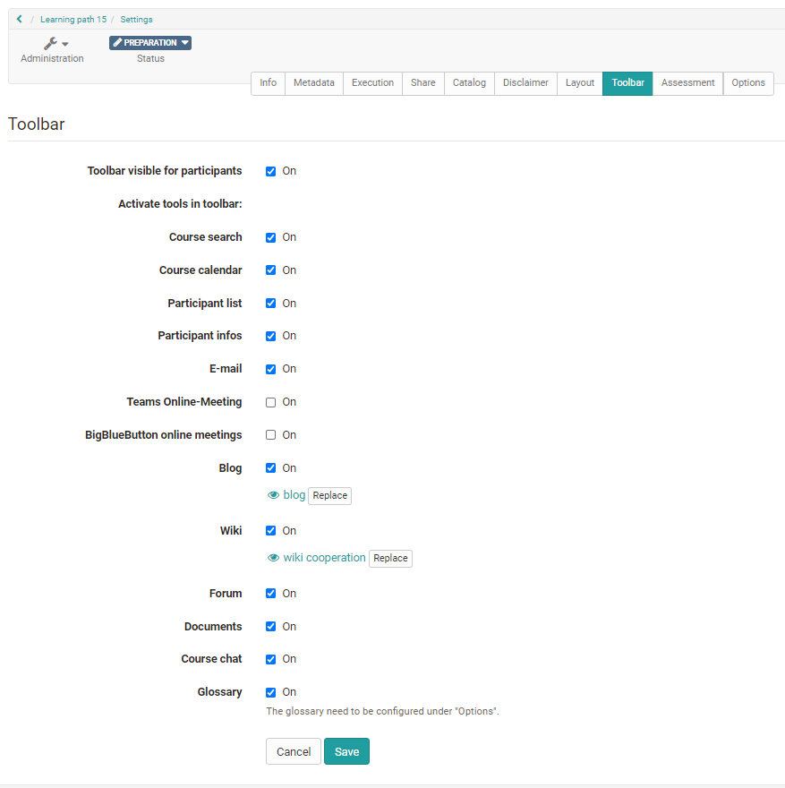
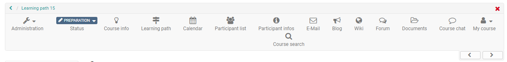
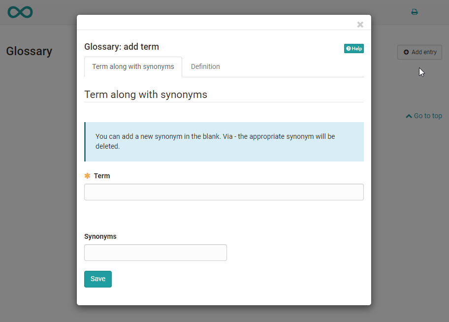

# Using Additional Course Features

In the "Administration" → "Settings" tab you can configure the following
additional functions.

  * 1 Using Additional Course Features 
    * 1.1Course Search
    * 1.2Course Calendar
    * 1.3Participant list
    * 1.4Participant infos
    * 1.5E-Mail
    * 1.6Teams Online-Meeting
    * 1.7BigBlueButton online meetings
    * 1.8Blog
    * 1.9Wiki
    * 1.10Forum
    * 1.11Documents
    * 1.12 Course chat
    * 1.13 Glossary

  

## Course Search

In addition to a [full text search](../personal/Full-Text_Search.md) for the total of
OpenOlat you can activate a search within a course. You can search for the
following elements:

  * Title, short title, description of all course elements  

  * Content of html pages
  * Documents in folders
  * Title and content of forum entries
  * Title and content of notifications
  * Wiki entries

## Course Calendar

One calendar can be activated per course. There are two options for
integration. The calendar can either be displayed as a course element or at a
central position at the top of the course toolbar and thus provide a good
overview.

New dates are simply created by clicking on the desired date. Afterwards, the
title, description, start and end as well as a location, possible repetitions
and visibility can be set. The date then appears in the calendar or in all
instances of the course calendar and can be edited by clicking on the date and
the "Edit" option.

With the "Edit" option you also get access to further calendar tabs and can
set links to course elements or external websites used in the course. If you
would like to delete all dates of a course calendar, simply click on the gear
symbol in the calendar area and select "Reset calendar".

Course calendars are also automatically transferred to the [personal calendars](../personal/Calendar.md) of course members. Thus all dates can be called up also
directly over the personal OpenOlat calendar. The same applies to group
calendars. In the case of group calendars, it is possible to set in the group
administration which write/read rights the members receive.

By default, only owners of a course have write access to the calendar. Course
participants only have read rights, so they cannot write new appointments or
edit existing ones. However, if you insert the calendar as a course element,
you can configure the permissions.

  

## Participant list

Here all course owners, coaches and participants of a course can be displayed
centrally. Course participants can send e-mails to specific persons, even to
individual course members. In contrast to the [course element "Participant list"](../learning_activities/Working_With_Course_Elements.md) no further configurations can be
made here.

  

## Participant infos

This tool corresponds to the [course element "Notifications".](../course_elements/Administration_and_Organisation.md) Participants can subscribe to the tool and thus be notified when
there is new information. In contrast to the course element no further
configurations can be made here.

  

## E-Mail

Here the course owner can configure to whom the learners can send mails via
this link. There are three course roles to choose from: "course owner,"
"coach," and "participant". A further differentiation is not possible. In case
you need more differentiated settings for sending mails to course members you
should use the [course element "E-mail"](../course_elements/Administration_and_Organisation.md) or the [course element "List of participants"](../course_elements/Communication_and_Collaboration.md).

  

## Teams Online-Meeting

Similar to the Microsoft Teams course element, rooms for synchronous meetings
can be created here.

  

## BigBlueButton online meetings

Similar to the [course element BigBlueButton](../course_elements/Course_element_BigBlueButton.md), rooms for synchronous
meetings can be created here.

  

## Blog

Here you can create or import a [blog (learning resource)](../resource_blog/index.md). Learners can subscribe to the central course
blog.

  

## Wiki

Here you can create or import a [Wiki (learning resource)](../resource_wiki/index.md). Learners can subscribe to the central Wiki.

  

## Forum

A central forum can be activated for a course. Course members can subscribe to
the forum as usual. However, differentiated settings as in the 
[course element "Forum"](../course_elements/Communication_and_Collaboration.md)
are not possible here.

  

## Documents

The teacher can use this link to provide important central documents of the
course for download. Students can download the documents, be notified when new
documents are available (subscribe) and, if required, send the files by
e-mail. However, configuration options are not as extensive as in the 
[course element "Folder"](../course_elements/Course_Element_Folder.md).

  

##  Course chat

A simple chat room is available as standard in every course. It is suitable
for short, synchronous exchanges. Here course members can make live contact
with other learners and lecturers, provided they are logged in at the same
time.

When the chat function is on, participants will see a chat link in the center
of the course toolbar.

If activated, course participants can choose between a personalised and an
anonymous view. When entering the chat room their name will not be displayed.
It will be displayed, however, if they select their name in the "Participants"
section.

The history of a course chat is accessible for up to one month. Open the
course chat and select the time span of your choice: 1 day, 1 week, or 1
month. The Chat will be adapted when using a mobile device. Tip: Partially the
portrait format is more useful than the landscape format.

You can activate the course chat in your course by checking the box "Course
chat" in the menu "Administration" → "Settings" -> "Toolbar" -> "Activate
tools in toolbar".

If you want to use the chat more intensively, you should drag the chat window
to a pleasant size.

Whether the chat function is available in your OpenOlat system depends on your
contract. In case you cannot activate the course chat, please send a message
to [contact@frentix.com](mailto:contact@frentix.com).

##  Glossary {: #glossary}

A glossary explains the terms of a course, subject or event to the
participants. Glossaries are OpenOlat learning resources that can be used
separately or integrated into a course.

The glossaries can be created as learning resources in the author area or
directly in the course under "Settings-> Options".

Once a glossary has been integrated into a course, the link to the glossary
will appear in the course toolbar. In order to make that glossary visible in
the toolbar you have to activate the corresponding tool "Glossary" in the tab
"Toolbar.

Enter the desired technical term under "Term". You can also add synonyms. For
example, the term "Information Technology" can be supplemented with the
synonym "IT". In the tab "Definition" you can then add the concrete definition
of the term. Terms that have been entered can also be changed or deleted
afterwards.

If you no longer use the glossary or want to integrate another glossary you
can make the desired changes in the course or on the info page by using the
drop-down menu "Course" via the menu item
"[Options](../course_create/Course_Settings.md)".

In the learning resource "Glossary" you can define in the tab "Write
permission" if only owners of that learning resource are allowed to create and
edit contributions or if users are granted that right as well. Owners of the
learning resource "Glossary" can basically change and delete all glossary
entries created. By default new glossary entries can only be made by course
owners.

  

If you only want to give certain people, e.g. the participants of a course,
the right to write a glossary, you take a different approach. For this
purpose, the "[Members management](Members_management.md)" of a course is
used. Create a new group there and add the desired persons as participants to
that group. Then go to "Rights" in the course's "Members management" and check
the box "Glossary tool" for course participants of that group. Now persons in
that group can add and modify glossary entries.

  

Per course only one glossary is allowed.

Attention: The owners of a course are not automatically also owners of the
learning resource.  If someone else has created a learning resource "Glossary"
he/she will not automatically become owner of the course in which that
resource has been integrated. In order to enable other course owners to make
modifications you have to set up one of the described permissions or you have
to enter the desired course owners as owners of the learning resource
"Glossary".

  

Furthermore, the links to the "Course Info" and to the "Lectures" appear in
the course toolbar.  

  

