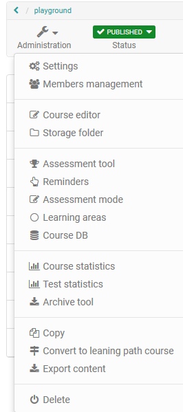
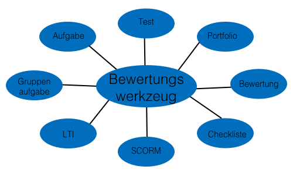
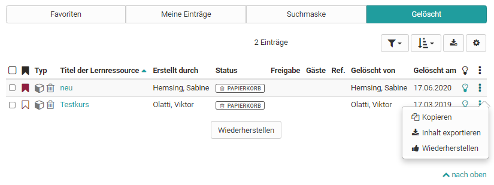

# Einsatz der Kurswerkzeuge

Auf dieser Seite erhalten Sie einen Überblick über die Untermenüs der „Administration“. Nicht nur Kurse, sondern alle Lernressourcen verfügen über den Bereich Administration mit weiteren Untermenüs.

Einige Tools der Menüs werden auf separaten Seiten vorgestellt.

{ class="shadow" }

!!! info "Weitere Informationen"

    Auf weiteren Seiten finden Sie nähere Informationen zu:

    * [Kurs Einstellungen](../course_create/Course_Settings.de.md)
    * [Mitgliederverwaltung](Members_management.de.md)
    * [Kursbausteine](../course_elements/index.de.md)
    * [Ablageordner](Storage_folder.de.md)
    * [Lektionen und Absenzen](Lectures_and_absences.de.md)
    * [Erinnerung](Course_Reminders.de.md)
    * [Prüfungsmodus](../e-assessment/Assessment_mode.de.md)
    * [Datenarchivierung](Data_archiving.de.md)

In Ihrem Kurs stehen Ihnen im Bereich der "Administration" eine Reihe von Werkzeugen zur Verfügung. Sie können in der [Mitgliederverwaltung](Members_management.de.md) die Kursteilnehmer und kursbezogenen Gruppen sowie Rechte organisieren. Die Kursstruktur und die Kursbausteine werden im Kurseditor eingerichtet. Im [Ablageordner](Storage_folder.de.md) werden die Kursdateien gesammelt.

Während der Durchführung des Kurses ist das [Bewertungswerkezug](Assessment_tool_-_overview.de.md) relevant. Auch kursbezogene Erinnerungen und [Lektionen](Lectures_and_absences.de.md) können organisiert werden. Für Online-Klausuren bietet sich der [Prüfungsmodus](../e-assessment/Assessment_mode.de.md) an. Es können auch bestimmte statistische Daten abgerufen und Daten [archiviert](Data_archiving.de.md) werden. Und natürlich können Kurse und Lernressourcen kopiert, exportiert oder gelöscht werden.

Hier ein Überblick über die einzelnen Menüs:

## Bewertungswerkzeug

Im Menü „Bewertungswerkzeug“, nicht zu verwechseln mit dem [Kursbaustein "Bewertung"](../course_elements/Course_Element_Assessment.de.md), erfolgt die gesamte Bewertung eines Kurses. Hier hat man Zugriff auf alle bewertbaren Kursbausteine und kann Bewertungen mit Punktevergabe, bestanden/nicht bestanden vornehmen und individuelle Feedbacks geben.

Das Menü Bewertungswerkzeug ist also während der Durchführung eines Kurses bzw. am Ende relevant.

Zugang zum Bewertungswerkzeug haben alle Besitzer des Kurses, Mitglieder einer Gruppe mit Rechten am Bewertungswerkzeug und alle Betreuer der Gruppen. Besitzer dürfen alle Kursteilnehmenden bewerten, Gruppenbetreuer nur die Mitglieder der betreuten Gruppen.

!!! tip "Tipp"

    Abonnieren Sie den Benachrichtigungsservice, entweder für neu eingegangene Testresultate und/oder neu erstellte Zertifikate.

Weitere Informationen zum Bewertungswerkzeug finden Sie [hier](Assessment_tool_-_overview.de.md).

## Kurs Statistiken {: #statistics}

Diese Kursfunktion zeigt Ihnen Statistiken über den Zugriff auf Ihren OpenOlat-Kurs an. Zugang zu den Statistiken haben alle Besitzer des Kurses. Sie erhalten jeweils sowohl eine tabellarische wie auch eine grafische Darstellung der Daten. Die Daten der Tabelle können Sie als Excel-Datei (z.B. für die Weiterverarbeitung) auf Ihren Rechner herunterladen.

Relevant für das Total der Kurszugriffe sind die Klicks eines Benutzers auf einen Kursbaustein, nicht aber die Klicks auf den Inhalt eines Kursbausteins. Wenn ein Benutzer beispielsweise dreimal das Wiki in der Kursnavigation wählt, wird dies als 3 Klicks gezählt, aber es wird kein Klick gezählt, wenn er im Wiki selbst auf einen Link klickt.

Statistiken können pro Stunde, pro Tag, pro Wochentag und pro Woche erstellt werden. Weiter können Sie bei Statistiken pro Tag und pro Woche die Zeitspanne wählen, während der die Kurszugriffe in der Statistik angezeigt werden. Wenn Sie einen Kursbaustein in der Tabelle anwählen, wird jeweils die Grafik zu diesem Kursbaustein angezeigt. Wählen Sie in der Zeile "Total" die Anzahl Klicks an, zeigt die Grafik die Zugriffe verteilt auf die Kursbausteine.

## Test Statistiken

Die Test Statistiken erlauben Ihnen generelle kursbezogene, anonymisierte statistische Auswertung Ihrer Tests. Angezeigt werden alle im Kurs enthaltenen Tests. Es werden sowohl die Kennzahlen für einen Test sowie weitere Analysen zur Bearbeitungsdauer, durchschnittlichen Punkten pro Frage und der prozentuale Anteil der richtigen Antworten pro Frage angezeigt. Des Weiteren werden für jede Frage Kennzahlen wie die Anzahl der Teilnehmer die die Frage ausgefüllt haben, die durchschnittliche Punktzahl und Bearbeitungsdauer usw. angezeigt und visualisiert.

Durch Kennwerte zur Testevaluation und Itemanalyse können Sie so einen Test im Hinblick auf z.B. Schwierigkeit und Eignung evaluieren.

Zugang zu den Test Statistiken haben neben den Kursbesitzern auch alle Betreuer des Kurses.

## Fragebogen Statistiken

Die Fragebogen Statistiken erlauben Ihnen die generelle kursbezogene, anonymisierte statistische Auswertung Ihrer Fragebögen/Umfragen. Für jede Umfrage gibt es eine Übersicht, Tabellen, Diagramme, sowie Zugriff auf die einzelnen Fragebögen.

In der Übersicht geht es um Kennzahlen wie die Anzahl der ausgefüllten Fragebögen, Abgabezeitraum und Bearbeitungsdauer. Im Tab „Tabellen“ liegen Auswertungen zu einzelnen Fragen vor. Im Tab „Diagramme“ werden die Ergebnisse in Form von Balkendiagrammen visualisiert und die zugehörigen statistischen Daten wie Median, Varianz und Standardabweichung angezeigt. Im Tab „Einzelne Fragebögen“ haben Sie Zugriff auf jeden einzelnen Fragebogen. Alle Zugriffe sind anonymisiert.

Zugang zu den Fragebogen Statistiken haben neben den Kursbesitzern auch alle Betreuer des Kurses.

## Datenarchivierung   {: #archive}

Über die [Datenarchivierung](Data_archiving.de.md) können die Ergebnisse diverser Kursbausteine eines Kurses gespeichert werden. Insbesondere die Speicherung von Ergebnissen der durchgeführten Umfragen, Tests, Selbsttests, Aufgaben, Gruppenaufgaben und die Kursresultate sind wichtige Elemente, die Sie zum Ende des Kurses sichern sollten.

Die Archivierungen erfolgen in der Regel im ZIP Format und enthalten Excel Dateien. Gehören zur Archivierung noch weitere Dateien, werden diese in Unterordnern innerhalb der ZIP Datei bereitgestellt.

## Lernbereich {: #learning_area}

Möchte man mehrere Gruppen zu einem Aspekt zusammenstellen, bieten sich Lernbereiche an. Dafür werden mehrere Gruppen einem Lernbereich zugeordnet und so gebündelt.

Mit Hilfe der Schaltfläche „Lernbereich erstellen“ weisen Sie dem Kurs einen neuen Lernbereich zu. Ordnen Sie dann diesem Lernbereich einzelne Gruppen zu. Wenn es bereits einen Lernbereich gibt, können Sie diesem dem Kurs eingebundene Gruppen zuordnen. Dazu editieren Sie den Lernbereich und wählen im Tab „Gruppenzuordnung" die entsprechenden Gruppen aus. Sind noch keine Gruppen erstellt worden, erscheint der Text: _Es wurde keine Lerngruppe gefunden. Bitte erstellen Sie zuerst eine Lerngruppe in der Mitgliederverwaltung._

Lernbereiche können z.B. im Kurseditor beim Kursbaustein „Einschreibung“ ausgewählt werden. Somit werden alle Gruppen eines Lernbereichs zur Einschreibung angeboten. Weiter stehen Lernbereiche in herkömmlichen Kursen jeweils in den Tabs „Sichtbarkeit“ oder „Zugang“ zur Auswahl, wenn die Option „gruppenabhängig“ aktiviert ist.

Der Vorteil gegenüber der expliziten Auflistung aller relevanten Gruppen in den Zugangs- und Sichtbarkeitsbeschränkung ist die grössere Flexibilität und die einfachere Handhabung im Kurseditor. Werden neue Gruppenregeln im Kurs definiert, so muss dieser neu publiziert werden. Ist stattdessen eine Lernbereichsregel definiert, so kann die Teilnahme einer Gruppe in der Lernbereichsverwaltung definiert werden. Der Kurs muss hierfür nicht neu publiziert werden.

!!! tip "Tipp"

    Lernbereiche können z.B. eingesetzt werden, wenn Sie denselben Kursbaustein mehreren Gruppen innerhalb eines Kurses verfügbar machen möchten, oder wenn bei einem Einschreibebaustein viele Gruppen zur Auswahl stehen, oder wenn Sie mehrere Gruppen für einen Betreuer bündeln möchten. Mit einem Lernbereich sparen Sie sich die Auswahl jeder einzelnen Gruppe.

## Kurs DB

Hier können Sie eine neue kurspezifische Datenbank anlegen, die bestimmte kurspezifische Informationen speichern kann.

## Buchungsmöglichkeiten

Hier erhalten Sie einen Überblick über alle Personen, die den Kurs gebucht haben.

## Kopieren

Ist ein Kurs abgelaufen, soll aber im nächsten Semester oder in einem gewissen Zeitabstand wiederholt durchgeführt werden, sollte dieser Kurs kopiert werden. Beim Kopieren eines Kurses werden die komplette Struktur, Ordnerinhalte, HTML-Seiten und Gruppennamen (ohne Gruppenmitglieder) übernommen. Das gesamte Kursgerüst bleibt also erhalten. Benutzerdaten wie Forumseinträge, Gruppenmitglieder, etc. werden jedoch nicht kopiert. Somit erhalten Sie auf diesem Weg einen komplett zurückgesetzten Kurs ohne userspezifische Datenreste.

!!! tip "Tipp"

    Erstellen Sie am besten eine Kurskopie, wenn Sie einen Kurs wiederholt durchführen möchten, anstatt nur die Personen aus der Mitgliederliste zu entfernen. Auf diese Weise entfallen auch alle Einträge im Bewertungswerkzeug und man erhält einen komplett bereinigten Kurs.

!!! tip "Tipp"

    Eine Kurs-Kopie kann auch sinnvollerweise nach Fertigstellung des Kurses und vor Beginn der Durchführung als Backup erstellt werden.

## In Lernpfad-Kurs konvertieren

Herkömmliche Kurse und Kurse die vor der OpenOlat Version 15 erstellt wurden, können über diesen Link in einen [Lernpfad-Kurs](../course_create/Learning_path_course.de.md) konvertiert werden.

## Inhalt exportieren

Exportieren Sie Ihre Lernressourcen als ZIP-Datei um eine Sicherungskopie zu erhalten oder um die Lernressource in einer anderen OpenOlat Instanz z.B. einer anderen Bildungseinrichtung zu importieren und so weiterzuverwenden.  

Als Besitzer einer Lernressource können Sie darüber hinaus im Administrationsmenü unter „Einstellungen“ → "Freigabe für andere Autoren" bestimmen, ob Ihre Lernressource von allen anderen OpenOlat-Autoren des Systems exportiert, kopiert oder referenziert werden darf.

Das Erlauben einer Kurskopie für andere Autoren bietet sich z.B.  für Kursvorlagen an.

## Lernressource löschen

Wenn ein Kurs bzw. Lernressource gelöscht wird, werden alle Benutzerdaten entfernt und der Kurs ist nun weder für die ehemaligen Teilnehmer noch die Betreuer aufruf- oder einsehbar. Kursbesitzer finden die gelöschte Lernressource anschließend im Autorenbereich im Tab "Gelöscht". Hier erscheint die Lernressource mit dem Status "Papierkorb". Es besteht weiter Zugriff auf die Menüpunkte der Administration. Der Status "Papierkorb" kann nicht geändert werden. Jedoch ist es möglich, über den Link im 3-Punkte Menü die Lernressource wiederherzustellen.

{ class="shadow lightbox" }

!!! info "Endgültiges Löschen"

    Das endgültige Löschen eines Kurses bzw. Lernressource aus dem Tab "Gelöscht" ist nur durch den OpenOlat Administrator möglich.

!!! info "Archivierung"

    Wenn Sie einen Kurs löschen, werden Benutzerdaten (z.B. Testresultate) zuerst als Excel-Datei in Ihrem [persönlichen Ordner](../personal/Personal_folders.de.md) archiviert und im Anschluss gelöscht.

Es ist möglich, andere Kursbesitzer via E-Mail über das Beenden oder Löschen eines Kurses zu informieren. Dies kann entweder im Beenden/Löschen-Dialog optional ausgewählt oder in der [Administration](../../../manual_admin/docs/administration/Modules_Repository.de.md) systemweit eingestellt werden.

Ebenso kann ein Kurs auch automatisiert beendet bzw. gelöscht werden. Entsprechende Einstellungen nimmt ebenfalls der Administrator unter Administration vor.
