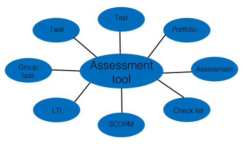
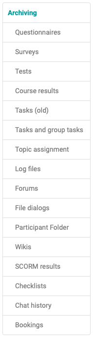
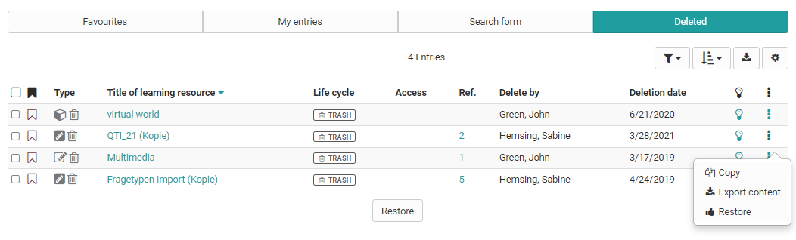

# Using Course Tools

On this page you get an overview of the course tools of the "Administration".
Not only courses, but all learning resources have the area "Administration"
with further submenus.

Some course administration tools are presented on separate pages.

  

**Page overview**

  * 1 Assessment Tool
  * 2 Course Statistics
  * 3Questionnaire statistics
  * 4 Data Archiving
  * 5 Learning Areas
  * 6Course DB
  * 7Booking methods
  * 8 Copy learning resource
  * 9Convert to Learning Path Course
  * 10 Export content
  * 11Delete learning resources

On further pages you will find information about:

  * [Course settings](../course_create/Course_Settings.md)
  * [Members management](Members_management.md)
  * Course elements of the [Course editor](https://confluence.openolat.org/display/OO161EN/Course+Elements+and+Course+Editor)
  * [Storage folder](Storage_folder.md)
  * [Lectures and Absences](../../manual_admin/administration/Lecture_and_roll_call_management.md)
  * [Reminder](Course_Reminders.md)
  * [Assessment mode](../e-assessment/Assessment_mode.md)
  * [Data archiving](Data_archiving.md)

A number of tools are available in the "Administration" area of your course.
You can organize course participants and course-related groups in the [members
management](Members_management.md). Groups can also be bundled in learning
areas. The course structure and the course tools are set up in the course
editor. Furthermore, you have access to the storage folder of a course.

During the course itself the [assessment
tool](Assessment_tool_-_overview.md) is relevant. Course-related [reminders
](Course_Reminders.md)and [lectures ](Lectures_and_absences.md)can also be
organized. The assessment mode is suitable for online exams. Certain
statistical data can also be retrieved and data archived. And of course
courses and learning resources can be copied, exported or deleted.

Here is an overview of the individual menus:

##  Assessment Tool

In the menu "Assessment tool," not to be confused with the course element
"Assessment," the entire assessment of a course is carried out. Here you have
access to all course elements that can be assessed and you can make
assessments with points awarded, passed/failed and give individual feedback.

  

The menu Assessment Tool is therefore relevant during the course or at the
end.

All owners of courses have access to the assessment tool as well as members of
a corresponding right group and, last but not least, all coaches. Owners may
assess all course participants, tutors only those they have been assigned to.
The course elements which should be assessed, first need to configured either
in the tab "Assessment" or "Test configuration". Only if the assessment is
turned on an assessment in the assessment tool becomes possible. To pass a
course, the tab "Score" in the course element needs to be filled in.

Further information about the assessment tool you can found
[here](Assessment_tool_-_overview.md).

##  Course Statistics

This course function provides you with statistics regarding access to your
OpenOlat course. All course owners have access to those statistics. You will
receive data in the form of tables as well as in the form of charts. Table
data can be downloaded as Excel files (e.g. for further processing) to your
computer.

Relevant for your total of course accesses are user clicks on a single course
element; however, clicks on this element's content will not be counted. If a
user selects the Wiki from course navigation and clicks it three times, three
clicks will be counted; no click will be counted though when clicking on a
link within that Wiki.

Statistics can be created per hour, per day, per weekday or per week.
Furthermore you can choose a certain period of time per day and per week
during which any course access should be displayed in your statistics.

When selecting a course element in your table its corresponding chart will be
displayed. If you select the number of clicks in the row "Total" your chart
will show all accesses sorted by course element.

Test Statistics

The test statistics allow you to perform general course-related, anonymous
statistical evaluations of your tests. All tests included in the course are
displayed. The key figures for a test as well as further analyses of the time
taken to complete a test, average points per question and the percentage of
correct answers per question are displayed. In addition, key figures such as
the number of participants who completed the question, average score, time
taken to complete the question, etc. are displayed and visualized for each
question.

You can evaluate a test with regard to e.g. difficulty and suitability by
means of characteristic values for test evaluation and item analysis.

Access to the test statistics is not only available to the course owners but
also to all coaches of the course.

## Questionnaire statistics

The questionnaire statistics allow you to make a general course-related,
anonymous statistical evaluation of your questionnaires/surveys. For each
survey there is an overview, tables, diagrams and access to the individual
questionnaires.

The overview includes key figures such as the number of completed
questionnaires, submission period and processing time. The tab "Tables"
contains evaluations for individual questions. In the tab "Diagrams" the
results are visualised in the form of bar charts and the corresponding
statistical data such as median, variance and standard deviation are
displayed. In the tab "Individual questionnaires" you have access to each
individual questionnaire. All accesses are anonymous.

Besides course owners all coaches have access to questionnaire statistics.

##  Data Archiving

Data archiving can be used to store the results of various course elements of
a course. In particular, saving the results of surveys, tests, self-tests,
tasks, group tasks and course results are important elements that you should
save at the end of the course.

The archives are usually in zip format and contain Excel files or rtf files
for text formats. If other files are included in the archiving, they will be
provided in subfolders within the zip file.

To save the results, first select a tool-specific block in the "[Archive
tool](Data_archiving.md)" area and then select the concrete blocks that you
want to save. Of course you can also click on "select all". The results can
then be downloaded by selecting the "Archive" option. The user will be
informed by mail if the download takes longer, as is the case with the log
files.

Archived self-tests and questionnaires contain anonymous user data, tests are
stored in a personalized way and contain all test results. Course results
contain the summarized overall evaluation of a course, not individual
elements. The Wiki packs all pages and uploaded files into one ZIP file. The
participant folder is saved according to the folder structure of this module.
Further details on the recorded log files can be found in the chapter ["Record
of Course Activities"](Record_of_Course_Activities.md).

In the archive tool you can also delete the chat history by clicking the
button "Delete" under "Chat history".

When deleting a course all course data (but not the course elements!) will be
stored in your personal folder automatically.

All course owners have access to the data archiving tool as well as members of
groups with rights to the data archiving tool.

  

##  Learning Areas

Learning areas are used to easily assign groups to different elements within a
course.

By using the button "Create learning area" you can create a new learning area
before allocating single groups to this learning area. If a learning area
already exists you can use this one to allocate linked groups. All you have to
do is editing the learning area, and then selecting the designated groups in
the tab "Group assignment". If no groups have been created yet, the text
appears:  _No learning group was found. Please create a learning group in the
members management first._

Learning areas can be selected in the course editor, for example in the course
element "Enrolment." This way all groups of a learning area will be offered
for enrolment. Furthermore learning areas are available in the tabs
"Visibility" or "Access" in conventional courses if the option "group-
dependent" has been activated.

The advantage over explicitly listing all relevant groups in the tabs "Access"
and "Visibility" is a greater flexibility and easier handling in the course
editor. If new group rules are defined in a course it has to be republished.
If instead a learning area rule has been defined, the participation of a group
can be defined in the learning area administration. In that case you do not
have to republish your course.

Learning areas are suitable for using the same course element within a course
in several groups or if there are a lot of groups to choose from along with
only one single registration element. Learning areas spare you the selection
of each single group.

## Course DB

Here you can create a new course-specific database that can store certain
course-specific information.

## Booking methods

Here you will find an overview of all the people who have booked your course.  

##  Copy learning resource

Learning resources are copied in order to be able to reuse an old course
structure for a new semester, for example. When copying a course, the
structure, folder contents, HTML pages and group names (without group members)
are copied. User data such as forum entries, group members, etc. are not
copied. As the owner of a learning resource, you can determine (under "Access
configuration") whether your learning resource can also be copied by other
OpenOlat authors.

This way you get a completely reset course without user-specific data remains.

 ~~As owner of a learning resource you can also determine in the
administration menu under "Settings" → "Share" whether your learning resource
may be copied by all other OpenOlat authors of the system.~~

  

Erstellen Sie am besten eine Kurskopie, wenn Sie einen Kurs wiederholt
durchführen möchten, anstatt nur die Personen aus der Mitgliederliste zu
entfernen. Auf diese Weise entfallen auch alle Einträge im Bewertungswerkzeug
und man erhält einen komplett bereinigten Kurs.

A course copy can also usefully be created as a backup after the course has
been completed and before the course begins.

## Convert to Learning Path Course

Traditional courses and courses created before OpenOlat version 15 can be
converted into a [learning path
course](https://confluence.openolat.org/display/OO150EN/Learning+path+course)
via this link.

##  Export content

Export your learning resources as a ZIP file. You can import tests,
questionnaires, CP and SCORM learning content into other LMSs that support the
same standard. Courses, wikis and glossaries can be imported into other
OpenOlat installations.

As the owner of a learning resource, you can also determine in the
administration menu under "Settings" → "Shared to other authors" whether your
learning resource may be exported, copied or referenced by all other OpenOlat
authors in the system.

Allowing a course copy for other authors is useful for course templates, for
example.

## Delete learning resources

You can delete them using the menu item in the "Administration" area. When
deleting integrated learning resources (e.g. a test) you will receive a
message with the display of the corresponding course. You must therefore first
delete the course element "Test" in the course so that you can delete the test
in the authoring area. The data is definitely deleted and cannot be restored.
Therefore a confirmation is necessary before deleting.

However, if the course is  **deleted** , all user data will be removed. Course
participants and authors no longer have access. Only the course owner has
access and finds the course in the authoring area under the tab "Deleted".
There the course can be restored, but without user data, these are permanently
deleted.

The final deletion of a course is only possible by the administrator.

When you delete a course, user data (e.g. test results) is first archived as
an Excel file in your [personal folder](../personal/Personal_folders.md) and then
deleted.

It is possible to inform other course owners via e-mail about the completion
or deletion of a course. This can either be optionally selected in the
Finish/Delete dialog or set in the
[administration](https://confluence.openolat.org/display/OO161EN/Modules%3A+Repository)
system-wide.

A course can also be closed or deleted automatically. The administrator makes
the appropriate settings under
[Administration](https://confluence.openolat.org/display/OO161EN/Modules%3A+Repository).

  

