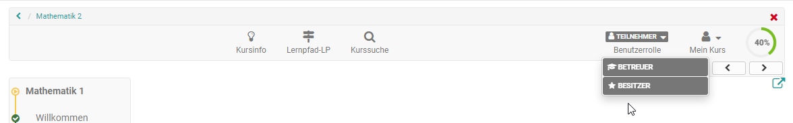

# Kursbetrieb

Sie haben Ihren Kurs freigeschaltet und Kursteilnehmer bearbeiten bereits die
Lerninhalte. Dieses Kapitel erklärt, welche Werkzeuge Sie als Kursbesitzer
während des Kursbetriebs nutzen können, welche zusätzlichen Funktionen im Kurs
zur Verfügung stehen und wie Sie Kursaktivitäten aufzeichnen können. Die
meisten zentralen Einstellungen nehmen Sie über die Werkzeuge, die Sie in der
Administration des Kurses bzw. der jeweiligen Lernressource finden, vor.
Weitere Informationen dazu finden Sie im Kapitel "[Einsatz der
Kurswerkzeuge](Using_Course_Tools.de.md)".

  * [Einsatz der Kurswerkzeuge](Einsatz+der+Kurswerkzeuge.html)
    * [Mitgliederverwaltung](Mitgliederverwaltung.html)
    * [Ablageordner](Ablageordner.html)
    * [Bewertungswerkzeug - Übersicht](../../pages/viewpage.action%EF%B9%96pageId=108593653.html)
    * [Lektionen und Absenzen](Lektionen+und+Absenzen.html)
    * [Erinnerung](Erinnerung.html)
    * [Datenarchivierung](Datenarchivierung.html)
  * [Einsatz weiterer Kursfunktionen der Toolbar](Einsatz+weiterer+Kursfunktionen+der+Toolbar.html)

 **Rollenwechsel:**

Wenn Sie als Kursbesitzer oder Betreuer in einem Kurs mehr als eine Rolle
innehaben (siehe [Mitgliederverwaltung](Mitgliederverwaltung.html)) erscheint
in der Kurs-Toolbar die Möglichkeit, bei geschlossenem Editor die
Benutzerrolle zu wechseln und sich so den Kurs aus Sicht der unterschiedlichen
Rollen anzuschauen. Je nachdem welche Rollen Sie im Kurs haben, sehen Sie die
jeweiligen Basis-Rollen angezeigt. Dabei wird nicht noch einmal zwischen
Betreuern und Gruppenbetreuern oder Teilnehmern und Gruppenteilnehmern
unterschieden, sondern die Möglichkeiten innerhalb der Rolle Betreuer bzw.
Teilnehmer zusammengefasst.

Der Rollenwechsel bietet sich an, wenn man sich den Kurs aus der jeweiligen
Perspektive anschauen will, z.B. als Kursbesitzer die Teilnehmenden Rolle
einnehmen möchte. Auch kann man sich so den Flow der Kursbausteine Aufgabe,
Gruppenaufgabe, Checkliste oder des Teilnehmer Ordners aus der Teilnehmersicht
anschauen.

  

  

