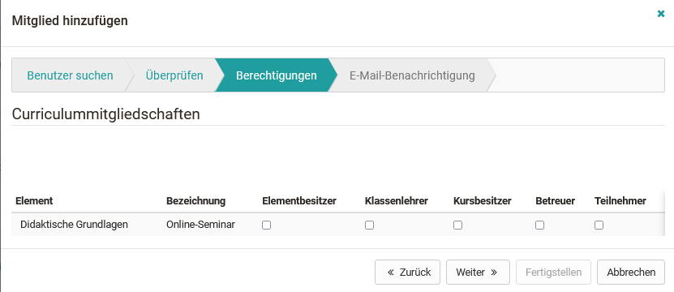

# Curriculum Management

## General information about Curriculum

What does curriculum in OpenOlat mean?

A curriculum is a curriculum which is closely linked to teaching objectives
and contents and which follows a certain sequence of events. In OpenOlat, the
curriculum primarily serves to structure the educational offerings. In this
way, courses and learning resources can be displayed in chronological order in
a tree structure and thus placed in a concrete educational context.

## Curriculum roles

The following roles are responsible for creating and managing curricula and
curriculum elements:

  * Curriculum administrator
  * Curriculum owner
  * Curriculum element owner

Detailed information on the roles can be found [here](User+management.html).

  

The various curricula in OpenOlat are administered in the curriculum
administration. As a rule, the curriculum administrator is responsible for
administering the curricula.

## Curriculum Browser

### Level Curriculum

At curriculum level, the curricula that have already been created are
displayed in tabular form. The number of curriculum elements is also
displayed. Curricula can be opened again for editing or deleted.

  

### Level Curriculum element

If you are in a curriculum, its tree structure is displayed in the Curriculum
Browser. All metadata such as start and end dates, curriculum type and
timetable are also displayed.

The following data can also be displayed in the table:

  *  **Ref:** Shows how many courses are assigned to this curriculum element.
  *  **Members:** Displays the number of all members assigned to this element.
  *  **Participants:** Displays the number of all participants (users) assigned to this element.
  *  **Coaches:** Displays the number of hosts assigned to this item.
  *  **Owners:** Displays the number of all owners assigned to this element.

  

## Create curriculum

First, a curriculum must be created as the top level. Curriculum elements can
then be subordinate to this.

  

Via "Create New Curriculum" you can enter a description in addition to the
identifier and the name. You can also create a link to an organization or
organizational element. All organizational elements to which the curriculum
administrator has access are available for selection.

Once the curriculum has been created, the curriculum elements can be created.

  

## Edit Curriculum and Add Curriculum Administrator

In the Curriculum Browser, you can edit the curriculum and change the metadata
using or the
3-point menu.

In the tab "User administration" you can add further curriculum administrators
to the curriculum or remove existing ones.

  

## Search Curriculum

In the Curriculum Browser you can search for existing Curricula.

In the tab "Search" you can also search for curriculum elements, which for
example are assigned to a certain course. In the "Advanced search" the search
criteria can be further restricted.

  

## Creating a Curriculum Element

  * A new element is created via "Create new element".
  * A new sub-element can be created via the gear - "Create new sub-element".

In addition to the designation and the name, a description can also be
entered. You can also assign a curriculum type to the curriculum element,
which defines the element in more detail.

You can choose whether the timetable for this element should be activated or
deactivated or whether the setting should be taken from the configuration of
the element type.

You can also specify a start and end date for the curriculum element.

  

## Edit Curriculum Element

The curriculum element can be further edited by clicking on the curriculum or
the gearwheel. It is also possible to move the element in the curriculum,
create a new subelement or delete the element.

  

### Edit Metadata

After you have selected the curriculum element, its metadata is displayed.
This can be changed with the appropriate authorization.

  

### Adding courses to the curriculum element

Courses can be assigned directly to each curriculum element. In the selection
under "Add courses", only courses for which corresponding access rights exist
are displayed.

  

### Adding Users and Roles to the Curriculum Element

Users with specific roles can be assigned directly to each curriculum element.
Once enrolled, the user will automatically have access to all courses
associated with that curriculum.

The following roles are available under "Add Users":

  * Element owner
  * Master coach
  * Course owner
  * Coach
  * Participant

  

  

