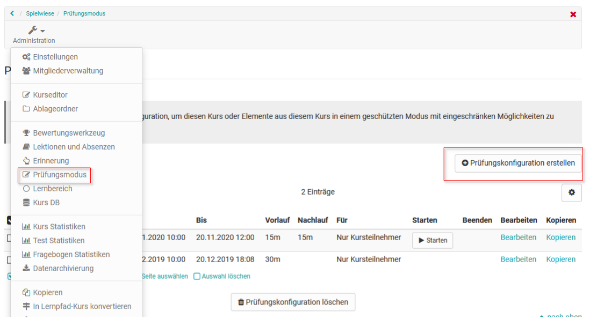
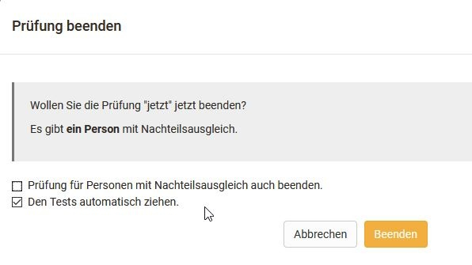

# Prüfungsmodus

## Im Kioskmodus Prüfungen und Tests durchführen

Mit dem Prüfungsmodus erstellen Sie Prüfungskonfigurationen, in denen Tests
und Prüfungen in geschütztem Modus während einer festgelegten Zeit
durchgeführt werden. Dabei ist nur der Zugriff auf zuvor festgelegte
Kursbausteine im betroffenen Kurs gestattet. Alle weiteren Funktionen in
OpenOlat wie andere Kurse, Gruppen, Notizen etc. werden während der
Prüfungsdauer ausgeblendet. Nur ein Logout ist während der Prüfung möglich.

Sie erstellen einen Prüfungsmodus indem Sie in der Kurs „Administration“ den
Link „Prüfungsmodus“ auswählen und auf den Button „Prüfungskonfiguration
erstellen“ klicken.

Auf der Übersichtsseite sehen Sie alle für einen Kurs bereits abgehaltenen,
laufenden oder geplanten Prüfungen. Geplante Prüfungen können bis zur Prüfung
noch bearbeitet werden, eine nachträgliche Bearbeitung ist nicht möglich. Die
Übersicht enthält Informationen zu Datum und Dauer, Vor- und Nachlaufzeiten
sowie Benutzergruppen.

Prüfungskonfigurationen werden vorab erstellt, und enthalten neben einer
Start- und Endzeit inklusive Vor- und Nachlaufzeiten, falls diese gewünscht
sind, die Einschränkungsmöglichkeit auf spezifische Nutzergruppen. So kann
eine Prüfung nur für Kursteilnehmer, nur für Gruppenteilnehmer ausgewählter
Gruppen, oder für beide gelten. Dadurch ist es möglich, zeitgleich
unterschiedlich konfigurierte Prüfungen für verschiedene Nutzergruppen
desselben Kurses abzuhalten. Neben der Benutzergruppe können Sie festlegen, ob
und auf welche Kurselemente der Zugriff eingeschränkt werden soll, und ob
eines davon als Startbaustein verwendet wird. Des Weiteren kann der Zugang zur
Prüfung auf spezifische IP-Adressen beschränkt, oder die Nutzung des [Safe
Exam Browsers](http://www.safeexambrowser.org) vorausgesetzt werden.

Benutzer, die einer Prüfung zugeteilt wurden, werden zu Beginn der Prüfung
bzw. zu Beginn der Vorlaufzeit über den Start der Prüfung informiert. Sollte
OpenOlat durch einen Nachlaufzeit am Ende der Prüfung noch gesperrt sein,
werden Benutzer ebenfalls darüber informiert.

Ein laufender Prüfungsmodus kann automatisch oder manuell beendet werden.

Er wird auch beendet, wenn der entsprechende Kurs beendet oder gelöscht wird.

Eine Schritt-für-Schritt Anleitung bietet dieses Video (bezieht sich auf eine
ältere OpenOlat Version):

## Konfigurationsmöglichkeiten

Detailliert können neben Titel und Beschreibung, die dem Benutzer in der
Prüfungsbenachrichtigung angezeigt werden, die folgenden Parameter
konfiguriert werden:

 **Beginn** : Legen Sie hier Datum und Uhrzeit für den Beginn der Prüfung
fest. Die **Vorlaufzeit** , die Sie in Minuten angeben, sperrt OpenOlat
während der angegebenen Dauer vor Prüfungsbeginn.

 **Ende** : Der Zeitpunkt an dem die Prüfung beendet wird. Wird eine
**Nachlaufzeit** in Minuten angegeben, wird OpenOlat während dieser Dauer im
Anschluss an die Prüfung noch gesperrt.

 **Art des Beginns / Endes** : Sie können zwischen Automatisch und manuellem
Start / Ende wählen. Bei manueller Bedienung finden Sie auf der
Übersichtsseite einen Start- und Ende-Link bei der entsprechenden
Prüfungskonfiguration.

 **Teilnehmer** : Hier legen Sie fest für welche Benutzer die Prüfung gültig
ist. Wählen Sie aus den Optionen "Nur Kursteilnehmer", "Nur Gruppenteilnehmer"
oder "Teilnehmer aus Kurs und Gruppe". Sobald eine Option mit Gruppen
ausgewählt wurde, müssen Sie zwingend immer über die Schaltflächen "Gruppen
auswählen" oder "Lernbereich auswählen" die betroffenen Gruppen auswählen.
Wird ein Curriculum verwenden, kann sich die Prüfung auf auch die
Curriculumteilnehmenden beziehen.

 **Zugriff auf Kursbaustein einschränken** : Um die Prüfung auf ausgewählte
Kursbausteine des betroffenen Kurses zu beschränken, wählen Sie hier die
Checkbox aus, und klicken Sie dann auf die Schaltfläche "Kursbausteine
auswählen". Es öffnet sich eine Liste aller Kursbausteine des Kurses - wählen
Sie jene Kurselemente aus, die den Probanden während der Prüfung angezeigt
werden sollen. Alle anderen Kursbausteine werden für die Dauer der Prüfung
ausgeblendet.

 **Startbaustein** : Soll den Studenten ein bestimmtes Kurselement direkt beim
Start angezeigt werden, so arbeiten Sie mit der Schaltfläche "Kursbaustein
auswählen". Wählen Sie aus den verfügbaren Kurselementen eines aus. Es werden
nur die Kursbausteine angezeigt, die im Schritt zuvor zur Anzeige ausgewählt
wurden.

 **Einschränkung auf IP-Adressen** : Um eine Ausführung der Prüfung nur an
bestimmten Computern oder Orten zuzulassen, markieren Sie hier die Checkbox
und tragen dann die zulässigen IP-Adressen ein. Diese sollten Sie von ihrer
Informatik-Abteilung erhalten können. Sie können dadurch z.B. verhindern, dass
eine Prüfung von einem Prüfling von zuhause abgelegt wird.

 **Safe Exam Browser verwenden** : Die Verwendung des Safe Exam Browser
erlaubt die sichere Ausführung von Online-Prüfungen, in dem der Computer in
den sogenannten Kioskmodus versetzt wird. Dadurch wird die Verwendung
unerlaubter Quellen während einer Prüfung unterbunden. Tragen Sie die Browser
Exam Keys aller zugelassenen Browser-Instanzen ein, um die Ausführung im SEB
zu ermöglichen. Benutzer werden darüber benachrichtigt, dass der SEB für die
Prüfung Voraussetzung ist. Erst wenn OpenOlat im Safe Exam Browser gestartet
wurde kann die Prüfung durchgeführt werden.

 **Prüfungskonfiguration auch bei Betreuer anwenden** : Wählen Sie diese
Checkbox, wenn Betreuer der ausgewählten Benutzergruppe(n) dieselbe Ansicht
erhalten sollen.

Ein laufender Prüfungsmodus kann vom Lehrenden im [Bewertungswerkzeug
](../course_operation/Assessment_tool_-_overview.de.md)verfolgt werden. Bewertungen
z.B. für Einsendeaufgaben oder Freitext Elemente von Tests können auch direkt
bewertet und für die User freigeschaltet bzw. sichtbar gemacht werden. So wird
direkt eine Prüfungseinsicht- und –besprechung ermöglicht. Ferner kann der
Lehrende im Bewertungswerkzeug im manuellen Modus die Prüfung beenden.

