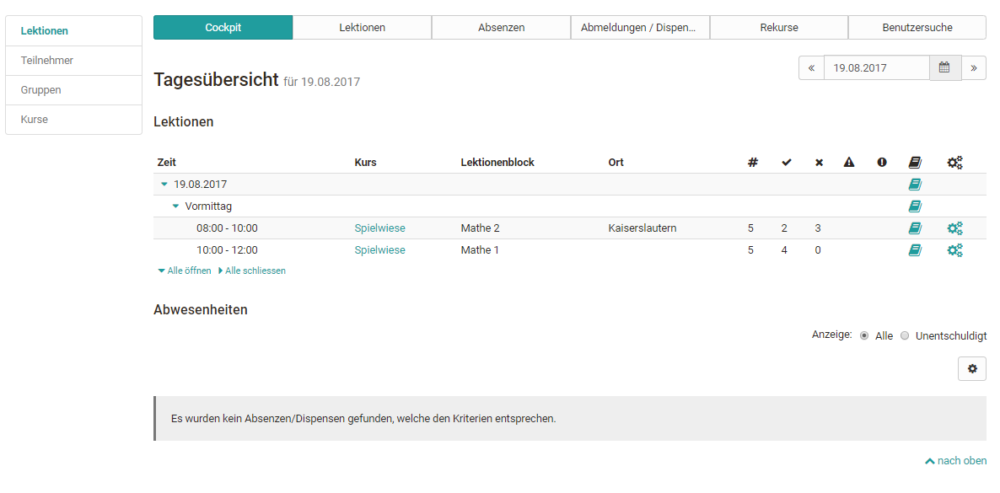
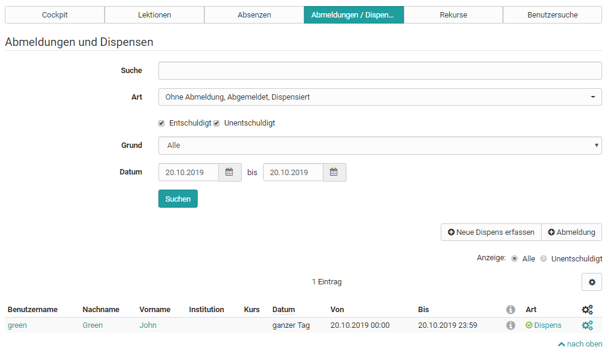
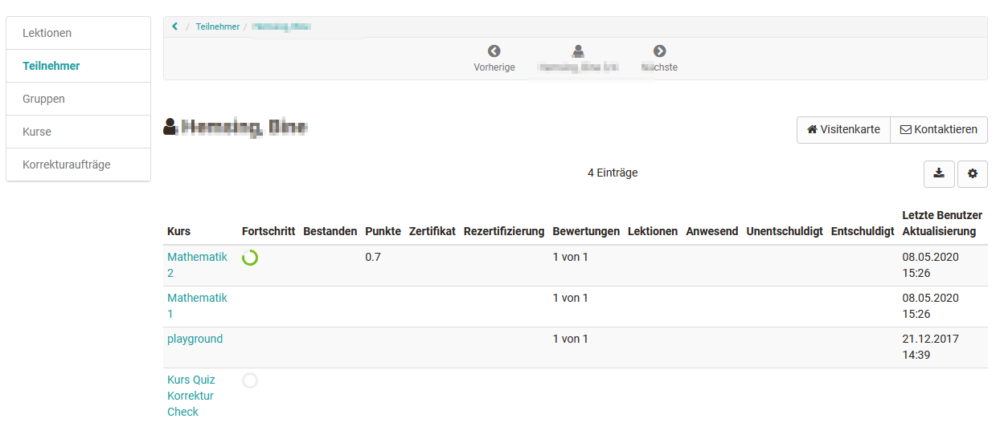
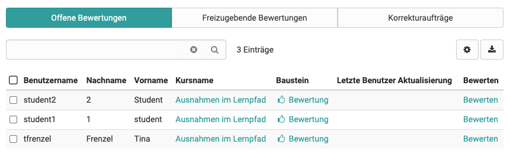
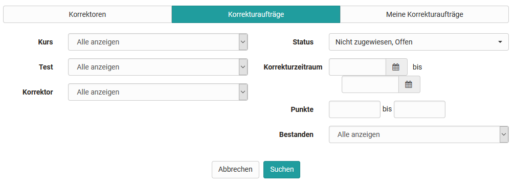
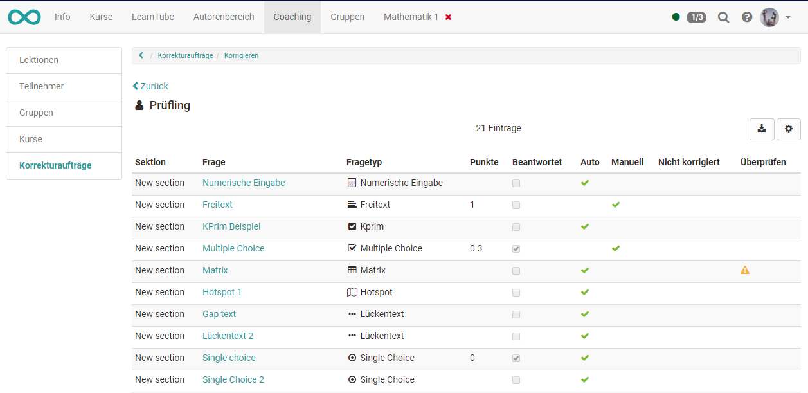

# Coaching

Das Coaching Tool dient der kursübergreifenden Organisation und Verwaltung von
Kursen, Teilnehmenden und Gruppen sowie der kursübergreifenden Korrektur von
Tests und dem kursübergreifenden Absenzenmanagement.

Mit dem Coaching-Tool haben Gruppen- und Kursbetreuer die Möglichkeit, alle
ihnen zugewiesen Kurs- oder Gruppenteilnehmenden auf einen Blick zu sehen und
zu verwalten. Benutzen Sie das Menü, um die Lernstatistiken von einzelnen
Benutzern, Gruppen oder Kursen zu betrachten sowie schnell auf
unterschiedlichen Wegen zum Bewertungswerkzeug für einzelne Teilnehmende zu
gelangen. So können Betreuer rasch Bewertungen vornehmen und sich einen
Gesamtüberblick verschaffen.

Nutzen Sie die Spaltensortierung je nach gewünschter Information.

  * 1 Coaching 
    * 1.1Lektionen
    * 1.2Teilnehmer
    * 1.3Gruppen
    * 1.4Kurse
    * 1.5Benutzerbeziehungen
    * 1.6Aufträge
    * 1.7Auftragsverwaltung

  

Der Reiter "Coaching" erscheint nur wenn diese Option vom Administrator auch
aktiviert wurde.

Bitte beachten Sie, dass Kurse erst dann als bestanden angezeigt werden
können, wenn der Kurshauptknoten ebenfalls entsprechend konfiguriert wurde.

## Lektionen

Wird das [Absenzmanagement ](../course_operation/Lectures_and_absences.de.md)von OpenOlat genutzt,
erscheint im Coaching-Modul der Bereich „Lektionen“.

### Tab Cockpit

Im Cockpit kann ein bestimmter Tag ausgewählt und die zugehörigen Lektionen
und Abwesenheiten im Überblick angezeigt werden. Über die angezeigte Übersicht
und Klick auf den jeweiligen Kurs hat der Lehrende auch Zugriff auf weitere
Informationen.

### Tab Lektionen

Hier kann ein Zeitfenster ausgewählt und nach Stichworten gesucht werden. Es
wird eine Übersicht über unterschiedliche Lektionenblöcke angezeigt. Weitere
Informationen zum Thema „Lektionen“ finden Sie

sites/manual_user/docs/e-assessment/Coaching.de.md §Lectures_-_Teacher_view.de.md§ 481
[hier](../course_operation/Lectures_-_Teacher_view.de.md).

### Tab Absenzen

Im Tab "Absenzen" können neue Absenzen erfasst und nach bestimmten Arten und
Gründen für die Abwesenheit gesucht werden.

### Tab Abmeldungen und Dispensen

Ähnlich wie im Tab Absenzen können hier Abmeldungen und Dispensen nach
bestimmten Kriterien angezeigt und auch neue Dispensen erfasst werden.

### Tab Rekurse

Hier kann nach abgelehntem, angenommenem oder pendentem Status für einen
bestimmten Zeitraum gesucht werden.

### Tab Benutzersuche

Übersicht aller Benutzer des jeweiligen Betreuers. Es kann nach einzelnen
Personen sowie nach Personen bestimmter Kurse oder nach dem Curriculum gesucht
werden.

  

## Teilnehmer

Der Bereich „Teilnehmer“ enthält eine Übersicht, inklusive des aktuellen
Status über alle Teilnehmenden aus allen Kursen des jeweiligen Betreuers, die
im Coaching Tool angezeigt werden. Diese Tabelle verschafft Ihnen einen
Überblick, in wie vielen von Ihnen betreuten Kursen ein Benutzer Mitglied ist
(Spalte "# Kurs"), wie viele er davon schon besucht (Spalte "Eingeloggt") oder
bestanden hat. In der Spalte "Eingeloggt" gibt eine farbliche Kodierung sowie
die Zahl einen raschen Überblick ob sich Teilnehmende bereits in all ihre
Kurse eingeloggt haben (= grün) oder ob sie sich bisher nur in einen Teil der
Kurse (=orange) oder noch gar nicht (=rot) eingeloggt haben.

Ein Klick auf den Namen führt zur Übersicht aller Kurse dieses Teilnehmers. So
erhält der Lehrende Zugriff auf die Assessmentbereiche eines Kurses der Person
inklusive des Zugriffes auf den jeweiligen Leistungsnachweis, das
Bewertungswerkzeug des Kurses sowie die jeweiligen Lektionen.

## Gruppen

Der Menüpunkt Gruppen öffnet eine tabellarische Übersicht aller von Ihnen
betreuten Gruppen der Kurse, die sich im Coaching Tool befinden. Im Gegensatz
zur Teilnehmer- und Kursübersicht erscheinen in der Gruppenübersicht nur die
OpenOlat-Benutzer, die über das Gruppensystem an einen der Coaching-Kurse
gekoppelt sind. Sie sehen auf einen Blick, in wie vielen Kursen die jeweilige
Gruppe eingebunden ist, ob sich alle Gruppenmitglieder schon mindestes einmal
in die Gruppe eingeloggt haben und wie viele Teilnehmende die Gruppe insgesamt
hat. Weiterhin erhalten Sie Informationen darüber, wie viele Gruppenmitglieder
den dazugehörigen Kurs bereits bestanden haben. Ein Klick auf einen
Gruppennamen öffnet die Liste der Gruppenmitglieder mit weiteren Informationen
zum Punktestand, Zertifikat usw.. Wenn Sie auf einen Benutzernamen klicken,
öffnet sich wiederum die benutzerspezifische Übersicht und Sie erhalten
Zugriff auf das Bewertungswerkzeug der Person für den zugehörigen Kurs und
haben Zugriff auf die Lektionen und den jeweiligen Leistungsnachweis.

## Kurse

Analog dazu sehen Sie nach einem Klick auf den Menüpunkt Kurse eine
tabellarische Übersicht aller von Ihnen betreuten Kurse, die veröffentlicht,
beendet oder zumindest für Betreuer zugänglich sind. In dieser Darstellung
erhält man auch schnell einen Überblick über die Teilnehmerzahl der einzelnen
Kurse, den Fortschritt der gesamten Kursteilnehmenden sowie das Ausmaß des
Logins der Kursteilnehmer. Ein grüner Punkt symbolisiert, dass sich alle
Kursteilnehmer mindestens einmal eingeloggt haben. Ein oranger Punkt zeigt an,
dass ein Teil der Kursteilnehmenden den Kurs schon mal aufgerufen hat. Ein
roter Punkt zeigt an, dass sich bisher noch keine Teilnehmenden in den Kurs
eingeloggt haben.

Ein weiterer Klick auf einen Kursnamen führt zu einer Übersicht der von Ihnen
betreuten Kursteilnehmenden und deren Kursfortschritt. Anschließend kann
wieder zum Bewertungswerkzeug eines Kursteilnehmers navigiert, sowie die
Leistungsübersicht oder das Absenzenmanagement angezeigt werden.

## Benutzerbeziehungen

Mit der Benutzer-zu-Benutzerbeziehung in OpenOlat können in der Administration

sites/manual_user/docs/e-assessment/Coaching.de.md §User_management.de.md§ 481
bzw. in der [Benutzerverwaltung ](Benutzerverwaltung.html)kursübergreifende
Betreuungsfunktionen für beispielsweise Mentoren, Lernbegleiter und
Vorgesetzte eingerichtet werden. Ist dies der Fall, können Betreuende im
Coaching Tool einfach und übersichtlich auf die zu betreuenden Personen
zugreifen und Bewertungen vornehmen.

Für jede Benutzer-zu-Benutzerbeziehung können spezifische Rechte definiert und
somit der Zugriff auf explizit freigegebene Inhalte der Betreuten erteilt
werden, wie z.B. Kursliste, Kalender, Absenzenübersicht, Leistungsnachweise
und Zertifikate. Analog wird auch die Rolle "Linienvorgesetzter" im
Coachingtool abgebildet. Hier kann ebenfalls auf definierte Inhalte von
Benutzern der eigenen Organisationseinheit zugegriffen werden.  

  

## Aufträge

Mit der neuen Korrektur-Infrastruktur können zugewiesene Korrektoren,
unabhängig von ihrer generellen OpenOlat Rolle, auch ohne Kursmitgliedschaft,
ausserhalb der Kurse über das Coachingtool auf die Online-Tests zugreifen und
diese korrigieren.

Lernressourcenverwalter oder Kursbesitzer erhalten im Menü "Korrekturaufträge"
eine Übersicht mit allen Korrektoren und deren Korrekturaufträge inklusive der
Anzeige, wie viele Aufträge noch offen bzw. überfällig sind.

### Tab offene Bewertungen

Hier finden Sie alle Ihrer noch offenen Bewertungen.

### Freizugebende Bewertungen

Hier finden Sie alle Bewertungen, die noch freigegeben werden müssen.

### Tab Korrekturaufträge

Hier kann der Bearbeitungsstand der Korrekturaufträge der unterschiedlichen
Korrektoren der Tests, bei denen man Besitzer ist, angezeigt und nach
verschiedenen Kriterien gefiltert werden.

Ein Hinzufügen von Korrektoren ist ebenfalls direkt bei der jeweiligen [Test

sites/manual_user/docs/e-assessment/Coaching.de.md §Test_settings.de.md§ 481
](../tests/Test_settings.de.md)Lernressource möglich.

## Auftragsverwaltung

Mit der neuen Korrektur-Infrastruktur können zugewiesene Korrektoren,
unabhängig von ihrer generellen OpenOlat Rolle, auch ohne Kursmitgliedschaft,
ausserhalb der Kurse über das Coachingtool auf die Online-Tests zugreifen und
diese korrigieren.

### Tab Korrektoren

Hier erhält man einen Überblick über alle Personen, die als Korrektoren den
eigenen Tests hinzugefügt wurden. Es besteht die Möglichkeit, die Personen
entsprechend der jeweiligen Tests zu filtern oder sich einen Überblick über
die zugewiesenen zu korrigierenden Tests einer Person zu verschaffen. Über die
entsprechende Spaltenauswahl kann man sich anzeigen lassen, wie viele Tests
ein Korrektor insgesamt bewerten soll, wie viele er schon erledigt hat, wie
viele offen sind, welche überfällig sind. Auch die vorgesehene Korrekturzeit
sowie die tatsächliche Korrekturzeit werden angezeigt.  

Testbesitzer können an dieser Stelle auch weitere Korrektoren zu den eigenen
Tests hinzufügen.

Ein Hinzufügen von Korrektoren ist ebenfalls direkt bei der jeweiligen [Test

sites/manual_user/docs/e-assessment/Coaching.de.md §Test_settings.de.md§ 481
](../tests/Test_settings.de.md)Lernressource möglich.

### Tab Korrekturaufträge

Hier kann der Bearbeitungsstand der Korrekturaufträge der unterschiedlichen
Korrektoren der Tests, bei denen man Besitzer ist, angezeigt und nach
verschiedenen Kriterien gefiltert werden.

### Tab Meine Korrekturaufträge

Hier findet der Korrektor all seine zu bewertenden Tests und kann diese nach
bestimmten Kriterien z.B. konkrete Test, bestanden/nicht bestanden oder
Bearbeitungsstand anzeigen lassen. Über den Link „Korrigieren“ gelangt der
Korrektor direkt zum zu korrigierenden Test und kann hier manuelle Bewertungen
vornehmen und auch automatische Bewertungen, wenn notwendig, überschreiben.
Sinnvoll ist es auch einen entsprechenden Kommentar zu hinterlassen. Je nach
Konfiguration kann die Bewertung auch anonym erfolgen.

Die übersichtliche Darstellung der Bewertung von einzelnen Testfragen zeigt
sehr gut an, wo es noch Handlungsbedarf gibt.

