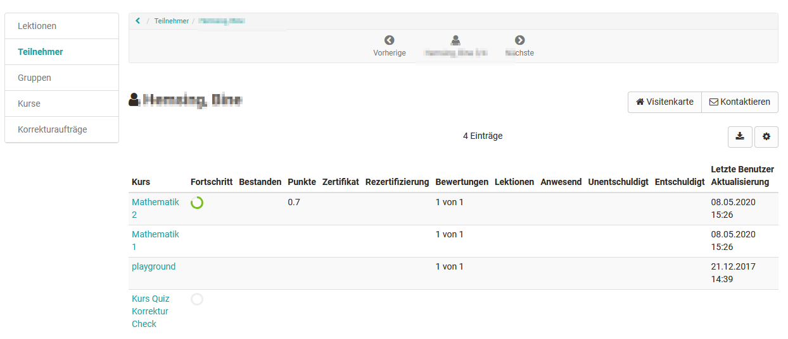
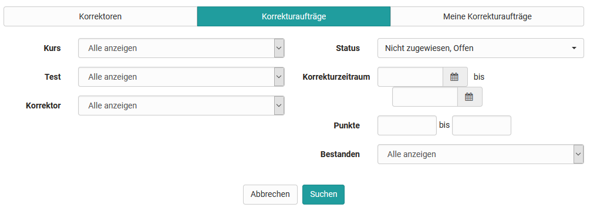
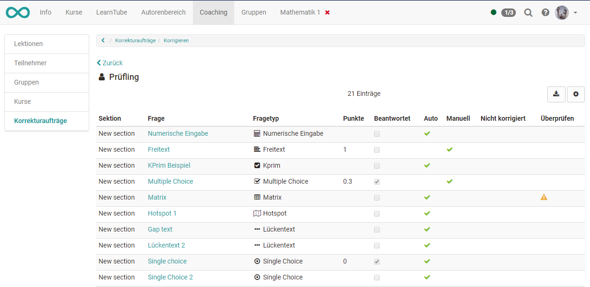

# Coaching

The Coaching tool is used for the cross-course organisation and administration
of courses, participants and groups as well as for cross-course correction of
tests and cross-course absence management.

With the Coaching tool, group and course coaches have the possibility to see
and manage all course or group participants assigned to them at a glance. Use
the menu to view the learning statistics of individual users, groups or
courses and to quickly access the assessment tool for individual participants
in different ways. This allows coaches to quickly make assessments and get a
complete overview.

Use column sorting according to the desired information.

  * 1 Coaching 
    * 1.1Lectures
    * 1.2Members
    * 1.3Groups
    * 1.4Courses
    * 1.5User relations
    * 1.6Grading assignments

The tab "Coaching" only appears if this option has been activated by the
administrator.

Please note that courses can only be displayed as passed if the course main
node has also been configured accordingly.

## Lectures

If the [absence
management](https://confluence.openolat.org/display/OO150EN/Lectures+and+absences)
of OpenOlat is used, the area " Lectures " also appears in the coaching
module.

### Tab Cockpit

A specific day can be selected in the cockpit and the corresponding lectures
and absences can be displayed in an overview. Via the displayed overview and
by clicking on the respective course, the coach also has access to further
information.

### Tab Lectures

Here you can select a time window and search for keywords. An overview of
different lecture blocks is displayed. You can find more information about
"[Lectures](https://confluence.openolat.org/display/OO142EN/Lectures+-+Teacher+view)"
here.

### Tab Absences

In the tab "Absences" you can enter new absences and search for specific types
and reasons for the absence.

### Tab Notice of absences / dispensation

Similar to the Absences tab, notices of absences and dispensations can be
displayed here according to certain criteria and new dispensations can also be
entered.

### Tab Appeals

Here you can search for rejected, accepted or pending status for a certain
period of time.

### Tab User search

  

Overview of all users of the respective coach. You can search for individual
persons as well as for persons of certain courses or for the curriculum.

## Members

The "Participants" area contains an overview, including the current status of
all participants from all courses of the respective coach, which are displayed
in the Coaching Tool. This table provides you with an overview of how many
courses you are coaching a user is a member of (column "# Course"), how many
of them they have already attended (column "Logged in") or passed. In the
column "Logged in" a color coding as well as the number gives a quick overview
if participants have already logged in to all their courses (=green) or if
they have logged in to only a part of the courses (=orange) or not at all
(=red) so far.

A click on the name leads to an overview of all courses of this participant.

This gives the teacher access to the assessment areas of a person's course,
including access to the respective credits, the course's assessment tool and
the respective lessons.

## Groups

The menu item Groups opens a tabular overview of all the groups you have
coached in the courses that are in the coaching tool. In contrast to the
participant and course overview, only those OpenOlat users appear in the group
overview who are linked to one of the coaching courses via the group system.
You can see at a glance how many courses the respective group is involved in,
whether all group members have already logged into the group at least once and
how many participants the group has in total.

Furthermore you will get information about how many group members have already
passed the corresponding course. A click on a group name opens the list of
group members with further information about the score, certificate etc.
Clicking on a username will again open the user-specific overview and you
will get access to the person's assessment tool for the associated course and
have access to the lessons and the respective certificate.

## Courses

Similarly, after clicking on the menu item Courses, you will see a tabular
overview of all the courses you have supervised, which have been published,
completed or at least made available to coaches. In this display you will also
quickly get an overview of the number of participants of individual courses as
well as the progress of the entire course participants. A green dot symbolizes
that all course participants have logged in at least once. An orange dot
indicates that some of the course participants have already accessed the
course. A red dot indicates that no participants have logged into the course
yet.

A further click on a course name shows the course participants you are
coaching and their progress. Afterwards you can navigate back to the
assessment tool of a course participant as well as display the performance
overview or absence management.

## User relations

With the user-to-user relationship in OpenOlat, cross-course support functions
can be set up in the administration or [user management](User+management.html)
for mentors, learning guides and supervisors, for example. If this is the
case, coaches can easily access the persons to be coached in the coaching tool
and make evaluations.

For each user-to-user relationship, specific rights can be defined and thus
access to explicitly approved content of the coaches can be granted, such as
course list, calendar, absence overview, performance records and certificates.
The role of "line manager" is mapped in the coaching tool in the same way.
Here, defined contents can also be accessed by users of the own organizational
unit.

## Grading assignments

With the new correction infrastructure, assigned graders, independent of their
general OpenOlat role, can access and correct online tests outside of the
courses via the coaching tool, even without course membership.

Learning resource administrators or course owners will get an overview in the
menu "Grading assignments" with all graders and their correction assignments
including a display of how many orders are still open or overdue.

### **Tab Graders**

Here you get an overview of all persons who have been added to your own tests
as graders. It is possible to filter the persons according to the respective
tests or to get an overview of the assigned tests to be corrected for a
person. Using the corresponding column selection, you can see how many tests a
grader is supposed to evaluate in total, how many he/she has already
completed, how many are open, which are overdue. The scheduled correction time
and the actual correction time are also displayed.  

Test owners can also add further graders to their own tests at this point.

It is also possible to add graders directly at the respective test learning
resource.

### Tab Grading assignments

Here you can view the processing status of the grading assignments of the
different graders of the tests you are the owner of and filter them according
to various criteria.

### Tab My grading assignments

Here the grader finds all his/her tests to be evaluated and can display them
according to certain criteria, e.g. concrete test, pass/fail or processing
status. Via the link "Grade" the grader can go directly to the test to be
corrected and can make manual assessments and also overwrite automatic
assessments if necessary. It is also useful to leave a corresponding comment.
Depending on the configuration, the assessment can also be anonymous.

The clear display of the evaluation of individual test questions shows very
well where there is still need for action.

  

