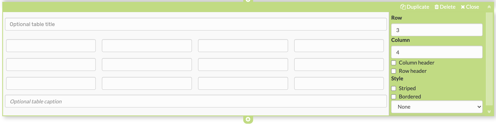
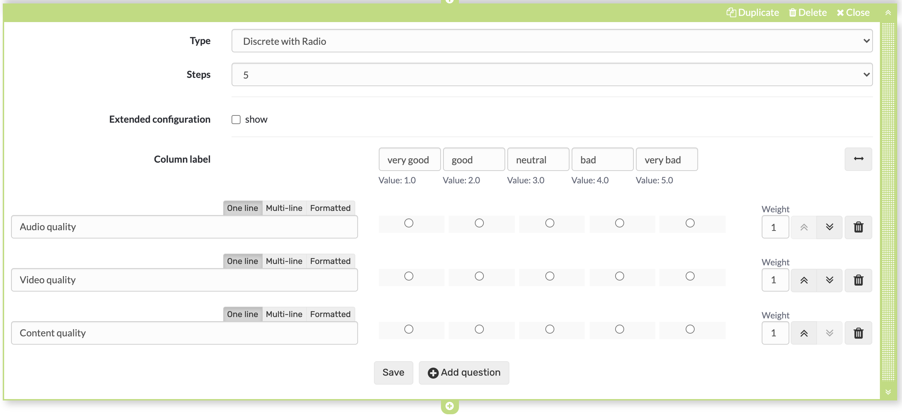
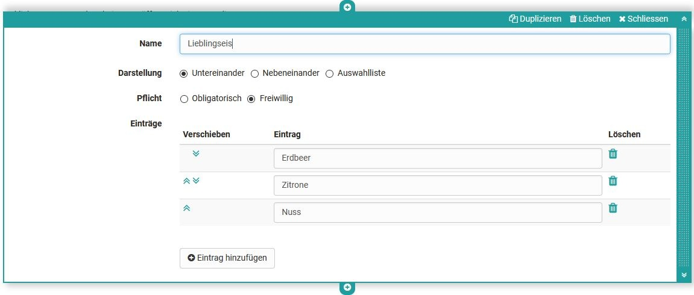
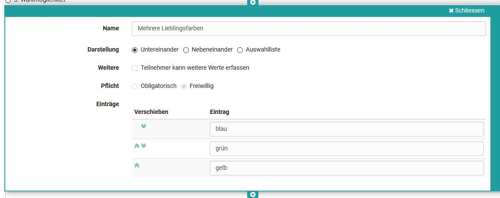
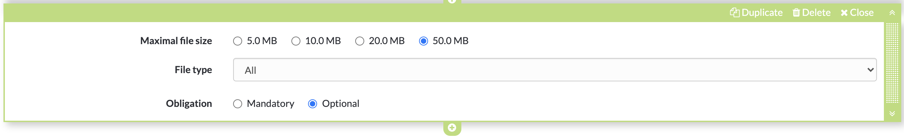

# Form editor (Questionnaire editor)

Select or create a learning resource of the type "Form" and click on "Edit content" in the administration. The editor opens and various options are available via the button "Add content".

As soon as you have created an element, you can also use the plus sign to add further elements above or below an element. Each element can also be duplicated, moved by drag and drop or deleted.

Form Editor

Select or create a learning resource of the type "Form" and click on "Edit content" in the administration. The editor will open and the button "Add content" offers several options.

Once you have created an element, you can also add more elements above or below an element using the "Add Block" button. Each element can also be duplicated, moved by drag and drop or deleted.

!!! info "Availability

 As of :octicons-tag-24: release 17.1. this redesigned form editor is available. It contains conceptual and UX improvements to ensure a more pleasant creation. Old forms (created with 16.1.-17.0.X) can still be opened and edited. If you want to fill an old form with new content, use the new layouts for that.

## Controls and blocks of the form editor

* **Layout menu**: There you can set all the template for the layout, add layouts on top and bottom and move the layout in position or order.
* **Block Menu**: :material-cog: (from l. to r.) Turn the inspector on and au, :material-content-copy: Duplicate form elements & blocks, Add blocks and move the block at the button using :material-drag-variant: drag n drop to the desired position.
* **Inspector**: There are all the settings that change the functionality, as well as the appearance of the particular block or layout.

{ class="lightbox" }

### Layout

A layout is a higher-level block that allows you to structure the content in different ways using columns and rows. Within a column and row you can add as many blocks as you want.

If you delete or change layouts, existing blocks will be moved to the existing columns. If they are not

Currently the following layout templates are available:

### Inspector

The settings for each block are located in the Inspector. On larger screens it opens by default to the right of the selected block. You can show and hide the window by clicking on the :material-cog: settings icon.

By clicking on the title bar of the inspector window you can also move it around the content space. When you select a new block, the inspector jumps back to the default position.

## Title

Inserting headings and formatting with h1 to h6

{ class="shadow lightbox" }

## Paragraph

Main element for adding text blocks, also for questions. The paragraph element contains central formatting and the possibility to distribute the text in columns.

{ class="shadow lightbox" }
  
## Table

If required, add a table to the form and configure it.

{ class="shadow lightbox" }
  
## Image

If necessary, add image elements to the form. To do this, upload a suitable graphic file. Then you can further configure the file, e.g. place a title or subtitle and also define the size, placement or border.

{ class="shadow lightbox" }

The positioning can also be further optimized by using the container element.  
  
## Rubric

Three different types are available for displaying a rubric. As with Single choice questions, the evaluations can relate to only one aspect or be continuous. Unlike the other question types, questions and answers are organized using the same element.

{ class="shadow lightbox" }

Further information can be found [here](Rubric.md).
  
## Single choice

Creates a single choice answer scale. The individual answers can be displayed next to each other, below each other or as a selection menu via the option "Selection list". The entries can be moved up or down using the arrow keys.

Under "Obligation", one can set the question as obligatory or optional.

The single choice question can also be used as a basis (condition) for the question rules. This way, certain containers and their contents are displayed depending on the answer selected by the user.

Give the element a meaningful name so that you can keep track of the question rules.

{ class="shadow lightbox" }

## Multiple choice

Creates a multiple choice selection scale. If necessary, participants can add additional items to the list. The order of the individual choices can be changed using the arrows.

Under "Obligation", one can set the question as obligatory or optional.

The multiple choice can also be used as a basis (condition) for the question rules. This way, certain containers and their contents are displayed depending on the predefined answer selected by the user.

Give the element a meaningful name so that you can keep track of the question rules.

{ class="shadow lightbox" }
  
## Text input

The text input provides the learner with a single or multiline field for text input. The text input can be obligatory or optional.

{ class="shadow lightbox" }
  
## Upload file

This element gives learners the ability to upload files. The Upload can be obligatory or optional.

{ class="shadow lightbox" }
  
## Information

The Information element can be used to query further user-specific information such as name or age. It can be selected whether the information must be filled in voluntarily (optional) or obligatory and whether the user may enter the data himself or whether the automatically transmitted data should be used.

This information causes the questionnaire to lose its anonymity.

{ class="shadow lightbox" }

## Terms of use

With this element the coach can add a declaration of consent to the form, which must be checked off by the users, otherwise only an intermediate storage is possible but no delivery of the questionnaire.

{ class="shadow lightbox" }

## Seperator

Separation line for structuring areas

{ class="shadow lightbox" }
  
## Question rules

(Branching - Working Title)

With question rules, the display of Layouts can be made dependent on certain answers of the single or multiple choice (condition field). Thus, a layout with the respective elements is only displayed if the user has selected a certain predefined answer.

Several rules can be added to a form.

{ class="shadow lightbox" }

## Tips for using the Form Editor

Here are a few more tips for using the Form Editor:

* For the "Rubric" choice, the questions and answers are created together.
* For all other question types, the questions are created using the "Paragraph" element and assigned to the answers of the appropriate question type.
* Use "Add entry" to add additional answer elements for single or multiple choice.
* In addition to the questions, add further elements if required, e.g. "Terms of use" or "Information".
* With the element "Container" you can create a multi-column design.
