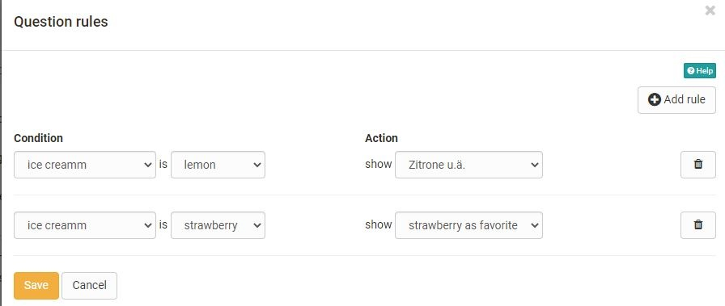

# Form editor

Select or create a learning resource of the type "Form" and click on "Edit content" in the administration. The editor opens.
Hier können Sie ein oder mehrere Layouts wählen und den Bereichen  verschiedene Elemente hinzufügen.

Über den Button "Inhalt hinzufügen" können sie jederzeit verschiedene Elemente hinzufügen. Sobald Sie ein Element erstellt haben, können Sie auch über die 3-Punkte Option über den Link davor/danach hinzufügen weitere Elemente passgenau hinzufügen. 

){ class="lightbox" }

Jedes Element kann auch dupliziert, per drag and drop verschoben oder gelöscht werden.

(löschen: As soon as you have created an element, you can also use the plus sign to add further elements above or below an element. Each element can also be duplicated, moved by drag and drop or deleted.)

!!! info "Availability

    As of :octicons-tag-24: release 17.1. this redesigned form editor is available. It contains conceptual and UX improvements to ensure a more pleasant creation. Old forms (created with 16.1.-17.0.X) can still be opened and edited. If you want to fill an old form with new content, use the new layouts for that.

## Controls and blocks of the form editor

* **Layout menu**: There you can set all the template for the layout, add layouts on top and bottom and move the layout in position or order.
* **Block Menu** :material-cog: 
Bezieht sich auf ein dem Layout hinzugefügtes Element z.B. einen "Paragraph" Text, eine "Einzelauswahl" usw. Sie können hier ein Element bzw. Block duplizieren, verschieben oder löschen sowie weitere Elemente davor oder danach hinzufügen.
* **Inspector**: In dem rechts erscheinenden überlagernden Menü There are all the settings that change the functionality, as well as the appearance of the particular block or layout.

{ class="lightbox" }

### Layout

A layout is a higher-level block that allows you to structure the content in different ways using columns and rows. Within a column and row you can add as many blocks as you want.

If you delete or change layouts, existing blocks will be moved to the existing columns. If they are not

Currently the following layout templates are available:

### Inspector

The settings for each block are located in the Inspector. On larger screens it opens by default to the right of the selected block. You can show and hide the window by clicking on the :material-cog: settings icon.

By clicking on the title bar of the inspector window you can also move it around the content space. When you select a new block, the inspector jumps back to the default position.

## Title

Inserting headings and formatting with h1 to h6

{ class="shadow lightbox" }

## Paragraph

Main element for adding text blocks, also for questions. The paragraph element contains central formatting and the possibility to distribute the text in columns.

{ class="shadow lightbox" }
  
## Table

If required, add a table to the form and configure it.

{ class="shadow lightbox" }
  
## Image

If necessary, add image elements to the form. To do this, upload a suitable graphic file. 

{ class="shadow lightbox" }

The positioning can also be further optimized by using the container element.  
  
## Rubric

Three different types are available for displaying a rubric. 
"Diskret mit Radiobutton" und "Diskret mit Slider" funktionieren ähnlich wie Single-Choice Fragen und sind mit Punktwerten verknüpft. "Kontinuierlich" dagegen ermöglicht eine fließende Bewertung ohne Punkte. Anders als bei den anderen Fragetypen werden hier Fragen und Antworten über dasselbe Element organisiert.

{ class="shadow lightbox" }

Für Rubrics stehen diverse Einstellungsmöglichkeiten zur Verfügung die Sie über das Zahnrad einblenden können. 
Further information can be found [here](Rubric.md).
  
## Single choice

Creates a single choice answer scale. The individual answers can be displayed next to each other, below each other or as a selection menu via the option "Selection list". The entries can be moved up or down using the arrow keys.

Under "Obligation", one can set the question as obligatory or optional.
Obligatorische Blöcke müssen ausgefüllt werden um das Formular absenden zu können.

The single choice question can also be used as a basis (condition) for the question rules. This way, certain containers and their contents are displayed depending on the answer selected by the user.

Give the element a meaningful name so that you can keep track of the question rules.

{ class="shadow lightbox" }

## Multiple choice

Creates a multiple choice selection scale. If necessary, participants can add additional items to the list. The order of the individual choices can be changed using the arrows.

Under "Obligation", one can set the question as obligatory or optional. Obligatorische Blöcke müssen ausgefüllt werden um das Formular absenden zu können.

The multiple choice can also be used as a basis (condition) for the question rules. This way, certain containers and their contents are displayed depending on the predefined answer selected by the user.

Give the element a meaningful name so that you can keep track of the question rules.

{ class="shadow lightbox" }
  
## Text input

The text input provides the learner with a single or multiline field for text input. Auch eine Einschränkung auf Zahlen oder ein Datum ist möglich.  The text input can be obligatory or optional (siehe Einzel- oder Mehrfachauswahl oben).

{ class="shadow lightbox" }
  
## Upload file

This element gives learners the ability to upload files. The Upload can be obligatory or optional (siehe Einzel- oder Mehrfachauswahl oben).

{ class="shadow lightbox" }
  
## Information

The Information element can be used to query further user-specific information such as name or age. 

Dabei kann eine der folgenden drei Varianten ausgewählt werden:

a) die Angaben sind freiwillig, User können bei Bedarf die Felder ausfüllen (optional)

b) die Angaben müssen vom Benutzer verpflichtend ausgefüllt werden sonst wird das Formular nicht gespeichert (obligatorisch)

c) die Angaben werden automatisch übertragen und könnten nicht geändert werden(automatisch obligatorisch)

Nutzt man das Formular im Rahmen des Kursbaustein "Umfrage" kann eine Befragung  ihre Anonymität verlieren.

{ class="shadow lightbox" }

## Terms of use

With this element the coach can add a declaration of consent to the form, which must be checked off by the users, otherwise only an intermediate storage is possible but no delivery of the form.

{ class="shadow lightbox" }

## Seperator

Separation line for structuring areas

{ class="shadow lightbox" }
  
## Question rules

(Branching - Working Title)

With question rules, the display of Layouts can be made dependent on certain answers of the single or multiple choice (condition field). Thus, a layout with the respective elements is only displayed if the user has selected a certain predefined answer.

Several rules can be added to a form.

{ class="shadow lightbox" }

## Tips for using the Form Editor

Here are a few more tips for using the Form Editor:

* For the "Rubric" choice, the questions and answers are created together.
* Use "Add entry" to add additional answer elements for single or multiple choice.
* In addition to the questions, add further elements if required, e.g. "Terms of use" or "Information".
* Vergessen Sie nicht den Blöcken Namen zu hinterlegen wenn Sie eine selektive Freigabe per Frageregeln erstellen wollen.

