# Formular Editor

Wählen oder erstellen Sie eine Lernressource vom Typ „Formular“ und klicken
Sie in der Administration auf „Inhalt editieren“. Es öffnet sich der Editor
und über den Button "Inhalt hinzufügen" stehen verschiedene Möglichkeiten zur
Verfügung.

Sobald Sie ein Element erstellt haben, können Sie auch über das Pluszeichen
weitere Elemente über oder unter einem Element hinzufügen. Jedes Element kann
auch dupliziert, per drag and drop verschoben oder gelöscht werden.

Seit der Version OpenOlat 16.1 handelt es sich beim Fragebogen Editor um den
Formular Editor, da die Lernressource Fragebogen in die Lernressource Formular
übergegangen ist.

Titel

|

Einfügen von Überschriften und Formatierung mit h1 bis h6

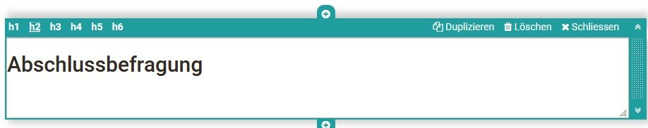

|

  
  
  
---|---|---  
  
Paragraph

|

Hauptelement zum Hinzufügen von Textblöcken, auch für Fragestellungen. Das
Paragraph Element beinhaltet zentrale Formatierungen sowie die Möglichkeit den
Text auf Spalten zu verteilen.

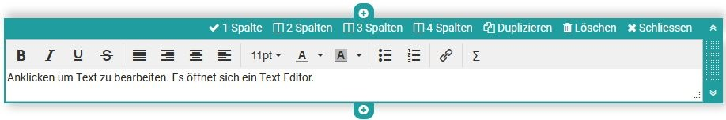

|

  
  
  
Tabelle|

Fügen Sie bei Bedarf dem Formular eine Tabelle hinzu und konfigurieren Sie
diese.

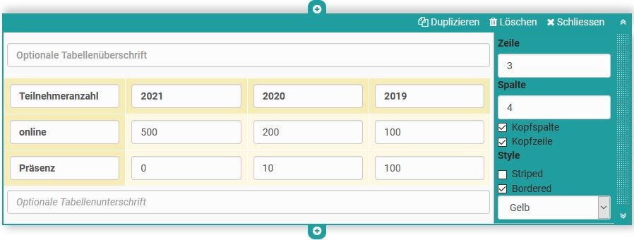

|

  
  
  
Bild|

Fügen Sie bei Bedarf dem Formular auch Bildelemente hinzu. Laden Sie dafür
eine passende Grafikdatei hoch. Anschließend können Sie die Datei weiter
konfigurieren, z.B. einen Titel oder Untertitel platzieren und auch die Größe,
Platzierung oder Umrandung definieren.

Auch kann die Positionierung durch die Verwendung des Container Element weiter
optimiert werden.

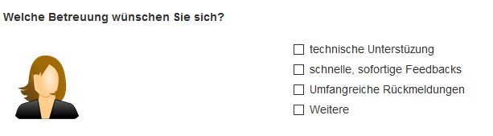

|  
  
  
Rubrik

|

Für die Darstellung eines [Rubrik ](Rubric.de.md)stehen drei unterschiedliche
Typen zur Verfügung. Die Bewertungen können sich wie bei Single-Choice Fragen
nur auf einen Aspekt beziehen oder kontinuierlich erfolgen. Anders als bei den
anderen Fragetypen werden hier Fragen und Antworten über dasselbe Element
organisiert.

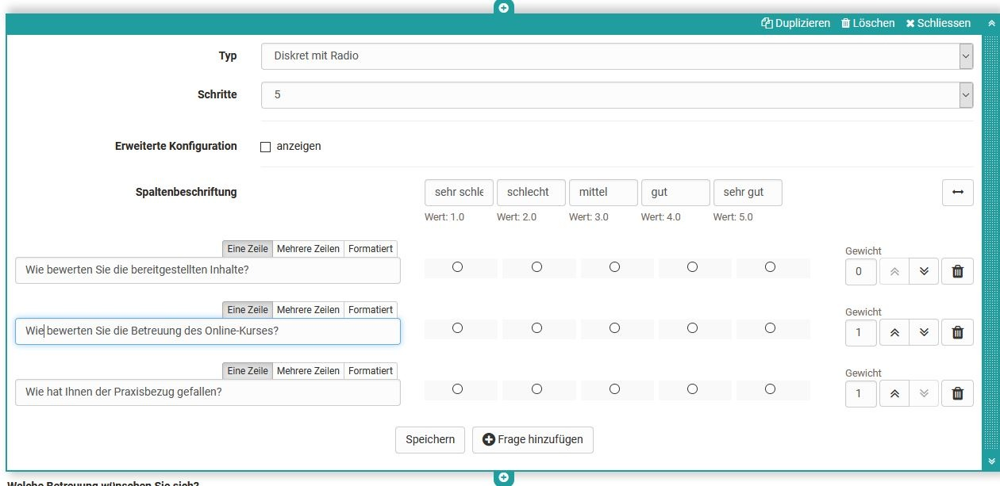

Weitere Infos finden Sie [hier](Rubrik.html).

|

  
  
  
Einzelauswahl

|

Erstellt eine Single-Choice Antwortskala. Die einzelnen Antworten können dabei
nebeneinander, untereinander oder als Wahl Menü über die Option „Auswahlliste“
dargestellt werden. Die Einträge können über die Pfeiltasten nach oben oder
unten verschoben werden.

Im Bereich "Pflicht" kann man die Frage als obligatorisch oder freiwillig
einstellen.

Die Einzelauswahl kann auch als Basis (Bedingung) für die Frageregeln
verwendet werden. Damit werden bestimmte Container und deren Inhalte in
Abhängigkeit der vom User gewählten Antwort angezeigt.

Vergeben Sie einen sinnvollen Namen für das Element, so dass Sie bei den
Frageregeln den Überblick behalten.

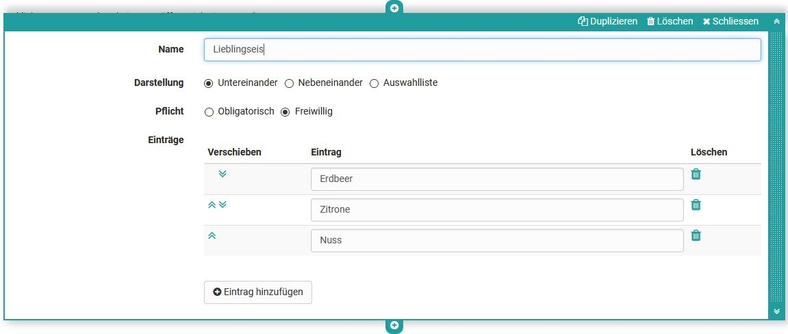

|

  
  
  
Mehrfachauswahl

|

Erstellt eine Multiple-Choice Auswahlskala. Bei Bedarf können die
Teilnehmenden in die Liste auch Ergänzungen eintragen. Die Reihenfolge lässt
sich über die Pfeile anpassen.

Im Bereich "Pflicht" kann man die Frage als obligatorisch oder freiwillig
einstellen.

Die Mehrfachauswahl kann auch als Basis (Bedingung) für die Frageregeln
verwendet werden. Damit werden bestimmte Container und deren Inhalte in
Abhängigkeit der vom User gewählten vorgegebenen Antwort angezeigt.

Vergeben Sie einen sinnvollen Namen für das Element, so dass Sie bei den
Frageregeln den Überblick behalten.

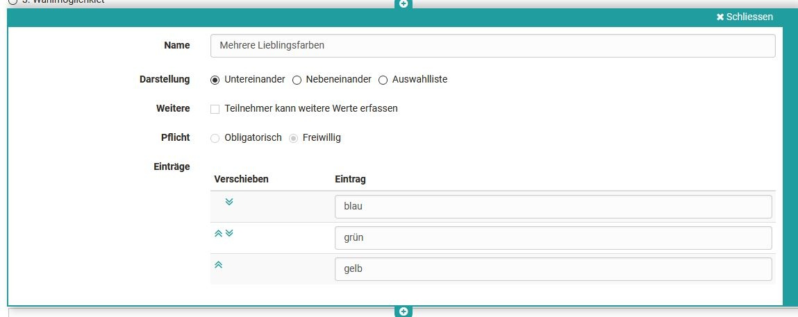

|

  
  
  
Texteingabe

|

Mit der Texteingabe wird den Lernenden ein ein- oder mehrzeiliges Feld für die
Texteingabe bereitgestellt. Die Texteingabe kann obligatorisch oder freiwillig
sein.

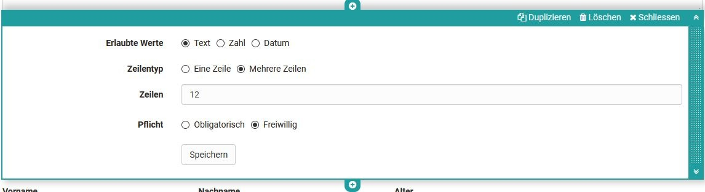

|

  
  
  
Datei hochladen

|

Mit diesem Element erhalten die Lernenden die Möglichkeit Dateien hochzuladen.
Eine Einstellung ob das Hochladen obligatorisch oder freiwillig erfolgt, ist
ebenfalls gegeben.

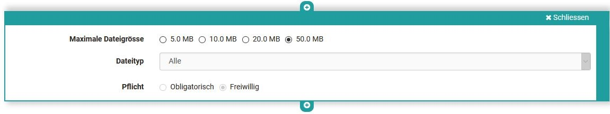

|

  
  
  
Informationen

|

Mit dem Element Informationen können weitere Userspezifische Informationen wie
Name oder Alter abgefragt werden. Dabei kann eine der folgenden drei Varianten
ausgewählt werden:

a) die Angaben sind freiwillig (optional)

b) die Angaben müssen vom Benutzer verpflichtend ausgefüllt werden
(obligatorisch)

c) die Angaben werden automatisch übertragen (automatisch obligatorisch)

Durch diese Informationen verliert der Fragebogen seine Anonymität.

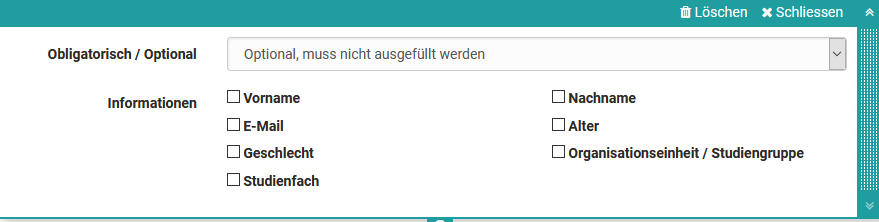

|

  
  
  
Nutzungsbedingungen

|

Mit diesem Element kann der Lehrende dem Formular eine Einverständniserklärung
hinzufügen, die von den Usern abgehakt werden müssen, ansonsten ist nur ein
zwischenspeichern aber keine Abgabe des Fragebogens möglich.

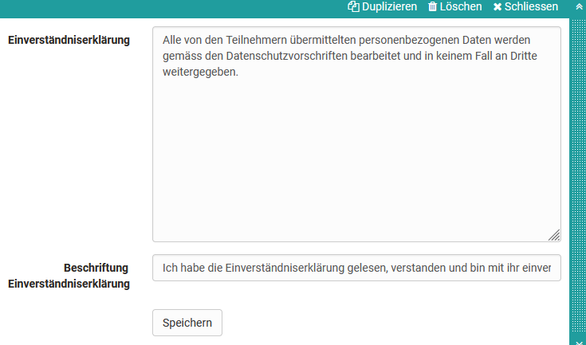

|

  
  
  
Container

|

Mit Containern kann ein Formular weiter strukturiert werden. Es steht dabei
ein 1-4 spaltiges Layout zur Verfügung. Auch Verschachtelungen innerhalb eines
Container Feldes sind möglich.

Ferner werden können Container als Sammelelemente und Basis für die die
Frageregeln verwendet werden (Branching Szenario).

Container ohne Inhalt werden nicht angezeigt.

|

  
  
  
Separator

|

Trennlinie zum Gliedern für Bereiche

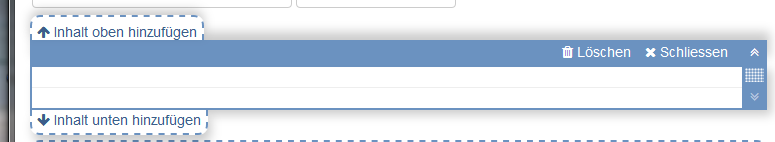

|

  
  
  
Frageregeln

(Branching - Working Title)

|

Mit Frageregeln kann die Anzeige von Containern in Abhängigkeit von bestimmten
Antworten der Einzel oder Mehrfachwahl (Bedingungsfeld) gesetzt  werden. So
wird ein Container mit den jeweiligen Elementen nur dann angezeigt, wenn der
User eine bestimmte vorgegebene Antwort ausgewählt hat.

Einem Formular können mehrere Regeln hinzugefügt werden.

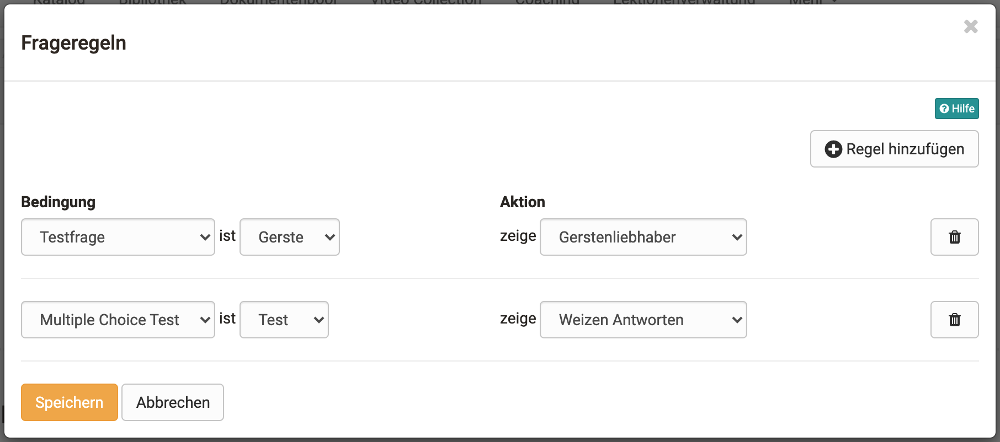

|  
  
  
### Tipps zur Nutzung des Formular Editors

Hier noch ein paar Tipps zur Verwendung des Formular Editors:

  * Bei der Wahl „Rubrik“ werden die Fragen und Antworten zusammen erstellt.
  * Bei allen anderen Fragetypen werden die Fragen mit Hilfe des Elements „Paragraph“ erstellt und den Antworten des passenden Fragetyps zugeordnet. 
  * Über „Eintrag hinzufügen“ können Sie bei der Einzel- bzw. Mehrfachauswahl weitere Antwortelemente ergänzen.   
  * Fügen Sie neben den Fragen bei Bedarf auch weitere Elemente z.B. „Nutzungsbedingungen“ oder „Informationen“ hinzu.
  * Mit dem Element "Container" können Sie ein mehrspaltiges Design erstellen.

