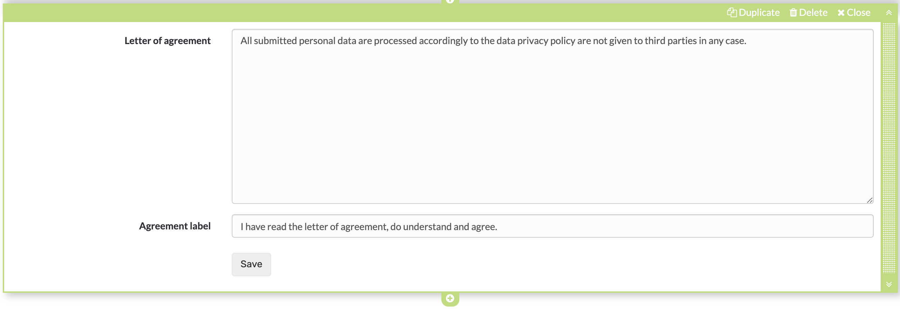

# Form editor (Questionnaire editor)

Select or create a learning resource of the type "Form" and click on "Edit
content" in the administration. The editor opens and various options are
available via the button "Add content".

As soon as you have created an element, you can also use the plus sign to add
further elements above or below an element. Each element can also be
duplicated, moved by drag and drop or deleted.

  

Since version OpenOlat 16.1, the survey editor is, strictly speaking, the form
editor, as the learning resource survey has become the learning resource form.

Title|

Inserting headings and formatting with h1 to h6

  
  
---|---  
Paragraph|

Main element for adding text blocks, also for questions. The paragraph element
contains central formatting and the possibility to distribute the text in
columns.

  
  
Table|

If required, add a table to the form and configure it.

  
  
Image|

If necessary, add image elements to the form. To do this, upload a suitable
graphic file. Then you can further configure the file, e.g. place a title or
subtitle and also define the size, placement or border.

The positioning can also be further optimized by using the container element.  
  
Rubric|

Three different types are available for displaying a rubric. As with Single
choice questions, the evaluations can relate to only one aspect or be
continuous. Unlike the other question types, questions and answers are
organized using the same element.

Further information can be found [here](Rubric.md).  
  
Single choice|

Creates a single choice answer scale. The individual answers can be displayed
next to each other, below each other or as a selection menu via the option
"Selection list". The entries can be moved up or down using the arrow keys.

Under "Obligation", one can set the question as obligatory or optional.

The single choice question can also be used as a basis (condition) for the
question rules. This way, certain containers and their contents are displayed
depending on the answer selected by the user.

Give the element a meaningful name so that you can keep track of the question
rules.

  
  
Multiple choice|

Creates a multiple choice selection scale. If necessary, participants can add
additional items to the list. The order of the individual choices can be
changed using the arrows.

Under "Obligation", one can set the question as obligatory or optional.

The multiple choice can also be used as a basis (condition) for the question
rules. This way, certain containers and their contents are displayed depending
on the predefined answer selected by the user.

Give the element a meaningful name so that you can keep track of the question
rules.

  
  
Text input|

The text input provides the learner with a single or multiline field for text
input. The text input can be obligatory or optional.

  
  
Upload file|

This element gives learners the ability to upload files. The Upload can be
obligatory or optional.

  
  
Information|

The Information element can be used to query further user-specific information
such as name or age. It can be selected whether the information must be filled
in voluntarily (optional) or obligatory and whether the user may enter the
data himself or whether the automatically transmitted data should be used.

This information causes the questionnaire to lose its anonymity.

  
  
Terms of use|

With this element the coach can add a declaration of consent to the form,
which must be checked off by the users, otherwise only an intermediate storage
is possible but no delivery of the questionnaire.

  
  
Container|

You can use containers to further structure forms. A 1-4 column layout is
available. Nesting within a container field is also possible.

Furthermore, containers can be used as collection elements and basis for the
question rules (branching scenario).

Containers without content are not displayed.  
  
Seperator|

Separation line for structuring areas

  
  
Question rules

(Branching - Working Title)

|

With question rules, the display of containers can be made dependent on
certain answers of the single or multiple choice (condition field). Thus, a
container with the respective elements is only displayed if the user has
selected a certain predefined answer.

Several rules can be added to a form.

 