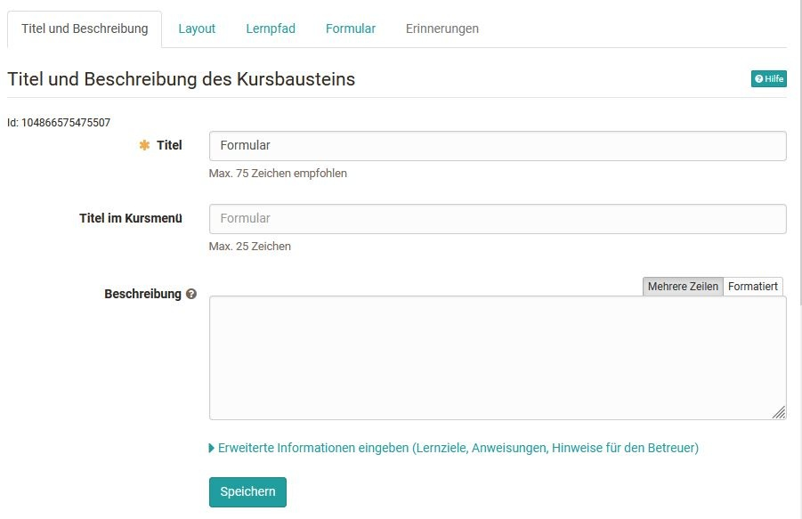
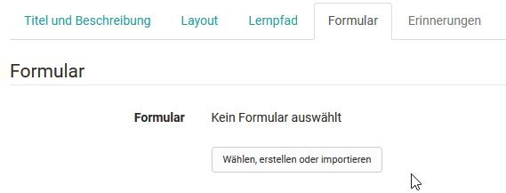
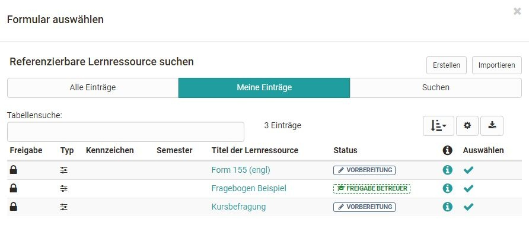
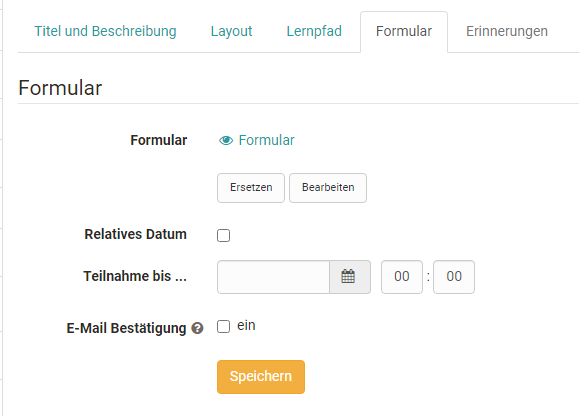
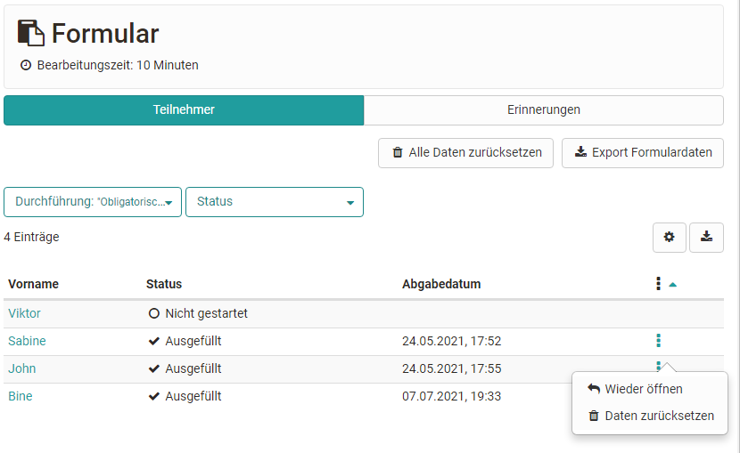

# Formular in Formularen

Formulare können mit Hilfe des Kursbausteins Formular in einen OpenOlat Kurs
eingebunden werden. Wie Sie Formulare erstellen und in Kurse einbinden
erfahren Sie [hier](Three_Steps_to_your_Form.de.md).

Nachdem Sie den Kursbaustein Formular dem Kurs hinzugefügt haben stehen Ihnen
im Kurseditor folgende Tabs zur Verfügung:

Im Tab "Titel und Beschreibung" sowie "Layout" können allgemeine
Beschreibungen und Informationen zum jeweiligen Kursbaustein hinterlegt und
die optische Darstellung definiert werden. Im [Tab Lernpfad
](../course_create/Learning_path_course_-_Course_editor.de.md)werden spezielle Einstellungen die für
Lernpfad Kurse gelten definiert. Herkömmliche Kurs verfügen dagegen über die
Tabs Sichtbarkeit und Zugang. Hier wird definiert, wer diesen Kursbaustein
sehen bzw. bearbeiten kann.

## Tab Formular im Kurseditor

Die zentrale Konfiguration erfolgt im Tab "Formular". Hier wird im ersten
Schritt entweder ein neues Formular erstellt oder ein existierendes
ausgewählt.

Nach Klick auf den Button werden alle Formulare, bei denen man Besitzer ist,
angezeigt und können einfach per Klick auf den Haken ausgewählt werden.

Hat man noch kein Formular erstellt, kann eine neue Lernressource Formular
über den Button "Erstellen" erstellt oder ein extern vorliegendes Formular
über den Button "Importieren" hinzugefügt werden. Anschließend erscheint das
gerade angelegte oder importierte Formular ebenfalls in der Liste und kann
ausgewählt werden.

Ein neu erstelltes Formular beinhaltet zunächst noch keine Elemente, Fragen
oder Textfelder. Diese müssen im Kurs über "Bearbeiten" oder alternativ direkt
in der Lernressource im [Formular Editor](Formular+Editor.html) hinzugefügt
werden.

Wenn ein Formular im Kurseditor erstellt wird, wird automatisch eine neue
Lernressource Formular angelegt, die auch im [Autorenbereich
](Autorenbereich.html)unter "Meine Einträge" zu finden ist und in weiteren
Kursen und Kursbausteinen eingebunden werden kann.

Nachdem ein Formular ausgewählt wurde kann es über den Link "Bearbeiten"
gestaltet werden. Wurde das Formular schon vorher passend eingerichtet ist
eine Bearbeitung nicht mehr nötig.

Zusätzlich kann in dem Tab definiert werden bis wann das Formular von den
Lernenden ausgefüllt werden kann. Hierfür kann ein festes oder ein relatives
Datum verwendet werden, z.B. x Tage nach dem ersten Kursbesuch. Sobald ein
Enddatum definiert wurde wird auch der Tab "[Erinnerungen](Erinnerung.html)"
aktiviert. Zum Beispiel könnte man eine Erinnerung erstellen, die die
Lernenden wenige Tage vor der Abgabedeadline noch einmal per Mail an das
Ausfüllen des Formulars erinnert. Wird die E-Mail Bestätigung aktiviert
erhalten die Teilnehmenden eine Bestätigungs-E-Mail und das von ihnen
ausgefüllte Formular als PDF Anhang.

Sobald ein Formular von mindestens einem Teilnehmenden angesehen wurde, kann
es nicht mehr ersetzt und nur ansatzweise bearbeitet werden.

## Ansicht bei geschlossenem Kurseditor

### für Besitzer und Betreuer

Bei geschlossenem Kurseditor sehen Besitzer und Betreuer eine Übersicht der
Lernenden des Kurses und ihren Status der Bearbeitung z.B. "Nicht gestartet".
Über die Filterfunktion kann auch eine bestimmte Personengruppe angezeigt
werden, z.B. alle Personen, die das Formular noch nicht gestartet haben. Das
eigentliche Formular sehen Besitzer und Betreuer hier aber nicht. Ein Export
der Formulardaten ist ebenfalls möglich.

Besitzer haben ferner noch die Möglichkeit, die Daten einzelner Personen oder
alle Daten zurückzusetzen und verfügen zusätzlich noch über den Tab
"Erinnerungen", wenn die Formularabgabe mit einer Deadline versehen ist. Hier
können sie neue Erinnerungen erstellen und sehen welche [Erinnerungen
](Erinnerung.html)schon versandt wurden.

### für Teilnehmende

Teilnehmenden wird dagegen direkt beim Klick auf das Formular das konkrete
Formular angezeigt und sie können es ausfüllen. Ein Zwischenspeichern ist
ebenfalls möglich.

Das fertig ausgefüllte Formular muss abschließend gespeichert werden und kann
dann vom User nicht mehr bearbeitet, nur noch angezeigt werden.

  

  

