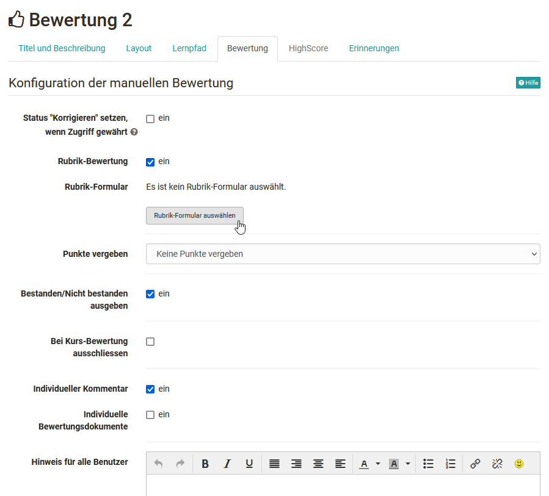
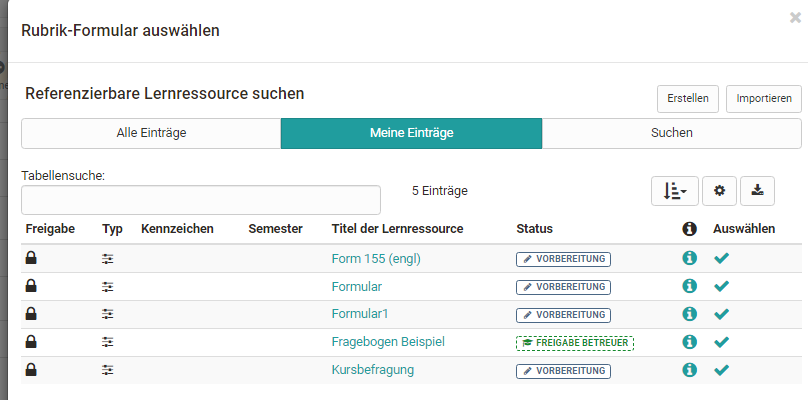
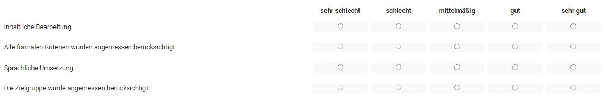
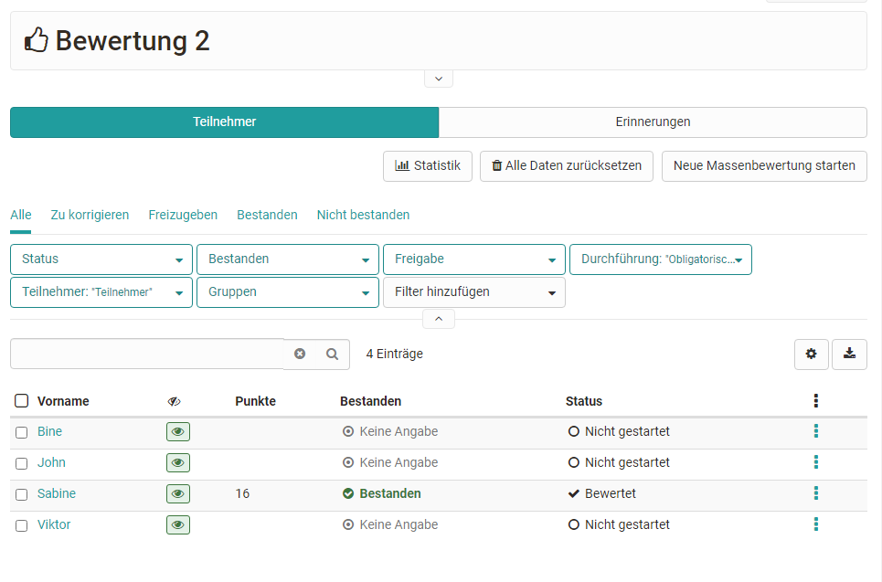
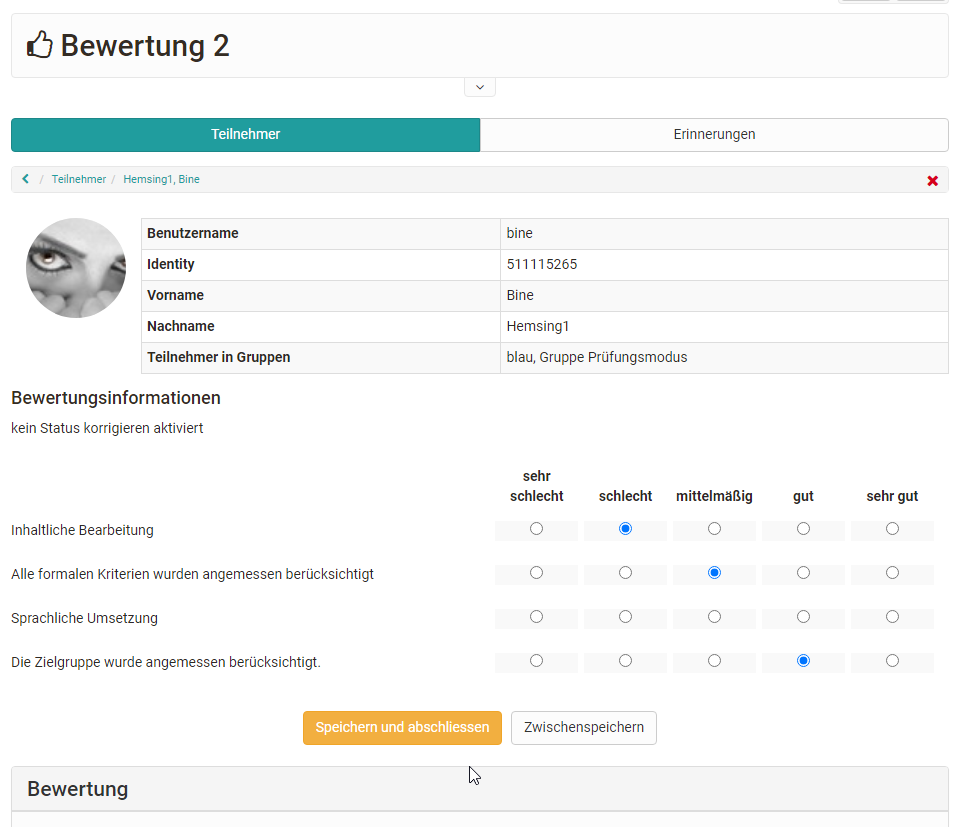

# Formular als Rubrik Bewertung

Die Lernressource Formular, insbesondere das dort integrierte [Rubrik
](Rubric.de.md)Element eignet sich optimal für eine kriterienbasierte Bewertung
von Leistungen. Dafür wird ein zuvor erstelltes Formular mit einem Rubrik
Element in den Kursbaustein "Bewertung" eines Kurses eingebaut.

## Im Kurseditor:

Gehen Sie in den Kurseditor und fügen Sie den [Kursbaustein
"Bewertung"](../course_elements/Course_Element_Assessment.de.md) hinzu.
Gehen Sie anschließend in den Tab "Bewertung" und aktivieren Sie die "Rubrik-
Bewertung"

Im nächsten Schritt können sie ein passendes Rubrik-Formular auswählen oder
erstellen.

Die Basis des Rubriks ist die Lernressource Formular der im 
[Formular-Editor](Form_editor_Questionnaire_editor.de.md) ein Rubrik Element hinzugefügt wurde.

In der erscheinenden Übersicht werden alle Formulare, bei denen Sie Besitzer
sind, angezeigt. Das gewünscht Formular mit dem Bewertungsrubrik kann einfach
per Klick auf den Haken ausgewählt und so dem Kurs hinzugefügt werden.

Hat man noch kein Formular erstellt, kann auch eine neue Lernressource
Formular über den Button "Erstellen" angelegt oder ein extern vorliegendes
Formular importiert werden. Anschliessend erscheint das gerade angelegte oder
importierte Formular ebenfalls in der Liste und kann ausgewählt werden.

Ein neu erstelltes Formular beinhaltet zunächst noch kein Rubrik Element.
Dieses muss im Kurs über "Bearbeiten" oder alternativ direkt in der
Lernressource im [Formular Editor](Form_editor_Questionnaire_editor.de.md) hinzugefügt werden.

Wenn ein Formular direkt im Kurseditor erstellt wird, wird automatisch eine
neue Lernressource Formular angelegt, die auch im [Autorenbereich](../authoring/index.de.md)unter "Meine Einträge" zu finden ist und in weiteren
Kursen eingebunden werden kann.

Nachdem ein Formular ausgewählt wurde kann es über den Link "Bearbeiten"
gestaltet werden. Wurde das Formular schon vorher passend eingerichtet ist
eine Bearbeitung nicht mehr notwendig.

### Bewertungsrubrik Beispiel

So könnte ein Bewertungsrubrik aussehen:

Rubrik Bewertung konfigurieren

Nachdem ein Rubrik mit der Bewertung verknüpft wurde können im Tab "Bewertung"
folgende weitere Konfigurationen vorgenommen werden:

  
|  
  
---|---  
Status "Korrigieren" setzen wenn Zugriff gewährt|

Wird der Haken gesetzt erscheint bei geschlossenem Editor für Besitzer und
Betreuer unter Status die Anzeige "Korrigieren". Den Teilnehmenden wird
passend dazu "In Korrektur" angezeigt.

Ist der Haken nicht gesetzt, sieht der User "Keine Angabe" und den Lehrenden
wird der Status "Nicht gestartet" oder "Bewertet" angezeigt, je nachdem ob
eine Bewertung schon vorgenommen wurde oder nicht.  
  
Punkte vergeben| Punkte können, sofern aktiviert, automatisch oder manuell
vergeben werden. Automatische Punkte können als Summe oder Durchschnitt
übernommen werden.  
Bestanden/Nicht bestanden ausgeben| Sofern ein bestanden angezeigt werden soll
kann definiert werden ob die Anzeige automatisch basierend auf einer
Punkteschwelle erfolgen soll oder ob ein bestanden manuell gesetzt werden
soll.  
Bei Kurs-Bewertung ausschliessen| Ist der Haken gesetzt, wird die Bewertung
nicht beim Bestehen des Kurses berücksichtigt (siehe Konfiguration in der
"Administration" →  "Einstellungen"→ "Bewertung".  
Individueller Kommentar| Wenn aktiviert, kann ein individueller Kommentar zur
Rubrikbewertung hinterlassen werden z.B. eine Bewertung näher erläutert
werden.  
Individuelle Bewertungsdokumente| Wenn aktiviert, können ergänzend zur Rubrik-
Bewertung individuell weitere Dokumente zur Verfügung gestellt werden.  
Hinweise für alle Benutzer| Hier können Hinweise für Betreuer hinterlassen
werden. Die Teilnehmenden sehen die Hinweise nicht.  
  
Weitere Informationen zum Kursbaustein Bewertung finden Sie
[hier](../course_elements/Course_Element_Assessment.de.md).

### Rubrik-Bewertung vornehmen

Die eigentliche Bewertung der Lernenden erfolgt dann bei geschlossenem Kurs-
Editor im Kursrun direkt beim gewünschten Kursbaustein oder im
Bewertungswerkzeug.

Wählen Sie hierfür die zu bewertende Person aus der Liste aus und markieren
Sie einfach die gewünschten Punkte. Sofern aktiviert werden die Punkte aus der
Rubrikbewertung automatisch übernommen und führen so schnell zu einer
Kriterien basierten, transparenten Bewertung.

  

  

